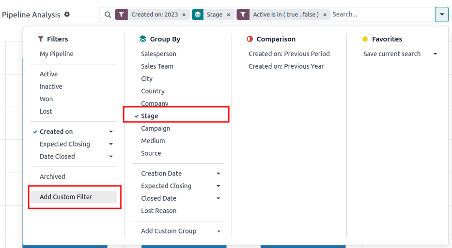
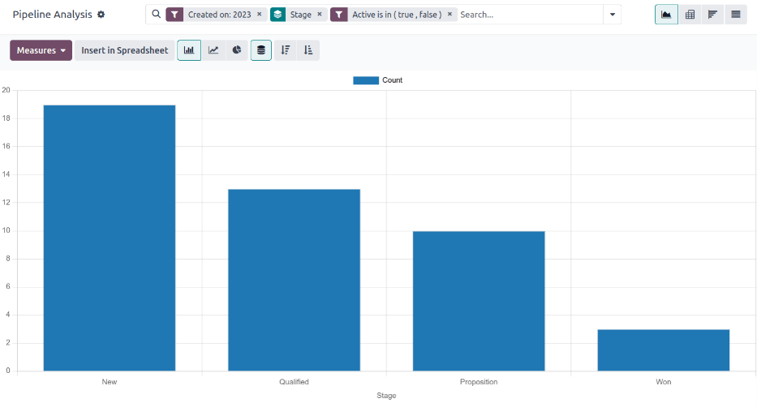

# Phân tích chu trình

The _CRM_ app manages the sales pipeline as leads/opportunities move from stage to stage,\
origination to sale (**Won**) or archival (**Lost**).

After organizing the pipeline, use the search options and reports available on the _Pipeline_\
_Analysis_ page to gain insight into the effectiveness of the pipeline and its users.

To access the _Pipeline Analysis_ page, go to CRM app ‣ Reporting ‣ Pipeline.

## Navigate the pipeline analysis page

Upon accessing the Pipeline Analysis page, a bar graph showcasing the leads from the\
past year automatically populates. The bars represent the number of leads in each stage of the sales\
pipeline, color-coded to show the month the lead reached that stage.

The interactive elements of the Pipeline Analysis page manipulate the graph to report\
different metrics in several views. From left-to-right, top-to-bottom, the elements include:

* Actions: represented by the ⚙️ (gear) icon, located next to the\
  Pipeline Analysis page title. When clicked, a drop-down menu appears with three\
  options, each with their own sub-menu: Knowledge, Dashboard,\
  Spreadsheet. (See [Save and share reports](win_loss.md#win-loss-save-reports) for more\
  information)
  * The Knowledge option is for linking to or inserting the graph in a _Knowledge_ app\
    article.
  * The Dashboard option is for adding the graph to a dashboard in the _Dashboards_ app.
  * The Spreadsheet option is for linking the graph in a spreadsheet in the _Documents_\
    app.
* Search... bar: shows the filters and groupings currently being applied to the graph.\
  To add new filters/groups, type them into the search bar, or click the ⬇️ (down arrow)\
  icon, at the end of the bar, to open a drop-down menu of options. (See [Search Options](win_loss.md#win-loss-search) for more information)

In the upper-right corner, there are view options represented by different icons. (See [View\
Options](win_loss.md#win-loss-view) for more information)

* Graph view: displays the data in a bar graph. This is the default view.
* Pivot view: displays the data in a customizable, categorized metrics table.
* Cohort view: displays and organizes the data, based on their Created on\
  and Closed Date week (default), day, month, or year.
* List view: displays the data in a list.

Located on the far-left side of the page, beneath the Pipeline Analysis page title,\
there are more configurable filter and view options.

* Measures: opens a drop-down menu of different measurement options that can be seen in\
  the graph, pivot, or cohort view. The Measure drop-down menu is not available in the\
  list view. (See [Measurement Options](win_loss.md#win-loss-measure) for more information)
* Insert in Spreadsheet: opens a pop-up window with options for adding a graph or pivot\
  table to a spreadsheet in the _Documents_ app or a dashboard in the _Dashboards_ app. This option\
  is not available in the cohort or list view.

With the graph view selected, the following options are available:

* Bar Chart: switches the graph to a bar chart.
* Line Chart: switches the graph to a line chart.
* Pie Chart: switches the graph to a pie chart.
* Stacked: when selected, the results of each stage of the graph are stacked on top of\
  each other. When not selected, the results in each stage are shown as individual bars.
* Descending: re-orders the stages in the graph in descending order from left-to-right.\
  Click the icon a second time to deselect it. Depending on the search criteria, this option may not\
  be available.
* Ascending: re-orders the stages in the graph in ascending order from left-to-right.\
  Click the icon a second time to deselect it. Depending on the search criteria, this option may not\
  be available.

With the pivot view selected, the following options are available:

* Flip Axis: flips the X and Y axis for the entire table.
* Expand All: when additional groupings are selected using the ➕ (plus\
  sign) icons, this button opens those groupings under every row.
* Download xlsx: downloads the table as an Excel file.

### Search options

The Pipeline Analysis page can be customized with various filters and grouping options.

To add new search criteria, type the desired criteria into the search bar, or click the\
⬇️ (down arrow) icon, next to the search bar, to open a drop-down menu of all options.\
See the sections below for more information on what each option does.

Bộ lọc

The Filters section allows users to add pre-made and custom filters to the search\
criteria. Multiple filters can be added to a single search.

* My Pipeline: show leads assigned to the current user.
* Opportunities: show leads that have been qualified as opportunities.
* Leads: show leads that have yet to be qualified as opportunities.
* Active: show active leads.
* Inactive: show inactive leads.
* Won: show leads that have been marked **Won**.
* Lost: show leads that have been marked **Lost**.
* Created On: show leads that were created during a specific period of time. By\
  default, this is the past year, but it can be adjusted as needed, or removed entirely.
* Expected Closing: show leads that are expected to close (marked **Won**) during\
  a specific period of time.
* Date Closed: show leads that were closed (marked **Won**) during a specific\
  period of time.
* Archived: show leads that have been archived (marked **Lost**).
* Add Custom Filter: allows the user to create a custom filter with numerous\
  options. (See [Add Custom Filters and Groups](win_loss.md#win-loss-custom-filters) for more\
  information)

Nhóm theo

The Group By section allows users to add pre-made and custom groupings to the\
search results. Multiple groupings can be added to split results into more manageable chunks.

#### IMPORTANT

The order that groupings are added affects how the final results are displayed. Try\
selecting the same combinations in a different order to see what works best for each use\
case.

* Salesperson: groups the results by the Salesperson to whom a lead is assigned.
* Sales Team: groups the results by the Sales Team to whom a lead is assigned.
* City: groups the results by the city from which a lead originated.
* Country: groups the results by the country from which a lead originated.
* Company: groups the results by the company to which a lead belongs (if multiple\
  companies are activated in the database).
* Stage: groups the results by the stages of the sales pipeline.
* Campaign: groups the results by the marketing campaign from which a lead\
  originated.
* Medium: groups the results by the medium (Email, Google Adwords, Website, etc.)\
  from which a lead originated.
* Source: groups the results by the source (Search engine, Lead Recall,\
  Newsletter, etc.) from which a lead originated.
* Creation Date: groups the results by the date a lead was added to the database.
* Conversion Date: groups the results by the date a lead was converted to an\
  opportunity.
* Expected Closing: groups the results by the date a lead is expected to close\
  (marked "Won").
* Closed Date: groups the results by the date a lead was closed(marked "Won").
* Lost Reason: groups the results by the reason selected when a lead was marked\
  "Lost."
* Add Custom Group: allows the user to create a custom group with numerous\
  options. (See [Adding Custom Filters and Groups](win_loss.md#win-loss-custom-filters) for more\
  information)

So sánh

The Comparison section allows users to add comparisons to the same search criteria\
over another period of time.

This option is only available if the search includes time-based filters, such as\
Created On, Expected Closing, or Date Closed. While\
multiple time-based filters can be added at once, only one comparison can be selected at a\
time.

* Previous Period: adds a comparison to the same search criteria from the previous\
  period.
* Previous Year: adds a comparison to the same search criteria from the previous\
  year.

Yêu thích

The Favorites section allows users to save a search for later, so it does not need\
to be recreated every time.

Multiple searches can be saved, shared with others, or even set as the default for whenever\
the Pipeline Analysis page is opened.

* Save current search: save the current search criteria for later.
  * Default filter: when saving a search, check this box to make it the default\
    search filter when the Pipeline Analysis page is opened.
  * Shared: when saving a search, check this box to make it available to other\
    users.

#### Add custom filters and groups

In addition to the pre-made options in the search bar, the Pipeline Analysis page can\
also utilize custom filters and groups.

Custom filters are complex rules that further customize the search results, while custom groups\
display the information in a more organized fashion.

**To add a custom filter:**

1. On the Pipeline Analysis page, click the down arrow icon next to the\
   Search... bar.
2. In the drop-down menu, click Add Custom Filter.
3. The Add Custom Filter pop-up window appears with a default rule (Country\
   is in \_\_\_\_\_) comprised of three unique fields. These fields can be edited to make a custom rule,\
   and multiple rules can be added to a single custom filter.
4. To edit a rule, start by clicking the first field (Country), and select an option\
   from the drop-down menu. The first field determines the primary subject of the rule.
5. Next, click the second field, and select an option from the drop-down menu. The second field\
   determines the relationship of the first and third fields, and is usually an **is** or **is not**\
   statement, but can also be **greater than or less than** statements, and more.
6. Finally, click the third field, and select an option from the drop-down menu. The third field\
   determines the secondary subject of the rule.
7. With all three fields selected, the rule is complete.
   * **To add more rules:** click New Rule and repeat steps 4-7, as needed.
   * **To delete a rule:** click the 🗑️ (trash) icon to the right of the rule.
   * **To duplicate an existing rule:** click the ➕ (plus sign) icon to the right of\
     the rule.
   * **To create more complex rules:** click the Add branch icon to the right of the\
     rule. This adds another modifier below the rule for adding an "all of" or "any of" statement.

1. Once all rules have been added, click Add to add the custom filter to the search\
   criteria.
   * **To remove a custom filter:** click the ✖️ (x) icon beside the filter in the\
     search bar.

**To add a custom group:**

1. On the Pipeline Analysis page, click the down arrow icon next to the\
   search bar.
2. In the drop-down menu that appears, click Add Custom Group.
3. Scroll through the options in the drop-down menu, and select one or more groups.
   * **To remove a custom group:** click the ✖️ (x) icon beside the custom group in the\
     search bar.

### Measurement options

By default, the Pipeline Analysis page measures the total Count of leads\
that match the search criteria, but can be changed to measure other items of interest.

To change the selected measurement, click the Measures button on the top-left of the\
page, and select one of the following options from the drop-down menu:

* Days to Assign: measures the number of days it took a lead to be assigned after\
  creation.
* Days to Close: measures the number of days it took a lead to be closed (marked**Won**).
* Days to Convert: measures the number of days it took a lead to be converted to an\
  opportunity.
* Exceeded Closing Days: measures the number of days by which a lead exceeded its\
  Expected Closing date.
* Expected MRR: measures the Expected Recurring Revenue of a lead.
* Expected Revenue: measures the Expected Revenue of a lead.
* Prorated MRR: measures the Prorated Monthly Recurring Revenue of a lead.
* Prorated Recurring Revenues: measures the Prorated Recurring Revenues of a lead.
* Prorated Revenue: measures the Prorated Revenue of a lead.
* Recurring Revenues: measures the Recurring Revenue of a lead.
* Count: measures the total amount of leads that match the search criteria.

### Xem tuỳ chọn

After configuring filters, groupings, and measurements, the Pipeline Analysis page can\
display the data in a variety of ways. By default, the page uses the graph view, but can be changed\
to a pivot view, cohort view, or list view.

To change the pipeline to a different view, click one of the four view icons, located in the\
top-right of the Pipeline Analysis page.

Chế độ xem biểu đồ

The graph view is the default selection for the Pipeline Analysis page. It\
displays the analysis as either a: bar chart, line chart, or pie chart.

This view option is useful for quickly visualizing and comparing simple relationships, like\
the Count of leads in each stage, or the leads assigned to each\
Salesperson.

By default, the graph measures the Count of leads in each group, but this can be\
changed by clicking the Measures button, and [selecting another option](win_loss.md#win-loss-measure) from the resulting drop-down menu.

Chế độ xem pivot

The pivot view displays the results of the analysis as a table. By default, the table groups\
the results by the stages of the sales pipeline, and measures Expected Revenue.

The pivot view is useful for analyzing more detailed numbers than the graph view can handle,\
or for adding the data to a spreadsheet, where custom formulas can be set up, like in an Excel\
file.

The three icons at the top-left of the page perform the following functions:

* Flip Axis: flips the X and Y axis for the entire table.
* Expand All: when additional groupings are selected using the ➕ (plus\
  sign) icons, this button opens those groupings under every row.
* Download xlsx: downloads the table as an Excel file.

#### NOTE

The Stage grouping cannot be removed, but the measurement can be changed by\
clicking the Measures button, and selecting another option.

Chế độ xem Cohort

The cohort view displays the analysis as periods of time (cohorts) that can be set to days,\
weeks, months, or years. By default, Week is selected.

This view option is useful specifically for comparing how long it has taken to close leads.

From left-to-right, top-to-bottom, the columns in the chart represent the following:

* Created On: rows in this column represent the weeks of the year, in which\
  records matching the search criteria exist.
  * When set to Week, a row with the label W52 2023 means the results\
    occurred in: Week 52 of the Year 2023.
* Measures: the second column in the chart is the measurement of the results. By\
  default, it is set to Count, but can be changed by clicking the\
  Measures button, and selecting an option from the drop-down menu.
* Closed Date - By Day/Week/Month/Year: this column looks at what percentage of\
  the measured results were closed in subsequent days/weeks/months/years.
* Average: this row provides the average of all other rows in the column.

The cohort view can also be downloaded as an Excel file, by clicking the Download\
icon in the top-left of the page.

Chế độ xem danh sách

The list view displays a single list of all leads matching the search criteria. Clicking a\
lead opens the record for closer review. Additional details such as Country,\
Medium, and more can be added to the list, by clicking the Filters\
icon in the top-right of the list.

This view option is useful for reviewing many records at once.

Clicking the ⚙️ (gear) icon opens the Actions drop-down menu, with options for the\
following:

* Import records: opens a page for uploading a spreadsheet of data, as well as a\
  template spreadsheet to easily format that data.
* Export All: downloads the list as an xlsx file for Excel.
* Knowledge: inserts a view of, or link to, the list in an article in th&#x65;_&#x4B;nowledge_ app.
* Dashboard: adds the list to _My Dashboard_ in the _Dashboards_ app.
* Spreadsheet: links to, or inserts, the list in a spreadsheet in the _Documents_\
  app.

#### NOTE

On the list view, clicking New closes the list, and opens the _New Quotation_\
page. Clicking Generate Leads opens a pop-up window for lead generation.\
Neither feature is intended to manipulate the list view.

## Tạo báo cáo

After understanding how to [navigate the pipeline analysis page](win_loss.md#win-loss-pipeline), the\
Pipeline Analysis page can be used to create and share different reports. Between the\
pre-made options and custom filter and groupings, almost any combination is possible.

Once created, reports can be [saved to favorites, shared with other users, and/or added to\
dashboards and spreadsheets](win_loss.md#win-loss-save-reports).

A few common reports that can be created using the Pipeline Analysis page are detailed\
below.

### Win/Loss reports

Đạt/mất là phép tính dựa trên các lead đang hoạt động hoặc đã từng hoạt động trong chu trình, và được đánh dấu là **Đạt** hoặc **Mất** trong một khoảng thời gian cụ thể. Bằng cách tính toán số cơ hội đạt so với cơ hội mất, các bộ phận có thể làm rõ những chỉ số hiệu suất chính (KPI) đang giúp chuyển đổi lead thành doanh số, như thành viên hoặc bộ phận sales cụ thể, các kênh marketing hoặc chiến dịch nhất định,...

$$
\begin{equation}
Win/Loss Ratio = \frac{Opportunities Won}{Opportunities Lost}
\end{equation}
$$

A win/loss report filters the leads from the past year, whether won or lost, and groups the results\
by their stage in the pipeline. Creating this report requires a custom filter, and grouping the\
results by Stage.

Follow the steps below to create a win/loss report:

1. Navigate to CRM app ‣ Reporting ‣ Pipeline.
2. On the Pipeline Analysis page, click the ⬇️ (down arrow) icon, next to\
   the search bar, to open a drop-down menu of filters and groupings.
3. In drop-down menu that appears, under the Group By heading, click Stage.
4. Under the Filters heading, click Add Custom Filter to open another pop-up\
   menu.
5. In the Add Custom Filter pop-up menu, click on the first field in the\
   Match any of the following rules: section. By default, this field displays\
   Country.
6.  Clicking that first field reveals a sub-menu with numerous options to choose from. From this\
    sub-menu, locate and select the Active option. Doing so automatically populates the\
    remaining fields.

    The first field reads: Active. The second field reads: is. And lastly,\
    the third field reads: set.

    In total, the rule reads: Active is set.
7. Click New Rule, change the first field to Active, and the last field to\
   not set. In total, the rule reads Active is not set.
8. Nhấp Thêm.

The report now displays the total Count of leads, whether "Won" or "Lost," grouped by\
their stage in the CRM pipeline. Hover over a section of the report to see the number of leads in\
that stage.

#### Customize win/loss reports

After [creating a win/loss report](win_loss.md#win-loss-win-loss), consider using the options below to\
customize the report for different needs.

Filters and groups

To add more filters and groups, click the ⬇️ (down arrow) icon, next to the search\
bar, and select one or more options from the drop-down menu.

Some useful options include:

* Created on: adjusting this filter to a different period of time, such as the\
  last 30 days, or the last quarter, can provide more timely results.
* Add Custom Filter: clicking this option, and scrolling through the numerous\
  options in the drop-down menu, opens up additional search criteria, like Last\
  Stage Update or Lost Reason.
* Add Custom Group > Active: Clicking Add Custom Group ‣ Active\
  separates the results into **Won** (true) or **Lost** (false). This\
  shows at what stage leads are being marked **Won** or **Lost**.
* Multiple Groupings: add multiple Group By selections to split\
  results into more relevant and manageable chunks.
  * Adding Salesperson or Sales Team breaks up the total count of\
    leads in each Stage.
  * Adding Medium or Source can reveal what marketing avenues generate\
    more sales.

Chế độ xem pivot

By default, pivot view groups win/loss reports by Stage and measures\
Expected Revenue.

To flesh out the table:

1. Click the ⬇️ (down arrow) next to the search bar.
2. In the pop-up menu, replace the Stage grouping with something like\
   Salesperson or Medium.
3. Click the Measures button and click Count to add the number of\
   leads back into the report.
   * Other useful measures for pivot view include Days to Assign and\
     Days to Close.

#### IMPORTANT

In pivot view, the Insert In Spreadsheet button may be greyed out due to the\
report containing duplicate group bys. To fix this, replace the\
Stage grouping in the search bar with another option.

Chế độ xem danh sách

In list view, a win/loss report displays all leads on a single page.

To better organize the list, click the ⬇️ (down arrow) next to the search bar, and\
add more relevant groupings or re-organize the existing ones. To re-order the nesting, remove\
all Group By options and re-add them in the desired order.

To add more columns to the list:

1. Click the Filters icon in the top-right of the page.
2. Select options from the resulting drop-down menu. Some useful filters include:
   * **Campaign**: Shows the marketing campaign that originated each lead.
   * **Medium**: Shows the marketing medium (Banner, Direct, Email, Google Adwords, Phone,\
     Website, etc.) that originated each lead.
   * **Source**: Shows the source of each lead (Newsletter, Lead Recall, Search Engine, etc.).

## Save and share reports

After [creating a report](win_loss.md#win-loss-reports), the search criteria can be saved, so the report\
does not need to be created again in the future. Saved searches automatically update their results\
every time the report is opened.

Additionally, reports can be shared with others, or added to spreadsheets/dashboards for greater\
customization and easier access.

Save to Favorites

To save a report for later:

1. On the Pipeline Analysis page, click the ⬇️ (down arrow) icon, next\
   to the search bar.
2. In the drop-down menu that appears, under the Favorites heading, click\
   Save current search.
3. In the next drop-down menu that appears, enter a name for the report.
   * Checking the Default filter box sets this report as the default analysis when\
     the Pipeline Analysis page is accessed.
   * Checking the Shared box makes this report available to other users.
4. Finally, click Save. The report is now saved under the Favorites\
   heading.

Add to a Spreadsheet

Inserting a report into a spreadsheet not only saves a copy of the report, it allows users to\
add charts and formulas like in an Excel file.

To save a report as a spreadsheet:

* **In Graph or Pivot View**:
  1. Click the Insert in spreadsheet button.
  2. In the pop-up menu that appears, click Confirm.
* **In Cohort or List View**:
  1. Click the ⚙️ (gear) icon.
  2. In the drop-down menu that appears, hover over Spreadsheet.
  3. In the next drop-down menu, click either Insert in spreadsheet or\
     Link in spreadsheet.

Saved reports are viewable in the _Documents_ app.

> 

Add to a Dashboard

Adding a report to a dashboard saves it for later and makes it easy to view alongside the rest\
of My Dashboard.

To add a report to My dashboard:

1. On the Pipeline Analysis page, click the ⚙️ (gear) icon.
2. In the drop-down menu that appears, hover over Dashboard.
3. In the Add to my dashboard drop-down menu, enter a name for the report (by\
   default, it is named Pipeline).
4. Nhấp Thêm.

To view a saved report:

1. Return to the main apps page, and navigate to Dashboards app ‣ My\
   Dashboard.

#### SEE ALSO

* [Convert leads into opportunities](applications/sales/crm/acquire_leads/convert.md)
* [Create and send quotations](applications/sales/crm/acquire_leads/send_quotes.md)
* [Manage lost opportunities](applications/sales/crm/pipeline/lost_opportunities.md)
