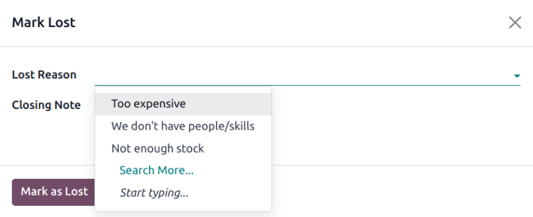
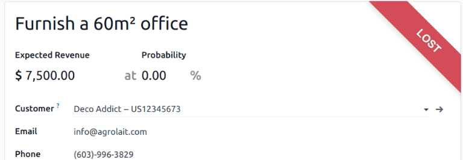

# Manage lost opportunities

Not every opportunity results in a successful sale. To keep the pipeline up-to-date, *lost*
opportunities need to be identified. Specifying why an opportunity was lost provides additional
insight that can prove useful for future opportunities.

## Mark an opportunity as lost

To mark an opportunity as lost, first open the CRM app, and select an opportunity
from the pipeline, by clicking on its corresponding Kanban card. Doing so reveals that opportunity's
detail form.

Then, click Lost, located at the top of the opportunity's detail form.

This opens the Mark Lost pop-up window. From the Lost Reason drop-down menu,
choose an existing lost reason. If no applicable reason is available, create a new one by entering
it into the Lost Reason field, and clicking Create.

Additional notes and comments can be added below the lost reason in the designated
Closing Note field.

When all the desired information has been entered in the Mark Lost pop-up window, click
Mark as Lost.

After clicking Mark as Lost, a red Lost banner is added to the upper-right
corner of the opportunity.

#### NOTE
To mark an *inactive* (archived) opportunity as lost, set the Probability field to
`0` percent.

## Create/edit lost reasons

To create a new lost reason, or edit an existing one, navigate to CRM app ‣
Configuration ‣ Lost Reasons.

To edit an existing lost reason:

1. Click on the reason to be edited to highlight it.
2. Change the selected lost reason by editing the Description field.
3. When finished, click Save in the upper-left corner.

To create a new lost reason:

1. Click New in the upper-left corner of the Lost Reasons page.
2. In the new blank line, click in the Description field, then type the new lost reason.
3. When finished, click Save.

## View lost opportunities

To retrieve lost opportunities in Odoo *CRM*, open the CRM app. On the main
Pipeline dashboard, click into the Search... bar at the top of the page, and
remove all of the default filters.

Open the Filters drop-down menu, by clicking the 🔻(triangle pointed down)
icon to the right of the Search... bar to open the drop-down menu containing
Filters, Group By, and Favorites options, designated into
respective columns.

Select the Lost option from the Filters section. Upon selecting
Lost, only the opportunities marked as `Lost` appear on the Pipeline page.

### Sort opportunities by lost reason

To filter opportunities by a specific lost reason, click the 🔻(triangle pointed down)
icon to the right of the Search... bar again to open the drop-down menu. In addition to
the Lost filter, under the Filters column, click Add Custom
Filter, which opens an Add Custom Filter pop-up window.

On the Add Custom Filter pop-up window, click in the first field, and type `Lost Reason`
in the Search... bar, or scroll to search through the list to locate it. Then, click
into the next field, and select = from the drop-down menu. Click into the third field,
and select a lost reason from the drop-down menu. Finally, click Add.

## Restore lost opportunities

To restore a lost opportunity, open the CRM app to reveal the Pipeline
dashboard. Or, navigate to CRM app ‣ Sales ‣ My Pipeline. From here, click the
🔻(triangle pointed down) icon to the right of the Search... bar to open the
drop-down menu that contains Filters, Group By, and Favorites
columns.

Under the Filters column, select Lost. Doing so reveals all the lost
opportunities on the Pipeline page.

Then, click on the Kanban card of the desired lost opportunity to restore, which opens that
opportunity's detail form.

From the lost opportunity's detail form, click Restore in the upper-left corner. Doing
so removes the red Lost banner from the opportunity form, signifying the opportunity has
been restored.

### Restore multiple opportunities at once

To restore multiple opportunities at once, navigate to the main Pipeline dashboard in
the *CRM* app, open the Filters drop-down menu, and select the Lost option.

Next, select the list view option, represented by the ≣ (list) icon in the upper-right
corner. Doing so places all the opportunities from the Pipeline page in a list view.
With the list view chosen, select the checkbox to the left of each opportunity to be restored.

Once the desired opportunities have been selected, click the ⚙️ Actions drop-down menu
at the top of the Pipeline page. From the ⚙️ Actions drop-down menu, select
Unarchive.

Doing so removes those selected opportunities from the Pipeline page because they no
longer fit the Lost filter criteria. Delete the Lost filter from the search
bar to reveal these newly-restored opportunities.

## Manage lost leads

If *Leads* are enabled on a database, they can be marked as *lost* in the same manner as
opportunities. Leads use the same [lost reasons](#crm-lost-reasons) as opportunities.

#### NOTE
To enable leads, navigate to CRM app ‣ Configuration ‣ Settings and check
the Leads checkbox. Then, click Save. This adds a new Leads
menu to the header menu bar at the top of the page.

### Mark a lead as lost

To mark a lead as lost, navigate to CRM app ‣ Leads, and select a lead from the
list. Doing so reveals that lead's detail form.

Then, click Lost, located at the top of the lead's detail form.

This opens the Mark Lost pop-up window. From the Lost Reason drop-down menu,
choose an existing lost reason. If no applicable reason is available, create a new one by entering
it into the Lost Reason field, and clicking Create.

Additional notes and comments can be added below the lost reason designated in the
Closing Note field.

When all the desired information has been entered in the Mark Lost pop-up window, click
Mark as Lost.

### Restore lost leads

To restore a lost lead, navigate to CRM app ‣ Leads, then click the 🔻
(triangle pointed down) icon to the right of the Search... bar to open the drop-down
menu that contains the Filters, Group By, and Favorites columns.

Under the Filters column, select Lost. Doing so reveals all the lost leads
on the Leads page.

Then, click on the desired lost lead to restore, which opens that lead's detail form.

From the lost lead's detail form, click Restore in the upper-left corner. Doing so
removes the red Lost banner from the lead form, signifying the lead has been restored.

### Restore multiple leads at once

To restore multiple leads at once, navigate to CRM app ‣ Leads, open the
Filters drop-down menu, and select the Lost option. Select the checkbox to
the left of each lead to be restored.

Once the desired leads have been selected, click the ⚙️ Actions drop-down menu at the
top of the Leads page. From the ⚙️ Actions drop-down menu, select
Unarchive.

Doing so removes those selected leads from the Leads page because they no longer fit the
Lost filter criteria. Delete the Lost filter from the Search...
bar to reveal these newly-restored leads.

#### SEE ALSO
[Phân tích chu trình](../performance/win_loss.md)
