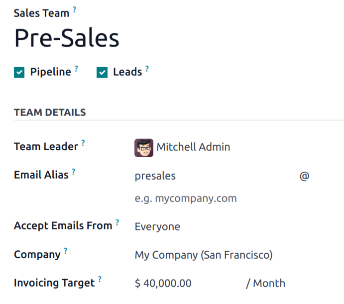
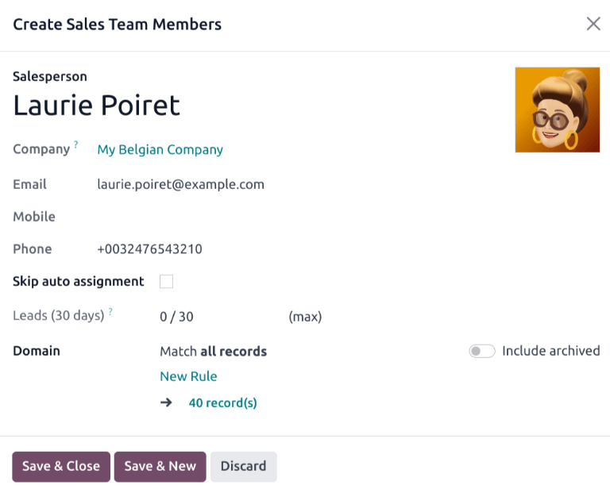
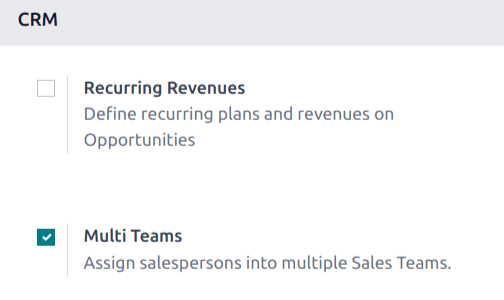
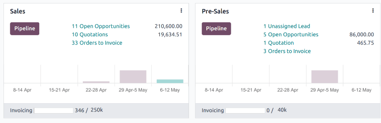

# Manage sales teams

The *Sales Teams* feature within Odoo's *CRM* app allows for the creation and management of multiple
sales teams, each with their own assignment rules, invoicing targets, and roster of salespeople.

## Create a sales team

To create a new sales team, go to CRM app ‣ Configuration ‣ Sales Teams, then
click New.

On the blank sales team form, enter a name in the Sales Team field.

Next, select a Team Leader from the drop-down list.

Set an Email Alias to automatically generate a lead/opportunity for this sales team
whenever a message is sent to that unique email address. Choose whether to accept emails from
Everyone, Authenticated Partners, Followers Only, or
Authenticated Employees.

Select a Company from the drop-down menu to assign this team to.

#### NOTE
The Company field is only visible in multi-company databases, and is not required.

#### NOTE
If the *Sales* app is installed on the database, an Invoicing Target field appears on
the sales team form. This is the revenue target for the current month. The amount entered in this
field is used to populate the invoicing progress bar on the [sales team dashboard](#crm-sales-team-dashboard).

### Add sales team members

To add team members, click Add under the Members tab when editing the sales
team's configuration page. This opens a Create Sales Team Members pop-up window.

#### NOTE
If the Rule-Based Assignment feature has **not** been enabled on the *CRM* app's
*Settings* page, clicking Add under the Members tab opens an
Add: Salespersons pop-up window. Tick the checkbox to the far-left of the
salesperson to be added to the team, then click Select.

Select a user from the Salesperson drop-down list to add them to the team. To prevent
this salesperson from being automatically assigned leads, tick the Skip auto assignment
checkbox. If this feature is activated, the salesperson can still be assigned leads manually.

The Leads (30 days) field tracks how many leads the salesperson has been assigned in the
past thirty days for this team, and the maximum number of leads they should be assigned. To edit the
maximum number of leads this salesperson can be assigned, enter that amount in the Leads
(30 days) field.

Click Save & Close when finished, or Save & New to add additional members.

## Enable multi teams

To allow salespeople to be assigned to more than one sales team, the *Multi Teams* setting needs to
be enabled. First, navigate to CRM app ‣ Configuration ‣ Settings. Under the
CRM section, tick the checkbox labeled Multi Teams. Then, click
Save at the top-left of the page.

## Sales team dashboard

To view the sales team dashboard, go to CRM app ‣ Sales ‣ Teams. Any team the
user is a member of appears in the dashboard.

Each Kanban card gives an overview of the sales team's open opportunities, quotations, sales orders,
and expected revenue, as well as a bar graph of new opportunities per week, and an invoicing
progress bar.

Click the Pipeline button to go directly to that team's *CRM* pipeline.

Click on the <i class="fa fa-ellipsis-v"></i> (vertical ellipsis) icon in the top-right corner of
the Kanban card to open a drop-down menu. Then, to view or edit the team's settings, click
Configuration.

#### SEE ALSO
- [Utilize activities for sales teams](../optimize/utilize_activities.md)
- [Assign leads with predictive lead scoring](../track_leads/lead_scoring.md)
