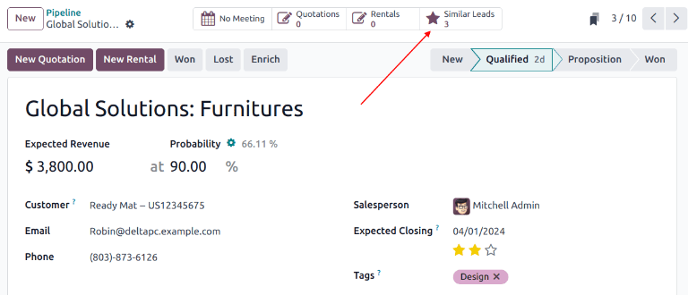
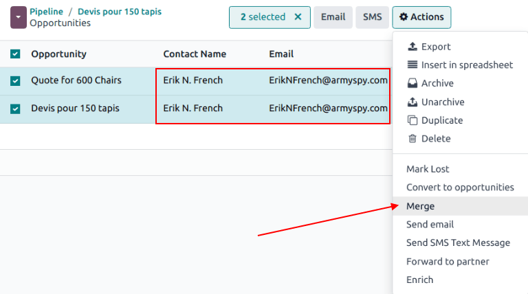

# Merge similar leads and opportunities

Odoo automatically detects similar *leads* and *opportunities* within the *CRM* app. Identifying
these duplicated records allows them to be merged without losing any information in the process.
Not only does this help keep the *pipeline* organized, but it also prevents customers from being
contacted by more than one salesperson.

#### NOTE
When merging opportunities, no information is lost. Data from the other opportunity is logged in
the chatter, and the information fields, for reference.

## Identify similar leads and opportunities

Similar leads and opportunities are identified by comparing the *email address* and *phone number*
of the associated contact. If a similar lead/opportunity is found, a *Similar Leads* smart button
appears at the top of the lead (or opportunity) record.

### Comparing similar leads and opportunities

Để so sánh chi tiết các lead/cơ hội tương tự, hãy đi đến Ứng dụng CRM ‣ Chu trình hoặc Ứng dụng CRM ‣ Lead. Mở một lead hoặc cơ hội, sau đó nhấp vào nút thông minh Lead tương tự. Thao tác này sẽ mở chế độ xem Kanban chỉ hiển thị các lead/cơ hội tương tự. Nhấp vào một thẻ để xem chi tiết lead/cơ hội đó và xác nhận xem có nên hợp nhất chúng hay không.

## Merging similar leads and opportunities

#### IMPORTANT
When merging, Odoo gives priority to whichever lead/opportunity was created in the system first,
merging the information into the first created lead/opportunity. However, if a lead and an
opportunity are being merged, the resulting record is referred to as an opportunity, regardless
of which record was created first.

After confirming that the leads/opportunities should be merged, return to the Kanban view using the
breadcrumb link, or by clicking the Similar Leads smart button. Click the
<i class="oi oi-view-list"></i> (list) icon to change to list view.

Check the box on the left of the page for the leads/opportunities to be merged. Then, click the
<i class="fa fa-cog"></i> Actions icon at the top of the page, to reveal a drop-down menu. From
that drop-down menu, select the Merge option to merge the selected opportunities or
leads.

When Merge is selected from the <i class="fa fa-cog"></i> Actions drop-down menu, a
Merge pop-up modal appears. In that pop-up modal, under the Assign
opportunities to heading, select a Salesperson and Sales Team from the
appropriate drop-down menus.

Below those fields, the leads/opportunities to merge are listed, along with their related
information. To merge those selected leads/opportunities, click Merge.

## When leads/opportunities should not be merged

There may be instances where a similar lead or opportunity is identified, but should *not* be
merged. These circumstances vary, based on the processes of the sales team and organization. Some
potential scenarios are listed below.

### Lost leads

If a lead/opportunity has been marked as [lost](lost_opportunities.md), it can still be merged
with an active lead or opportunity. The resulting lead/opportunity is marked active, and added to
the pipeline.

### Different contact within an organization

Leads/opportunities from the same organization, but with different points of contact, may not have
the same needs. In this case, it is beneficial to *not* merge these records, though assigning the
same salesperson, or sales team, can prevent duplicated work and miscommunication.

### Existing duplicates with more than one salesperson

If more than one lead/opportunity exists in the database, there may be multiple salespeople assigned
to them, who are actively working on them independently. While these leads/opportunities may need
to be managed separately, it is recommended that any affected salespeople be tagged in an internal
note for visibility.

### Contact information is similar but not exact

Similar leads and opportunities are identified by comparing the email addresses and phone numbers of
the associated contacts. However, if the email address is *similar*, but not *exact*, they may need
to remain independent.
