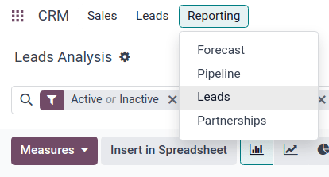
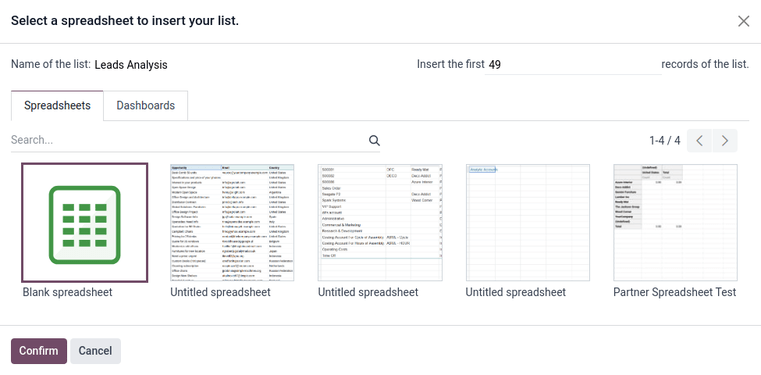

# Marketing attribution reports

Use the Odoo *CRM* app to compile a *marketing attribution report*, which analyzes the source of
leads, and groups them in such a way as to calculate marketing's overall impact on lead generation,
attribution, won rate, and more.

## Leads Analysis dashboard

Begin by navigating to the Leads Analysis dashboard by going to CRM app
‣ Reporting ‣ Leads.

#### SEE ALSO
- [Convert leads into opportunities](applications/sales/crm/acquire_leads/convert.md)
- [Create leads](applications/sales/crm/acquire_leads/email_manual.md)

The <i class="fa fa-area-chart"></i> (graph) view is shown, by default, with Active or
Inactive and Created on: [current year] filters active in the Search...
bar. The graph visualization displays the number of leads generated, by month and by sales team,
with each sales team attributed to its own color per month shown.

Switch the view to the <i class="oi oi-view-list"></i> (list) option, by clicking the respective
icon located at the top-right of the dashboard. This allows leads to easily be displayed in the
grouping set by the *Group By* parameters.

## Add UTM parameters

*Urchin Tracking Modules (UTMs)* are snippets of text embedded in URLs that are used to track
visitor data. This includes parameters relating to how a visitor reached the link, such as the type
of website visited, and/or marketing campaign the visit came from.

Odoo can use these UTMs as parameters in the marketing attribution report to track the metrics and
performance of marketing campaigns.

### Create UTMs

The [link tracker](applications/websites/website/reporting/link_tracker.md) in Odoo can be used to
create and configure UTMs.

UTMs can also be automatically generated by the [Email Marketing](applications/marketing/email_marketing.md) and [Marketing Automation](applications/marketing/marketing_automation.md) apps.

The UTM parameters used in a marketing attribution report are *Medium*, *Source*, and *Campaign*, in
descending order of coverage.

- *Medium* is the UTM with the widest coverage, and is used to identify the medium used to access
  the link. This can include mediums such as social media, email, or cost per click (CPC).
- *Source* is more narrow, and is used to identify the source of traffic. For example, the name of
  a website, search engine used, or a specific social media platform.
- *Campaign* is the most narrow, and can track specific marketing campaigns by name. This can
  include a contest or product name, type of sale, etc.

## Tạo báo cáo

To start creating a report, click the <i class="fa fa-caret-down"></i> (down arrow) to the right of
the Search... bar to see the list of filtering and grouping parameters.

Filters, located in the left column of the search options, can be used to keep only the
results that fit the filter. For example, selecting the Won filter only shows leads that
have been won in the attribution report.

Group By, found in the middle column, is used to organize the results into groups, and
can be used with or without filters.

## Export reports

To set the measures of the report, begin by navigating to the <i class="oi oi-view-pivot"></i>
(pivot view) on the Leads Analysis dashboard.

Click the Measures button to view the available measures of
the report. Select the desired measures from the drop-down menu (multiple measures can be selected),
and verify the measures, filters, and groups are all displayed correctly in the pivot table. This
ensures the data is ready for export.

To quickly export the data in a list, as a .xlsx file, navigate to the <i class="oi oi-view-list"></i>
(list view). Click on the Actions <i class="fa fa-cog"></i> (gear) icon,
located to the right of Lead Analysis in the top-left of the page, and click
<i class="fa fa-upload"></i> Export All. The report downloads automatically as a .xlsx file.

For more export options, the report can be exported to the Odoo *Documents* app. From the
<i class="oi oi-view-list"></i> (list view) of Leads Analysis page, begin by clicking
the Actions <i class="fa fa-cog"></i> (gear) icon again. Now, navigate to
<i class="fa fa-table"></i> Spreadsheet, and click <i class="oi oi-view-list"></i> Insert list in
spreadsheet. A pop-up window titled, Select a spreadsheet to insert your list. appears.

The report can be renamed using the `Name of the list` field, if desired. The number of items on the
report can be set with the field labeled: `Insert the first _ records of the list`. Next, select
either a new Blank spreadsheet, or export into an existing spreadsheet. Finally, click
the Confirm button.

To export the report as a .xlsx file, for use in an external spreadsheets program, click the
Actions <i class="fa fa-cog"></i> (gear) icon, and select the <i class="fa fa-upload"></i>
Export All option. If prompted, choose a file location, name the file, then click
Save.
