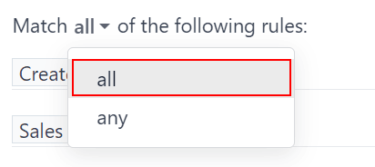

# Quality leads report

A *quality lead* is a lead that is likely to result in a sale. It should match the characteristics
most commonly believed to help salespeople close a deal, in addition to more precise criteria that
is specific to each organization.

#### NOTE
The specific criteria that defines a *quality lead* is different for every organization. For more
information, see [Define a quality lead](#track-links-define-a-lead).

A quality leads *report* compares how many quality leads each salesperson has received over a
specific amount of time, such as within the past 30 days. Sales managers can use such a report to
make more informed decisions when assigning new leads to their team

## Create a quality leads report

To create a quality leads report, first navigate to CRM app ‣ Reporting ‣
Pipeline to open the Pipeline Analysis dashboard. Click into the Search...
bar at the top of the page and remove any active filters.

Click the 🔻(triangle pointed down) icon to the right of the Search... bar
to open the drop-down mega menu that contains Filters, Group By, and
Favorites columns. Click Add Custom Filter. This opens a Add
Custom Filter pop-up window.

The Add Custom Filter pop-up window allows for the creation of more specific filters.

### Add custom filters

In order to generate a quality leads report, filters need to be created for the following
conditions:

- [Starting date](#quality-leads-report-starting-date): limits results to those created within
  a specific time frame.
- [Specific sales teams](#quality-leads-report-sales-team): limits results to only include
  leads for one or more sales teams. This filter is optional and should not be included if the is
  intended for the entire company.
- [Exclude unassigned leads](#quality-leads-report-unassigned-leads): excludes leads without an
  assigned salesperson.
- [Include archived leads](#quality-leads-report-archived-leads): ensures that both active and
  inactive leads are included in the results.
- [Add rules for quality leads](#quality-leads-report-add-quality-rules): includes or excludes
  results based on criteria that is specific to a company or sales team.

#### Add a starting date filter

Begin by first defining the rule's parameter with a date range, by clicking into the first field, on
the left of the row, and typing `Created On` in the Search... bar, or by scrolling
through the menu's list to locate it.

In the rule's operator drop-down menu, define the parameter further by selecting either:

- >= (greater than or equal to) to specify a start date and include all entries *after*
  that start date (as well as the initial value itself); or
- is between to more sharply define a time frame with a clear start and end date. All
  matching entries that fit within the defined start and end dates are included in the report.

With either option, use the pop-up calendar's day and time pickers, in the far right field, to
define the respective date range. Setting these values concludes the creation of the first rule.

#### Add a sales team filter

#### NOTE
This filter is optional. To view results for the entire company, do **not** add this filter.

To limit the results of the report to one or more sales teams, click New Rule. Next,
click the first field for the new rule, and type `Sales Team` in the Search... bar, or
scroll to search through the list to locate it.

In the rule's second field, select is in from the drop-down menu. Selecting this
operator limits results to the sales teams selected in the next field.

Lastly, in the third field, select the desired sales team from the drop-down menu. Multiple teams
can be added in this field, where each parameter is treated with an "or" (e.g. "any") operator in
the search logic.

#### Exclude unassigned leads

Next, add a New Rule. Then, click into the first field for the new rule, and type
`Salesperson` in the Search... bar, or scroll to search through the list to locate it.

In the rule's second field, select is set from the drop-down menu. Selecting this
operator excludes any leads not assigned to a specific salesperson.

#### Include archived leads

Next, in the upper-right corner of the Add Custom filter pop-up window, move the
Include archived toggle to active.

Enabling this feature adds archived (inactive) leads to the report.

#### Add rules for quality leads

The filters added in this step vary, based on how an organization defines a *quality lead*.

##### Define a quality lead

As defined earlier, a *quality lead* is a lead that is likely to result in a won opportunity.
Although the exact criteria for a quality lead varies from organization to organization, it is often
a combination of factors commonly attributed to positive sales outcomes, in addition to factors
valued by the specific organization.

In addition to the basic filters and grouping options outlined in the general [Quality leads
report](#track-links-create-quality-leads-report), consider the following filters when defining a
quality lead:

- Email or Phone: the information in these fields can help determine whether
  or not a lead is a professional contact.
- Source: this field links to the marketing and lead generation efforts from other Odoo
  applications, including *Live Chat*, *Social Marketing*, and *Email Marketing*.
- Stage: this filter can be used to eliminate or target leads that have reached specific
  stages.
- Medium: a lead's source can indicate its quality level, as various channels have
  different won rates and expected revenues.
- Campaign: adding this filter helps track of the success of different marketing efforts
  to capture high quality leads.
- Lost Reason: exclude leads that may appear to be quality based on various criteria,
  but have been marked as *lost* for specified reasons.
- Tags: include or exclude results based on one or more customized tags.

## View the report

#### IMPORTANT
At the top of the Add Custom Filter form, there is an option to match any
or all of the rules. In order to properly run the report, only records that match
**all** of the following filters should be included. Before adding the filters, make sure
all is selected in this field.

After the filters are configured, click Add. The default display for the report is a bar
graph, where the leads are grouped by *stage*.

Để nhóm kết quả theo chuyên viên sales, nhấp biểu tượng 🔻(tam giác hướng xuống) bên phải thanh Tìm kiếm... để mở menu thả xuống. Dưới tiêu đề Nhóm theo, chọn Chuyên viên sales. Trong cùng cột đó, dưới tiêu đề Nhóm theo, nhấp Thêm nhóm tùy chỉnh, sau đó chọn Hoạt động từ menu thả xuống để thêm lớp *trạng thái* lead, dưới nhóm chính Chuyên viên sales.

The report now displays the total count of *quality leads* each salesperson has received in the
designated time period. Because there are layered Group By filters, the grouped leads
are also color-coded to identify whether they are *active* or *marked as lost*.
