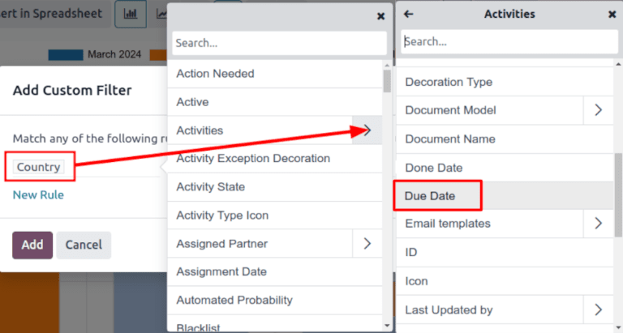

# Unattended leads report

*Unattended leads* are leads that have scheduled activities that are either due or past due.
Whenever an activity is scheduled, Odoo tracks the due date, and sends email reminders to the users
the activity is assigned to.

An *unattended leads report* compiles all active leads in the pipeline with due or past due
activities, allowing a sales manager to identify which opportunities require immediate attention.

By pulling a daily unattended leads report, sales managers can remind their teams to address
outstanding activities before they become past due, helping avoid neglected leads and reinforcing
proactive behaviors in their salespeople.

#### IMPORTANT
In order to pull a unattended leads report, sales teams **must** be regularly utilizing activity
in the *CRM* pipeline, on individual lead and opportunity cards.

It is **not** possible to compile a complete report if the sales people are not using the
*Activities* feature in the *chatter*

For more information, refer to [Activities](../../../essentials/activities.md)

## Create an unattended leads report

To create an unattended leads report, first navigate to CRM app ‣ Reporting ‣
Pipeline to open the Pipeline Analysis dashboard. Click into the Search...
bar at the top of the page, and remove all of the default filters.

#### NOTE
The Created on filter can remain active, as this variable may be useful to include in
the report.

Next, add custom filters by clicking the 🔻(triangle pointed down) icon to the right of
the Search... bar to open the drop-down menu that contains Filters,
Group By, and Favorites columns. Under the Filters column,
click Add Custom Filter, which opens an Add Custom Filter pop-up window.

The Add Custom Filter pop-up window allows for the creation of more specific filters.

### Add custom filters

In order to generate an unattended leads report, filters need to be created for the following
conditions:

> - [Past due activities](#unattended-leads-report-past-due): limits the results to only include
>   leads with an assigned activity where the due date has past. This can be altered to include
>   activities due to occur on the date the report is generated as well.
> - [Unassigned leads](#unattended-leads-report-exclude-unassigned): excludes leads without an
>   assigned salesperson.
> - [Specific sales teams](#unattended-leads-report-sales-team): limits results to only include
>   leads assigned to one or more sales teams. This filter is optional and should not be included if
>   the report is intended for the entire company.

#### Add filter for past due activities

Click the first field for the new rule, and type `Activities` in the Search... bar, or
scroll to search through the list to locate it. Then, next to Activities, click the
> (greater than sign) to open a new drop-down menu with secondary conditions.

Type `Due Date` in the Search... bar, or scroll to search through the list. Click
Due Date to add it to the rule.

> 

Then, click into then next field and select <= from the drop-down menu. Selecting this
operator includes all activities with a due date up to, and including, the date selected in the next
field.

The third field can be left as today's date, or adjusted as needed.

#### Exclude unassigned leads

After filtering for activities, add a New Rule. Then, click into the first field for the
new rule, and type `Salesperson` in the Search... bar, or scroll to search through the
list to locate it.

In the rule's second field, select is set from the drop-down menu. Selecting this
operator excludes any leads not assigned to a specific salesperson.

#### Add a Sales team

#### NOTE
This filter is optional. To view results for the entire company, do **not** add this filter, and
continue to [View results](#unattended-leads-report-view-results)

To limit the results of the report to one or more sales teams, click New Rule. Next,
click the first field for the new rule, and type `Sales Team` in the Search... bar, or
scroll to search through the list to locate it.

In the rule's second field, select is in from the drop-down menu. Selecting this
operator limits results to the sales teams selected in the next field.

Lastly, in the third field, select the desired sales team from the drop-down menu. Multiple teams
can be added in this field, where each parameter is treated with an "or" (e.g. "any") operator in
the search logic.

## Xem kết quả

At the top of the Add Custom Filter form, there is an option to match any or
all of the rules. In order to properly run the report, only records that match **all**
of the following filters should be included. Before adding the filters, make sure all is
selected in this field.

After the filters are configured, click Add. The resulting report displays all leads
assigned to a salesperson where an activity is past due, or is due on the current date. The default
display is a bar graph, where the leads are grouped by *stage*.

To group the results by salesperson, click the 🔻(triangle pointed down) icon to the
right of the Search... bar to open the drop-down menu that contains Filters,
Group By, and Favorites columns. Under the Group By heading,
select Salesperson.

#### NOTE
The option to group by Sales Team is also available under the Group By
heading.

To change to a *list* view, click the ≣ (list) icon in the top-right corner of the
screen.

#### SEE ALSO
[Hoạt động](../../../essentials/activities.md)
