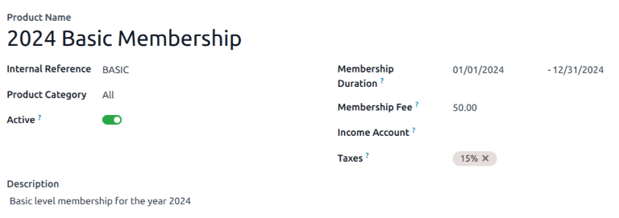
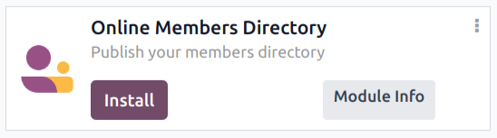

# Thành viên

The *Members* application is where all operations related to memberships can be configured and
managed. The *Members* app integrates with the *Sales* and *Accounting* applications to sell and
invoice memberships directly to customers.

## Dịch vụ thẻ thành viên

To create a new membership product, navigate to Members app ‣ Configuration ‣
Membership Products, and click New to open a blank product record.

Complete the blank form with the necessary information, including the Membership
Duration.

#### NOTE
Membership products require a start and end date, as they are used to determine [membership
status](#sales-membership-status). Membership products can be sold *before* their active start
date.

Membership products can be added to a sales order, and invoiced as regular products or
subscriptions.

## Activate a membership

To activate a membership from the *Contacts* application, navigate to Contacts app,
and click on a contact to open that specific contact's detail form.

From the resulting contact form, open the Membership tab, and click Buy
Membership.

On the Join Membership pop-up window that appears, select a Membership from
the drop-down menu. Then, configure a Member Price.

Click Invoice Membership when both fields are filled in. Doing so reveals a
Membership Invoices page, wherein invoices can be confirmed and completed.

Ngoài ra, để cung cấp tư cách thành viên miễn phí, hãy đánh dấu vào ô Thành viên miễn phí trong tab Thành viên của biểu mẫu liên hệ.

## Membership status

The Current Membership Status is listed on the Membership tab of each
contact record:

- Non Member: a partner who has **not** applied for membership.
- Cancelled Member: a member who has cancelled their membership.
- Old Member: a member whose membership end date has passed.
- Waiting Member: a member who has applied for membership, but whose invoice has not
  yet been created.
- Invoiced Member: a member whose invoice has been created, but has not been paid.
- Paid Member: a member who has paid the membership fee.

## Publish members directory

To publish a list of active members on the website, the *Online Members Directory* application must
first be [installed](../general/apps_modules.md#general-install). After installing the module, add the `/members` page to
the website's menu by [editing the website menu](../websites/website/pages/menus.md).

### Publish individual members

Return to CRM app ‣ Sales ‣ Customers, and click the Kanban card for a member.
From the resulting customer form that appears, click the Go to Website smart button at
the top of the page to open the member's webpage.

Click the <i class="fa fa-pencil"></i> Edit button to reveal a sidebar of editing tools. After
making any necessary changes to the page, click Save. At the top of the page, slide the
Unpublished toggle to the active, Published position.

Repeat these steps for all desired members.

* [Members analysis](members/members_analysis.md)
