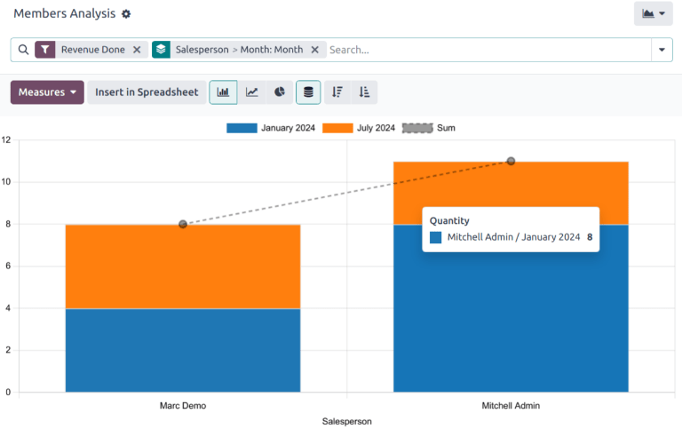

# Members analysis

The *Members Analysis* report provides a detailed overview of all memberships sold and managed
within the *Members* application.

To access the *Memberships Analysis* report, navigate to Members app ‣ Reporting.

## Navigate the report

The default *Members Analysis* report displays a bar chart, measuring the Quantity of
memberships against the amount of Revenue Done. The data is grouped by the assigned
salesperson, then by the month the membership begins.

Additional [Group By](../../essentials/search.md#search-group) options include the following:

- Salesperson: the internal user in charge of the contact. This information is managed
  in the *Salesperson* field on the *Sales & Purchase* tab on the contact's record.
- Associated Partner: the contact listed as the *Associated Member* on the *Membership*
  tab on the contact's record.
- Membership Product: the type of membership assigned to a contact. This includes both
  purchased memberships and free memberships.
- Current Membership State: the status of the membership.
- Company: the company the membership is purchased through. This option only appears in
  multi-company databases.
- Month: the month the membership began.

## Xem kết quả

Click the <i class="fa fa-area-chart"></i> (graph) icon to change to graph view. Then, click the
corresponding icon at the top of the report to switch to a <i class="fa fa-bar-chart"></i> (bar
chart), <i class="fa fa-line-chart"></i> (line chart), or <i class="fa fa-pie-chart"></i> (pie
chart).

Click the <i class="oi oi-view-pivot"></i> (pivot) icon to change to the pivot view.

#### SEE ALSO
- [Bộ lọc tuỳ chỉnh](../../essentials/search.md#search-custom-filters)
- [Yêu thích](../../essentials/search.md#search-favorites)
