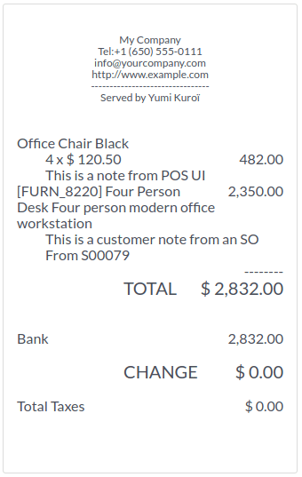
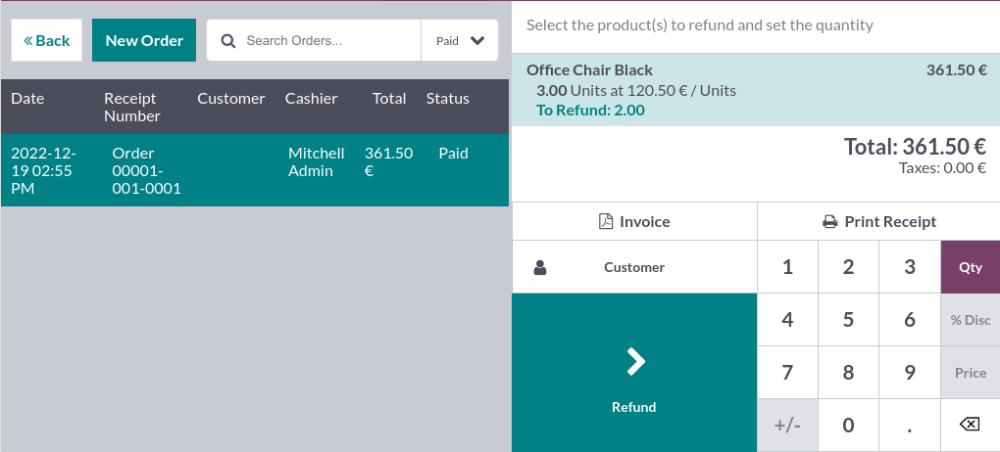

# Điểm bán hàng

With **Odoo Point of Sale**, run your shops and restaurants easily. The app works on any device with
a web browser, even if you are temporarily offline. Product moves are automatically registered in
your stock, you get real-time statistics, and your data is consolidated across all shops.

#### SEE ALSO
- [Odoo Tutorials: Point of Sale Tutorials](https://www.odoo.com/slides/point-of-sale-28)
- [IoT Boxes Documentations](applications/general/iot.md)

## Start a session

From the **POS dashboard**, click New Session, and at the Opening Cash
Control screen, click Open Session to start a POS session, or click Continue
Selling if the session is already opened.

#### NOTE
[Multiple users](applications/sales/point_of_sale/employee_login.md) can be logged into the same session at the
same time. However, the session can only be opened once on the same browser.

## Sell products

Click on products to add them to the cart. To change the **quantity**, click Qty and
enter the number of products using the keypad. To add a **discount** or modify the product
**price**, click respectively % Disc or Price and enter the amounts.

Once an order is completed, proceed to checkout by clicking Payment. Select the
**payment method**, enter the received amount, and click Validate. Click
New Order to move on to the next customer.

#### NOTE
The system can only load a limited number of products for effective opening. Click
Search more if the desired product is not loaded automatically.

## Set customers

Registering your customer is necessary to [collect their loyalty points and grant them rewards](applications/sales/point_of_sale/pricing/loyalty.md), automatically apply the [attributed pricelist](applications/sales/point_of_sale/pricing/pricelists.md), or [generate and print an invoice](applications/sales/point_of_sale/receipts_invoices.md#receipts-invoices-invoices).

You can create customers from an [open POS session](#pos-session-start) by clicking
Customer ‣ Create, and filling in the contact information. You can also create
customers from the backend by going to Point of Sale ‣ Orders ‣ Customers and
clicking New. Then, fill in the information and save.

To set a customer during an order, access the list of customers by clicking Customer on
the POS interface. You can also set a customer at the payment screen by clicking
Customer.

## Customer notes

You can add **customer notes** about specific products directly from an open [POS session](#pos-session-start). For instance, to provide cleaning and maintenance tips. They can also be used
to track a customer's particular request, such as not wanting the product to be assembled for them.

To do so, select a product and click Customer Note on the pad. Doing so opens a pop-up
window in which you can add or modify content for the note.

#### NOTE
Product notes from an [imported SO](applications/sales/point_of_sale/shop/sales_order.md) are displayed
identically in the cart.

Customer notes appear on customers' receipts and invoices similarly to how they appear in the cart,
under the related product.

## Return and refund products

To return and refund a product,

1. [start a session](#pos-session-start) from the **POS dashboard**;
2. click Refund and select the corresponding order;
3. select the product and the quantity to refund using the keypad;
4. click Refund to go back to the previous screen;
5. once the order is completed, click Payment to proceed to the refund;
6. click Validate and New Order to move on to the next customer.

#### NOTE
- You can filter the **orders list** by Receipt Number, Date or
  Customer using the search bar.
- You can also refund a product by selecting the returned product from an open session, and
  setting a negative quantity that equals the number of returned products. To do so, click
  Qty and +/-, followed by the quantity of returned products.

Once the return payment is validated, Odoo generates the required credit note, referencing the
original receipt or invoice and partially or fully canceling the document.

## Manage the cash register

To add or take out cash from the register, click the **menu icon** in the upper right corner of your
screen and Cash In/Out.

Doing so opens a pop-up window on which you can select Cash In or Cash Out,
enter the amount and the reason, and click Confirm.

## Close the POS session

To close your session, click the **menu icon** in the upper right corner of your screen and
Close Session.

Doing so opens the Closing Control pop-up screen. From this screen, you can retrieve
various information:

- the number of orders made and the total amount made during the session;
- the expected amounts grouped by payment method.

Trước khi đóng cửa sổ này, hãy đếm tiền mặt bằng biểu tượng máy tính. Thao tác này sẽ mở cửa sổ bật lên tính toán tổng số tiền trong ngăn két dựa trên các đồng xu và tờ tiền được đếm và nhập thủ công. Sau đó, nhấp Xác nhận hoặc Hủy để đóng cửa sổ. Số tiền tính toán sẽ được hiển thị trong cột Đã đếm, và Thông tin tiền được ghi rõ trong phần **Ghi chú**.

Once you are done controlling the amounts, click Close Session to close and go back to
the **POS dashboard**.

#### NOTE
- To reach the backend without closing the session, click Backend on the dropdown
  menu.
- To abort, click Discard on the pop-up window.
- Depending on your setup, you might only be allowed to close a session if the expected cash
  revenue equals the counted cash. To close it anyway, click Ok on the
  Payments Difference screen.

* [Cấu hình](applications/sales/point_of_sale/configuration.md)
  * [IoT system connection](applications/sales/point_of_sale/configuration/pos_iot.md)
  * [Máy in ePOS](applications/sales/point_of_sale/configuration/epos_printers.md)
  * [Secure connection (HTTPS)](applications/sales/point_of_sale/configuration/https.md)
  * [Self-signed certificate for ePOS printers](applications/sales/point_of_sale/configuration/epos_ssc.md)
* [Multi-employee management](applications/sales/point_of_sale/employee_login.md)
* [Receipts and invoices](applications/sales/point_of_sale/receipts_invoices.md)
* [Màn hình khâu chuẩn bị](applications/sales/point_of_sale/preparation.md)
* [Self-ordering](applications/sales/point_of_sale/self_order.md)
* [Product combos](applications/sales/point_of_sale/combos.md)
* [Shop features](applications/sales/point_of_sale/shop.md)
  * [Đơn bán hàng](applications/sales/point_of_sale/shop/sales_order.md)
  * [Mã vạch](applications/sales/point_of_sale/shop/barcode.md)
  * [Serial numbers and lots](applications/sales/point_of_sale/shop/serial_numbers.md)
  * [Giao hàng sau](applications/sales/point_of_sale/shop/ship_later.md)
  * [Màn hình cho khách hàng](applications/sales/point_of_sale/shop/customer_display.md)
* [Restaurant features](applications/sales/point_of_sale/restaurant.md)
  * [Floors and tables](applications/sales/point_of_sale/restaurant/floors_tables.md)
  * [Orders printing](applications/sales/point_of_sale/restaurant/kitchen_printing.md)
  * [Hoá đơn](applications/sales/point_of_sale/restaurant/bill_printing.md)
  * [Tiền tip](applications/sales/point_of_sale/restaurant/tips.md)
* [Pricing features](applications/sales/point_of_sale/pricing.md)
  * [Chiết khấu](applications/sales/point_of_sale/pricing/discounts.md)
  * [Discount tags (barcode scanner)](applications/sales/point_of_sale/pricing/discount_tags.md)
  * [Chương trình khách hàng thân thiết](applications/sales/point_of_sale/pricing/loyalty.md)
  * [Bảng giá](applications/sales/point_of_sale/pricing/pricelists.md)
  * [Flexible taxes (fiscal positions)](applications/sales/point_of_sale/pricing/fiscal_position.md)
  * [Làm tròn tiền](applications/sales/point_of_sale/pricing/cash_rounding.md)
  * [Electronic shelf labels](applications/sales/point_of_sale/pricing/electronic_labels.md)
* [Phương thức thanh toán](applications/sales/point_of_sale/payment_methods.md)
  * [Payment terminals](applications/sales/point_of_sale/payment_methods/terminals.md)
    * [Adyen](applications/sales/point_of_sale/payment_methods/terminals/adyen.md)
    * [Ingenico](applications/sales/point_of_sale/payment_methods/terminals/ingenico.md)
    * [Mercado Pago](applications/sales/point_of_sale/payment_methods/terminals/mercado_pago.md)
    * [Razorpay](applications/sales/point_of_sale/payment_methods/terminals/razorpay.md)
    * [SIX](applications/sales/point_of_sale/payment_methods/terminals/six.md)
    * [Stripe](applications/sales/point_of_sale/payment_methods/terminals/stripe.md)
    * [Vantiv](applications/sales/point_of_sale/payment_methods/terminals/vantiv.md)
    * [Viva Wallet](applications/sales/point_of_sale/payment_methods/terminals/viva_wallet.md)
    * [Worldline](applications/sales/point_of_sale/payment_methods/terminals/worldline.md)
* [Báo cáo](applications/sales/point_of_sale/reporting.md)
