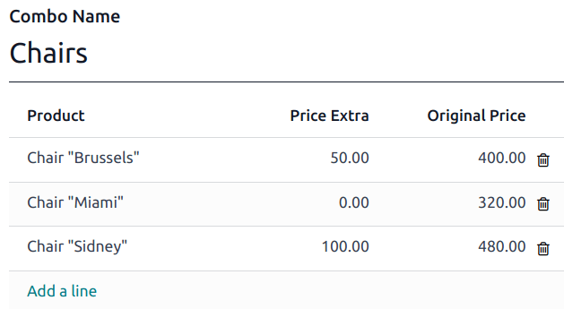
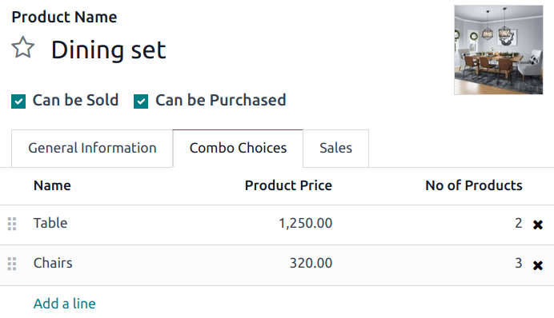
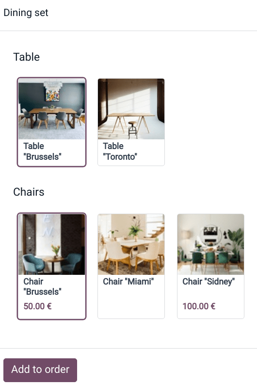

# Product combos

The **Product Combos** feature allows users to define and manage combination options for a single
product.

In the context of a restaurant, the feature enables users to create multiple-choice menus. For
example, a user can define a main dish and specify various options for sides, drinks, or desserts
that customers can combine with the main dish.

In retail, this feature allows you to create a product set with multiple products to choose from and
combine.

## Cấu hình

First, you need to create combination choices. To do so:

1. Go to Point of Sale ‣ Products ‣ Product Combos and click New.
2. Name your combo and add the products you want customers to choose from by clicking Add
   a line. You can also include an extra price for each option in the Extra Price
   column.

#### NOTE
As a reference, the selected product's original price is displayed in the Original
Price column.

Second, you need to create a specific product to gather combo choices. To do this:

1. Go to Point of Sale ‣ Products ‣ Products and click New.
2. Set the Product Type to Combo and fill in the  General
   Information tab.

   #### NOTE
   Giá bán của sản phẩm combo là cố định và không thay đổi dựa trên giá của từng mặt hàng riêng lẻ hoặc số lượng mặt hàng trong combo. Giá của sản phẩm combo chỉ bị ảnh hưởng bởi phần giá bổ sung được xác định tùy chọn khi tạo lựa chọn combo, hoặc nếu một biến thể của một trong các mặt hàng có mức giá bổ sung được chỉ định.
3. Go to the Combo Choices tab, click Add a line, and select the
   combinations to add. You can also create a new combination at this step by clicking
   New on the popup window.

Once you have created and added the combo choices into a product, you can sell combos in your retail
store or restaurant.

## Practical application

[Open a POS session](../point_of_sale.md#pos-session-start) and select the combo product. Choose the options and
click Add to order. As a reminder, the extra price appears under the related choices.

