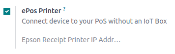

# Máy in ePOS

ePOS printers are designed to work seamlessly with Point of Sale systems. Once connected, these
devices automatically share information, allowing for direct printing of tickets from the POS system
to the ePOS printer.

## Cấu hình

To use an ePos printer in Point of Sale:

1. [Access the POS settings](../configuration.md#configuration-settings).
2. Activate the ePos Printer feature.
3. Fill in the field with your ePos IP address.

#### NOTE
When the printer connects to a network, it automatically prints a ticket with its IP address.

## Directly supported ePOS printers

The following ePOS printers are directly compatible with Odoo without needing an [IoT system](../../../general/iot/devices/printer.md).

- Epson TM-m30 i/ii/iii (Wi-Fi/Ethernet models only; Recommended)
- Epson TM-H6000IV-DT (Chỉ máy in biên lai)
- Epson TM-T70II-DT
- Epson TM-T88V-DT
- Epson TM-L90-i
- Epson TM-T70-i
- Epson TM-T82II-i
- Epson TM-T83II-i
- Epson TM-U220-i
- Epson TM-m10
- Epson TM-P20 (Wi-Fi® model)
- Epson TM-P60II (Biên lai: dòng Wi-Fi®)
- Epson TM-P60II (Peeler: dòng Wi-Fi®)
- Epson TM-P80 (Wi-Fi® model)

## ePOS printers with IoT system integration

The following printers require an [IoT system](../../../general/iot/devices/printer.md) to
be compatible with Odoo:

- Epson TM-T20 family (incompatible ePOS software)
- Epson TM-T88 family (incompatible ePOS software)
- Epson TM-U220 family (incompatible ePOS software)

#### IMPORTANT
- Epson printers using Wi-Fi/Ethernet connections and following the [EPOS SDK Javascript protocol](https://download4.epson.biz/sec_pubs/pos/reference_en/technology/epson_epos_sdk.html) are
  compatible with Odoo **without** needing an [IoT system](../../../general/iot/devices/printer.md).
- Thermal printers using ESC/POS are compatible **with** an [IoT system](../../../general/iot/devices/printer.md).
- Epson printers using only USB connections are compatible **with** an [IoT system](../../../general/iot/devices/printer.md).
- Epson printers that connect via Bluetooth are **not compatible**.

#### SEE ALSO
- [Secure connection (HTTPS)](https.md)
- [Self-signed certificate for ePOS printers](epos_ssc.md)
