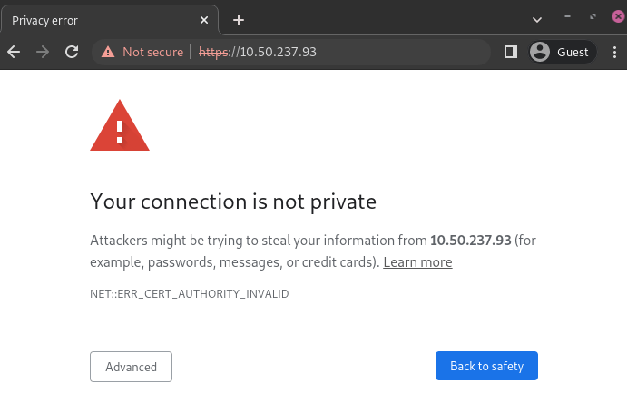

# Self-signed certificate for ePOS printers

Để làm việc với Odoo, một số mẫu máy in có thể hoạt động mà không cần [hệ thống IoT](applications/general/iot.md), nhưng có thể yêu cầu [giao thức HTTPS](applications/sales/point_of_sale/configuration/https.md) để thiết lập kết nối an toàn giữa trình duyệt và máy in. Tuy nhiên, khi truy cập địa chỉ IP của máy in qua HTTPS, hầu hết các trình duyệt sẽ hiển thị trang cảnh báo. Trong trường hợp này, bạn có thể tạm thời [bắt buộc kết nối](#epos-ssc-instructions), cho phép truy cập trang qua HTTPS và sử dụng máy in ePOS trong Odoo miễn là cửa sổ trình duyệt vẫn mở.

#### WARNING
The connection is lost after closing the browser window. Therefore, this method should only be
used as a **workaround** or as a pre-requisite for the [following instructions](#epos-ssc-instructions).

## Generate, export, and import self-signed certificates

For a long-term solution, you must generate a **self-signed certificate**. Then, export and import
it into your browser.

#### IMPORTANT
**Generating** an SSL certificate should only be done **once**. If you create another
certificate, devices using the previous one will lose HTTPS access.

Windows 10 & Linux OS

Generate a self-signed certificate

Navigate to the ePOS' IP address (e.g., `https://192.168.1.25`) and force the
connection by clicking Advanced and Proceed to [IP address]
(unsafe).

Then, sign in using your printer credentials to access the ePOS printer settings. To
sign in, enter `epson` in the ID field and your printer serial number in the
Password field.

Click Certificate List in the Authentication section, and click
create to generate a new **Self-Signed Certificate**. The Common
Name should be automatically filled out. If not, fill it in with the printer IP address
number. Select the years the certificate will be valid in the Validity
Period field, click Create, and Reset or manually restart the
printer.

The self-signed certificate is generated. Reload the page and click SSL/TLS
in the Security section to ensure **Selfsigned Certificate** is correctly
selected in the Server Certificate section.

Export a self-signed certificate

The export process is heavily dependent on the  and the
browser. Start by accessing your ePOS printer settings on your web browser by navigating
to its IP address (e.g., `https://192.168.1.25`). Then, force the connection as
explained in the **Generate a self-signed certificate tab**.

If you are using **Google Chrome**,

1. click Not secure next to the search bar, and Certificate is
   not valid;
   
2. go to the Details tab and click Export;
3. add `.crt` at the end of the file name to ensure it has the correct extension;
4. select Base64-encoded ASCII, single certificate, at the bottom of the
   pop-up window;
5. save, and the certificate is exported.

#### WARNING
Make sure that the certificate ends with the extension `.crt`. Otherwise, some
browsers might not see the file during the import process.

If you are using **Mozilla Firefox**,

1. click the **lock-shaped** icon on the left of the address bar;
2. go to Connection not secure ‣ More information ‣ Security tab
   ‣ View certificate;

1. scroll down to the Miscellaneous section;
2. click PEM (cert) in the Download section;
3. save, and the certificate is exported.

Import a self-signed certificate

The import process is heavily dependent on the  and the
browser.

Windows 10

Windows 10 manages certificates, which means that self-signed certificates must be
imported from the certification file rather than the browser. To do so,

1. open the Windows File Explorer and locate the downloaded certification file;
2. right-click on the certification file and click Install
   Certificate;
3. select where to install the certificate and for whom - either for the
   Current User or all users (Local Machine). Then, click
   Next;
4. on the `Certificate Store` screen, tick Place all certificates in
   the following store, click Browse..., and select
   Trusted Root Certification Authorities;
   
5. click Finish, accept the pop-up security window;
6. restart the computer to make sure that the changes are applied.

Linux

If you are using **Google Chrome**,

1. mở Chrome;
2. go to Settings ‣ Privacy and security ‣ Security ‣
   Manage certificates;
3. go to the Authorities tab, click Import, and select
   the exported certification file;
4. accept all warnings;
5. nhấp ok;
6. restart your browser.

If you are using **Mozilla Firefox**,

1. mở Firefox;
2. go to Settings ‣ Privacy & Security ‣ Security ‣ View
   Certificates... ‣ Import;
3. select the exported certification file;
4. tick the checkboxes and validate;
5. restart your browser.

Mac OS

On Mac OS, you can secure the connection for all browsers by following these steps:

1. open Safari and navigate to your printer's IP address. Doing so leads to a warning page;
2. on the warning page,  go to Show Details ‣ visit this website ‣ Visit
   Website, validate;
3. reboot the printer so you can use it with any other browser.

To generate and export an SSL certificate and send it to IOS devices, open **Google Chrome**
or **Mozilla Firefox**. Then,

Generate a self-signed certificate

Navigate to the ePOS' IP address (e.g., `https://192.168.1.25`) and force the
connection by clicking Advanced and Proceed to [IP address]
(unsafe).

Then, sign in using your printer credentials to access the ePOS printer settings. To
sign in, enter `epson` in the ID field and your printer serial number in the
Password field.

Click Certificate List in the Authentication section, and click
create to generate a new **Self-Signed Certificate**. The Common
Name should be automatically filled out. If not, fill it in with the printer IP address
number. Select the years the certificate will be valid in the Validity
Period field, click Create, and Reset or manually restart the
printer.

The self-signed certificate is generated. Reload the page and click SSL/TLS
in the Security section to ensure **Selfsigned Certificate** is correctly
selected in the Server Certificate section.

Export a self-signed certificate

The export process is heavily dependent on the  and the
browser. Start by accessing your ePOS printer settings on your web browser by navigating
to its IP address (e.g., `https://192.168.1.25`). Then, force the connection as
explained in the **Generate a self-signed certificate tab**.

If you are using **Google Chrome**,

1. click Not secure next to the search bar, and Certificate is
   not valid;
   
2. go to the Details tab and click Export;
3. add `.crt` at the end of the file name to ensure it has the correct extension;
4. select Base64-encoded ASCII, single certificate, at the bottom of the
   pop-up window;
5. save, and the certificate is exported.

#### WARNING
Make sure that the certificate ends with the extension `.crt`. Otherwise, some
browsers might not find the file during the import process.

If you are using **Mozilla Firefox**,

1. click the **lock-shaped** icon on the left of the address bar;
2. go to Connection not secure ‣ More information ‣ Security tab
   ‣ View certificate;
   
3. scroll down to the Miscellaneous section;
4. click PEM (cert) in the Download section;
5. save, and the certificate is exported.

Android OS

To import an SSL certificate into an Android device, first create and export it from a
computer. Next, transfer the `.crt` file to the device using email, Bluetooth, or USB. Once
the file is on the device,

1. open the settings and search for `certificate`;
2. click Certificate AC (Install from device storage);
3. select the certificate file to install it on the device.

#### NOTE
The specific steps for installing a certificate may vary depending on the version of
Android and the device manufacturer.

iOS

To import an SSL certificate into an iOS device, first create and export it from a computer.
Then, transfer the `.crt` file to the device using email, Bluetooth, or any file-sharing
service.

Downloading this file triggers a warning pop-up window. Click Allow to download
the configuration profile, and close the second pop-up window. Then,

1. go to the **Settings App** on the iOS device;
2. click Profile Downloaded under the user's details box;
3. locate the downloaded `.crt` file and select it;
4. click Install on the top right of the screen;
5. if a passcode is set on the device, enter the passcode;
6. click Install on the top right of the certificate warning screen and the pop-up
   window;
7. nhấp Hoàn tất.

The certificate is installed, but it still needs to be authenticated. To do so,

1. go to Settings ‣ General ‣ About > Certificate Trust Settings;
2. enable the installed certificate using the **slide button**;
3. click Continue on the pop-up window.

#### IMPORTANT
- If you need to export SSL certificates from an operating system or web browser that has not
  been mentioned, search for `export SSL certificate` + `the name of your browser or operating
  system` in your preferred search engine.
- Similarly, to import SSL certificates from an unmentioned OS or browser, search for `import SSL
  certificate root authority` + `the name of your browser or operating system` in your preferred
  search engine.

## Check if the certificate was imported correctly

To confirm your printer's connection is secure, connect to its IP address using HTTPS. For example,
navigate to `https://192.168.1.25` in your browser. If the SSL certificate has been applied
correctly, you should no longer see a warning page, and the address bar should display a padlock
icon, indicating that the connection is secure.
