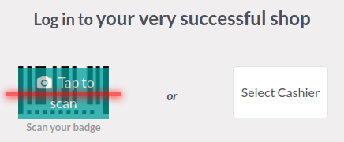

# Multi-employee management

Odoo Point of Sale allows you to manage access to a specific POS by enabling the **Multi Employees
per Session** feature. When activated, [you can select which users can log into the POS](#employee-login-use) and [keep track of the employees involved in each order](#employee-login-analytics).

## Cấu hình

[Access the POS settings](configuration.md#configuration-settings) and select your POS, or click the vertical
ellipsis button (⋮) on a POS card and click Edit. Then, enable
Multi Employees per Session, and add the allowed employees in the Allowed
Employees field.

## Practical application

Once the feature is activated, cashiers can log in [by scanning their badge](#employee-login-badge) or selecting their name from the list of allowed employees to [open the
session](../point_of_sale.md#pos-session-start).

To switch to another user [from an open session](../point_of_sale.md#pos-session-start), click the employee name
at the top-right of the screen and select the employee to swap with from the list.

Bạn cũng có thể yêu cầu nhân viên nhập mã PIN mỗi khi đăng nhập vào POS để ngăn họ đăng nhập bằng tài khoản người khác. Để thiết lập mã này, vào ứng dụng **Nhân viên**, mở biểu mẫu nhân viên và nhấp vào tab Cài đặt HR. Sau đó, nhập mã PIN tùy chọn vào trường Mã PIN trong danh mục Chấm công/Điểm bán hàng.

### Log in using badges

Để nhân viên có thể đăng nhập bằng cách quét thẻ, họ phải được gán ID thẻ. Để thực hiện, hãy truy cập ứng dụng **Nhân viên**, mở biểu mẫu nhân viên và nhấp vào tab Cài đặt HR. Sau đó, nhập ID thẻ tùy chọn vào trường ID thẻ trong phần Chấm công/Điểm bán hàng hoặc nhấp Tạo.

To switch to another user, lock the session by clicking the lock-shaped icon (🔓) at the
top-right of the screen and scan your badge.

## Phân tích

Sau khi bạn đóng và ghi sổ phiên POS, hãy truy cập báo cáo toàn diện để xem lại tất cả hoạt động của phiên, bao gồm cả người khởi tạo phiên và người xử lý các đơn hàng cụ thể. Để truy cập báo cáo của phiên, hãy nhấp vào nút dấu ba chấm dọc (⋮) trên thẻ POS và chọn Phiên từ phần Chế độ xem. Sau đó, hãy chọn một phiên cụ thể để xem thông tin chi tiết hơn và nhấp vào nút Đơn hàng để xem danh sách tất cả đơn hàng đã đặt trong phiên đó.

To get an overview of all orders, regardless of the session, click the vertical ellipsis button
(⋮) on the POS card and select Orders from the View section.
