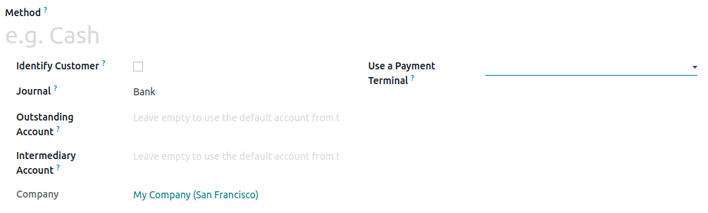

# Phương thức thanh toán

To add a payment method, you first need to create it. Go to Point of Sale ‣
Configuration ‣ Payment Methods ‣ New, and set a name. Check Identify Customer to
allow this payment method *exclusively* for registered customers.

Then, select the Journal. Choose Cash to use this payment method for cash
payments, or Bank to use it for card payments.

#### NOTE
Selecting a bank journal automatically adds the Use a Payment Terminal
field in which you can add your [payment terminal's information](terminals/).

#### SEE ALSO
[Payment terminals](terminals/).

Once the payment method is created, you can select it in your POS settings. To do so, go to the
[POS' settings](../configuration/#configuration-settings), click Edit, and add the payment method
under the Payments section.

* [Payment terminals](terminals/)
  * [Adyen](terminals/adyen.md)
  * [Ingenico](terminals/ingenico.md)
  * [Mercado Pago](terminals/mercado_pago.md)
  * [Razorpay](terminals/razorpay.md)
  * [SIX](terminals/six.md)
  * [Stripe](terminals/stripe.md)
  * [Vantiv](terminals/vantiv.md)
  * [Viva Wallet](terminals/viva_wallet.md)
  * [Worldline](terminals/worldline.md)
