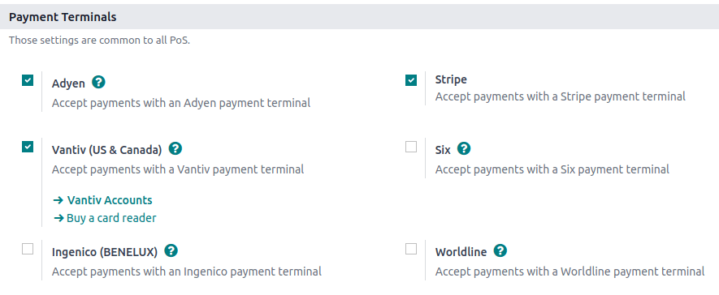

# Payment terminals

Connecting and integrating a payment terminal with your POS system allows you to accept multiple
payment options, including credit and debit cards, making the payment process more efficient.

## Cấu hình

Go to the [application settings](../../configuration/#configuration-settings), scroll down to the
Payment Terminals section, and tick your terminal's checkbox.

Then, follow the corresponding documentation to configure your device:

- [Adyen configuration](adyen.md)
- [Ingenico configuration](ingenico.md)
- [Mercado Pago configuration](mercado_pago.md)
- [Razorpay configuration](razorpay.md)
- [SIX configuration](six.md)
- [Stripe configuration](stripe.md)
- [Vantiv configuration](vantiv.md)
- [Viva Wallet configuration](viva_wallet.md)
- [Worldline configuration](worldline.md)

Once the terminal is configured, you can [create the corresponding payment method and add it to
the POS](../).

## Pay with a payment terminal

When processing a payment, select the terminal's payment method. Check the amount and
click on Send. Once the payment is successful, the status changes to Payment
Successful.

#### NOTE
- In case of connection issues between Odoo and the payment terminal, force the payment by
  clicking on Force Done, which allows you to validate the order.
   
  This option is only available after receiving an error message informing you that the
  connection failed.
   
- To cancel the payment request, click on Cancel.

* [Adyen](adyen.md)
* [Ingenico](ingenico.md)
* [Mercado Pago](mercado_pago.md)
* [Razorpay](razorpay.md)
* [SIX](six.md)
* [Stripe](stripe.md)
* [Vantiv](vantiv.md)
* [Viva Wallet](viva_wallet.md)
* [Worldline](worldline.md)
