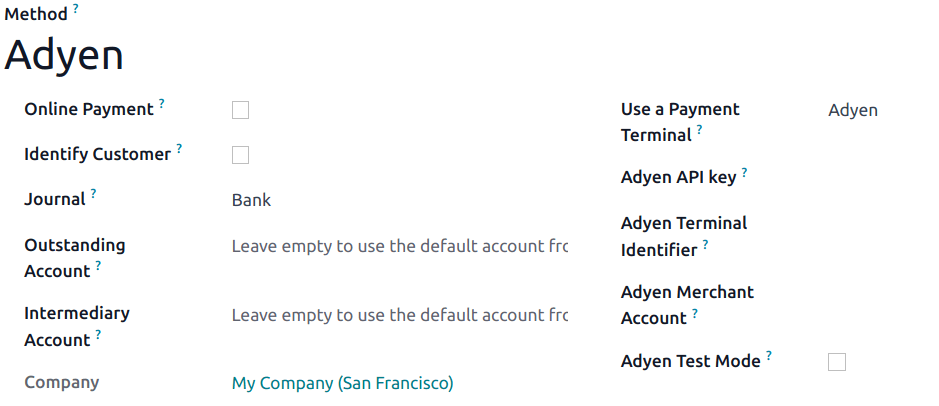

# Adyen

Connecting an **Adyen payment terminal** allows you to offer a fluid payment flow to your customers
and ease the work of your cashiers.

#### IMPORTANT
- Adyen payment terminals do not require an [IoT Box](../../../../general/iot/).
- Adyen terminals can be used in many countries, but not worldwide. Check the [List of countries
  supported by Adyen](https://docs.adyen.com/point-of-sale/what-we-support/supported-languages/).
- Adyen works only with businesses processing more than **$10 million annually** or invoicing a
  minimum of **1,000 transactions per month**.

#### SEE ALSO
- [List of payment methods supported by Adyen](https://docs.adyen.com/point-of-sale/what-we-support/payment-methods/)
- [List of Adyen terminals](https://docs.adyen.com/point-of-sale/what-we-support/select-your-terminals/)

## Cấu hình

Start by creating your Adyen account on [Adyen's website](https://www.adyen.com/). Then, board
your terminal following the steps described on your terminal's screen.

#### SEE ALSO
[Adyen Docs - Payment terminal quickstart guides](https://docs.adyen.com/point-of-sale/user-manuals)

### Generate an Adyen API key

**Khóa API Adyen** được sử dụng để xác thực các yêu cầu từ thiết bị đầu cuối Adyen của bạn. Để tạo khóa API, hãy truy cập Tài khoản Adyen ‣ Lập trình viên ‣ Thông tin xác thực API, sau đó **tạo** thông tin xác thực mới hoặc chọn thông tin xác thực **hiện có**. Nhấp Tạo khóa API và lưu khóa này để dán vào trường Khóa API Adyen trong Odoo tại phần [tạo phương thức thanh toán](#adyen-method-creation).

#### SEE ALSO
- [Adyen Docs - API credentials](https://docs.adyen.com/development-resources/api-credentials#generate-api-key).

### Locate the Adyen terminal identifier

The **Adyen Terminal Identifier** is the terminal's serial number, which is used to identify the
hardware.

To find this number, go to your Adyen account ‣ Point of Sale ‣ Terminals,
select the terminal to link with, and save its serial number to paste it into the Odoo
Adyen Terminal Identifier field at [the payment method creation](#adyen-method-creation).

### Set the Event URLs

For Odoo to know when a payment is made, you must configure the terminal **Event URLs**. To do so,

1. Log in to [Adyen's website](https://www.adyen.com/);
2. Go to Adyen's dashboard ‣ Point of Sale ‣ Terminals and select the connected
   terminal;
3. From the terminal settings, click Integrations;
4. Set the Switch to decrypted mode to edit this setting field as Decrypted;
5. Click the **pencil icon** button and enter your server address, followed by
   `/pos_adyen/notification` in the Event URLs field;
6. Click Save at the bottom of the screen to save changes.

### Configure the payment method

Enable the payment terminal [in the application settings](../../configuration/#configuration-settings) and
[create the related payment method](../). Set the journal type as
Bank and select Adyen in the Use a Payment Terminal field.

Finally, fill in the mandatory fields with your [Adyen API key](#adyen-api), [Adyen
Terminal Identifier](#adyen-identifier), and Adyen Merchant Account.

Once the payment method is created, you can select it in your POS settings. To do so, go to the
[POS' settings](../../configuration/#configuration-settings), click Edit, and add the payment method
under the Payments section.
