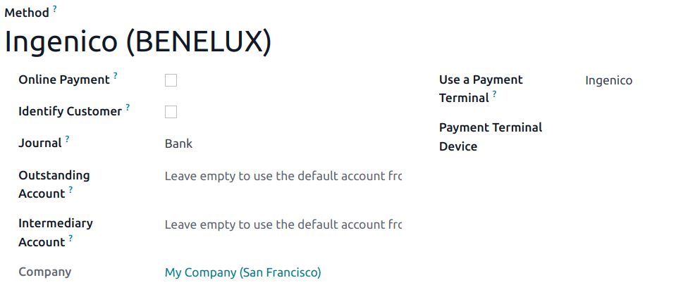

# Ingenico

Connecting a payment terminal allows you to offer a fluid payment flow to your customers and ease
the work of your cashiers.

#### IMPORTANT
- Ingenico payment terminals require an [IoT system](../../../../general/iot.md).
- Ingenico is currently only available in Belgium, the Netherlands and Luxembourg.
- Odoo works with the Ingenico Lane/, Desk/, and Move/ payment terminals as they support the TLV
  communication protocol through TCP/IP.

## Cấu hình

### Connect an IoT system

Connecting an Ingenico payment terminal to Odoo is a feature that requires an IoT system. For more
information on how to connect an IoT system to your database, please refer to the [IoT
documentation](../../../../general/iot.md).

### Configure the Lane/Desk/Move 5000 terminals for Ingenico BENELUX

1. Press the function button (F on Lane/5000, ⦿ on Desk/5000 and
   Move/5000).
2. Go to Kassa menu ‣ Settings Menu and enter the settings password.
3. Select Change Connection and press OK on the next screen.
4. Select TCP/IP and IP-address.
5. On the next screen, enter the IP address of your IoT system.
6. Enter `9000` as port number and press OK on the next screen.

At this point, the terminal restarts and should be displayed on the IoT system's form in Odoo.

### Configure the payment method

Enable the payment terminal [in the application settings](../../configuration.md#configuration-settings) and
[create the related payment method](../../payment_methods.md). Set the journal type as
Bank and select Ingenico in the Use a Payment Terminal field.
Then, select your terminal device in the Payment Terminal Device field.

Once the payment method is created, you can select it in your POS settings. To do so, go to the
[POS' settings](../../configuration.md#configuration-settings), click Edit, and add the payment method
under the Payments section.
