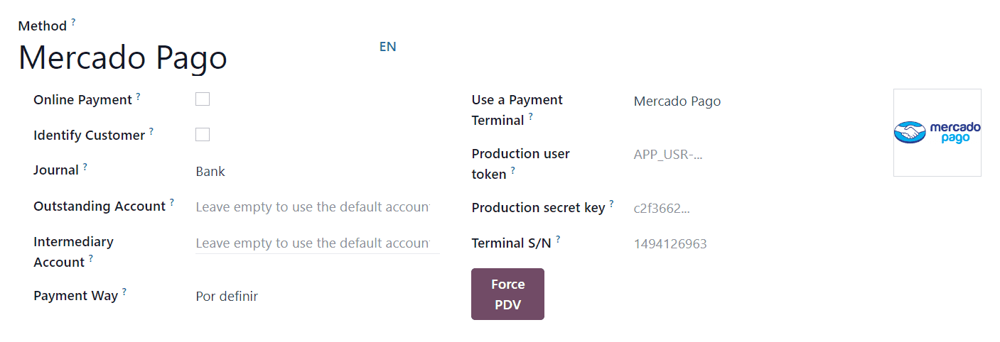

# Mercado Pago

Connecting a payment terminal allows you to offer a fluid payment flow to your customers and ease
the work of your cashiers.

#### IMPORTANT
Only **Point Smart** payment terminals in **Argentina**, **Brazil**, and **Mexico** are
supported. They can be purchased on [Mercado Pago's website](https://www.mercadopago.com.mx/herramientas-para-vender/lectores-point).

#### SEE ALSO
[Mercado Pago online payments](https://www.mercadopago.com.mx/herramientas-para-vender/check-out#benefits-checkout)

## Cấu hình

1. Create a [Mercado Pago account](https://www.mercadopago.com.mx/).
2. Associate your Point Smart terminal with a store and a cash drawer by
   following [Mercado Pago's documentation](https://vendedores.mercadolibre.com.ar/nota/locales-una-herramienta-para-mejorar-la-gestion-de-tus-puntos-de-venta/).

   #### NOTE
   All purchased terminals are automatically displayed on your Mercado dashboard.
3. Set your Point Smart terminal to the Point of Sale operation mode.

   #### WARNING
   Odoo does not support the Standalone operation mode.
4. [Create a Point Smart application](#pos-mercado-pago-application).
5. [Generate your credentials](#pos-mercado-pago-credentials).
6. [Create and configure the related payment method](#pos-mercado-pago-method).

### Point Smart application

Create a new application from Mercado Pago's [developer panel](https://www.mercadopago.com/developers) by following [Mercado Pago's applications documentation](https://www.mercadopago.com.mx/ayuda/20152), making sure you select In
person Payments.

### Thông tin đăng nhập

Once the Point Smart application is created, three credentials are required:

- An access token that Odoo uses to call Mercado Pago.
- A webhook secret key that Odoo uses to authenticate notifications sent by Mercado Pago.
- The **terminal serial number** at the back of your Point Smart terminal.

Retrieve the access token and webhook secret key by following [Mercado Pago's credentials
documentation](https://www.mercadopago.com.mx/developers/en/docs/your-integrations/credentials).
Then, copy and paste them into Odoo when creating the payment method.

#### IMPORTANT
For the webhooks configuration, add the URL of your Odoo database (e.g.,
`https://mycompany.odoo.com`) followed by `/pos_mercado_pago/notification` (e.g.,
`https://mycompany.odoo.com/pos_mercado_pago/notification`).

### Phương thức thanh toán

1. [Activate the POS Mercado Pago module](applications/general/apps_modules.md) to enable the
   payment terminal.
2. [Create the related payment method](applications/sales/point_of_sale/payment_methods.md) by going to
   Point of Sale ‣ Configuration ‣ Payment Methods.
3. Set the journal type as Bank
4. Select Mercado Pago in the Use a Payment Terminal field.
5. Fill in the mandatory fields with the [previously generated credentials](#pos-mercado-pago-credentials):
   - Fill in the Production user token field using the access token.
   - Fill in the Production secret key field using the webhook secret key.
   - Fill in the Terminal S/N field using the terminal serial number. You can find it at
     the back of your terminal.
   - Click the Force PDV button to activate the Point of Sale mode.

Select the payment method by going to the [POS' settings](applications/sales/point_of_sale/configuration.md#configuration-settings) and adding
it to the payment method under the Payment Methods field of the Payment
section.

#### IMPORTANT
Any action made on the terminal should trigger a notification on the POS interface. Ensure the
[webhook secret key](#pos-mercado-pago-credentials) is correctly configured if you are not
notified.
