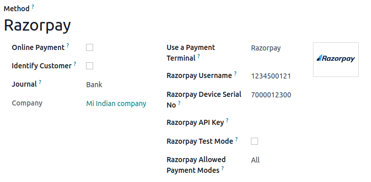

# Razorpay

Connecting a Razorpay payment terminal allows you to offer a fluid payment flow to your customers
and ease the work of your cashiers.

#### SEE ALSO
[Use Razorpay as apayment provider.](../../../../finance/payment_providers/razorpay.md)

## Cấu hình

### Locate your Razorpay credentials

[Create a Razorpay account](https://razorpay.com/docs/payments/easy-create-account/) and set it up
on their website.

You need the following credentials to set up the payment method in Odoo:

- [API key](https://razorpay.com/docs/payments/dashboard/account-settings/api-keys/)
- Tên người dùng Razorpay
- Razorpay device serial number, which can be found underneath the device or on [Razorpay's
  dashboard](https://dashboard.razorpay.com/).

### Configure the payment method

1. [Activate the POS Razorpay module](../../../../general/apps_modules.md) to enable the
   payment terminal.
2. [Create the related payment method](../../payment_methods.md) by going to
   Point of Sale ‣ Configuration ‣ Payment Methods.
   1. Set the Journal type as Bank.
   2. Select Razorpay in the Use a Payment Terminal field.
   3. Enter your username in the Razorpay Username field and your device's serial number
      in the Razorpay Device Serial No field.
   4. Fill in the Razorpay API Key field with the [Razorpay API key](#razorpay-credentials).
   5. Set the Razorpay Allowed Payment Modes according to your needs.

   

   #### NOTE
   You can enable the Razorpay Test Mode field while testing or keep it unchecked for
   production.

Once the payment method is created, you can enable it for your POS. To do so, go to the [POS'
settings](../../configuration.md#configuration-settings) and add the payment method under the Payment section.

#### NOTE
The terminal must have at least a 10% battery level to use it.
