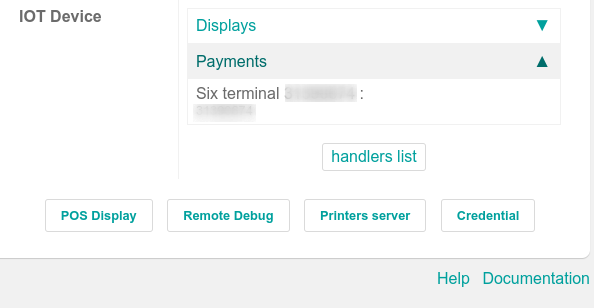

# SIX

Connecting a SIX payment terminal allows you to offer a fluid payment flow to your customers and
ease the work of your cashiers.

#### WARNING
Even though Worldline has recently acquired SIX Payment Services and both companies use Yomani
payment terminals, the firmware they run is different. Terminals received from Worldline are
therefore not compatible with this integration.

## Cấu hình

### Install the POS IoT Six module

To activate the POS IoT Six module, go to Apps, remove the Apps filter, and
search for **POS IoT Six**. This module adds the necessary driver and interface to your database to
detect Six terminals.

#### NOTE
This module replaces the **POS Six** module.

### Connect an IoT system

Connecting a Six payment terminal to Odoo is requires [using an IoT system](../../../../general/iot.md).

### Configure the terminal ID

Navigate to the IoT system's homepage, where you can find the  Six payment terminal
field once your database server is connected to the IoT system. Click Configure, fill
in the Terminal ID field with the ID received from Six, and click Connect.
Your Six terminal ID should appear in the Current Terminal Id section.

Odoo automatically restarts the IoT system when the Six terminal ID is configured. If your Six
terminal is online, it will be automatically detected and connected to the database. Check the IoT
system's homepage under the Payments section to confirm the connection.

### Configure the payment method

Enable the payment terminal [in the application settings](../../configuration.md#configuration-settings) and
[create the related payment method](../../payment_methods.md). Set the journal type as
Bank and select SIX IOT in the Use a Payment Terminal field.
Then, select your terminal device in the Payment Terminal Device field.

