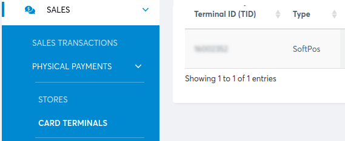

# Viva Wallet

Connecting a **Viva Wallet** [payment terminal](./)  allows you to offer a fluid
payment flow to your customers and ease the work of your cashiers.

#### NOTE
Viva Wallet lets you turn your phone into a mobile card reader: [Tap On Phone](https://www.vivawallet.com/gb_en/blog-tap-on-phone-gb).

## Cấu hình

Start by creating your Viva Wallet account on [Viva Wallet's website](https://www.vivawallet.com).

### Locate your Viva Wallet credentials

When configuring Viva Wallet in Point of Sale, you need to use specific credentials that are
available in your Viva Wallet account. These credentials include your [Merchant ID](#viva-wallet-id-key), [API key](#viva-wallet-id-key), [POS API credentials](#viva-wallet-pos-api), and [Terminal ID](#viva-wallet-identifier) number.

#### Merchant ID and API key

Locate your [Merchant ID and API key following the Viva documentation](https://developer.vivawallet.com/getting-started/find-your-account-credentials/merchant-id-and-api-key/).
Then, save the keys and paste them into the Odoo Merchant ID and API Key
fields [when creating the payment method](#viva-wallet-method-creation).

#### NOTE
These credentials are used for APIs that authenticate with Basic Auth.

#### POS API credentials

Locate and generate your [POS API credentials following the Viva documentation](https://developer.vivawallet.com/getting-started/find-your-account-credentials/pos-api-credentials/).
Then, save the keys and paste them in the Odoo Client secret and Client ID
fields [when creating the payment method](#viva-wallet-method-creation).

#### WARNING
These credentials are only displayed once. Ensure you keep a copy to secure them.

#### NOTE
These credentials are used for Android and iOS POS Activation requests, as well as the Cloud
Terminal API.

#### ID thiết bị đầu cuối

Your terminal ID number is used to identify your terminal. To find it:

1. Go to your Viva Wallet account and select the relevant account.
2. Go to Sales ‣ Physical payments ‣ Card terminals in the navigation menu.

The terminal ID number is located under the Terminal ID (TID) column. Save it to paste
it into the Terminal ID field [when creating the payment method](#viva-wallet-method-creation).

### Configure the payment method

1. [Activate the POS Viva Wallet module](../../../../general/apps_modules.md) to enable the
   payment terminal.
2. [Create the related payment method](../) by going to
   Point of Sale ‣ Configuration ‣ Payment Methods and clicking
   New.
3. Set the journal type as Bank.
4. Select Viva Wallet in the Use a Payment Terminal field.
5. Fill in the mandatory fields with your:
   - [Merchant ID and API key](#viva-wallet-id-key)
   - [Client ID and Client secret](#viva-wallet-pos-api)
   - [Terminal ID](#viva-wallet-identifier)
6. Save the form and copy the generated webhook URL from the Viva Wallet Webhook
   Endpoint field. This URL is necessary [when configuring the webhook](#viva-wallet-webhook).

### Configure the webhook

Webhooks allow you to receive real-time notifications whenever a transaction occurs within your Viva
Wallet account. Set them up for [payment transactions following the Viva documentation](https://developer.vivawallet.com/webhooks-for-payments/transaction-payment-created/).

#### SEE ALSO
[Setting up webhooks](https://developer.viva.com/webhooks-for-payments/#setting-up-webhooks)

### Link the payment method to a POS

You can select the payment method in your POS settings once the payment method is created. To do so,
go to the [POS' settings](../../configuration/#configuration-settings) and add the payment method under the
Payment methods field of the Payment section.
