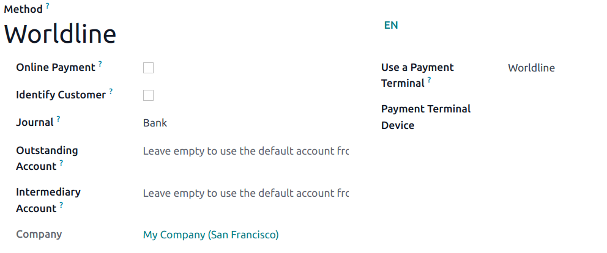

# Worldline

Connecting a payment terminal allows you to offer a fluid payment flow to your customers and ease\
the work of your cashiers.

#### IMPORTANT

* Worldline payment terminals require an [IoT Box](../../../../general/iot.md).
* Worldline is currently only available in Belgium, the Netherlands and Luxembourg.
* Odoo is compatible with Worldline terminals that use the CTEP protocol (e.g., the Yomani XR and\
  Yoximo terminals). If you have any doubts, contact your payment provider to ensure your\
  terminal's compatibility.

## Cấu hình

### Connect an IoT system

Connecting a Worldline Payment Terminal to Odoo is a feature that requires an IoT system. For more\
information on how to connect one to your database, please refer to the[IoT documentation](../../../../general/iot.md).

### Configure the protocol

Từ thiết bị đầu cuối, nhấp vào "." ‣ 3 ‣ dừng ‣ 3 ‣ 0 ‣ 9. Nhập mật khẩu kỹ thuật **"1235789"** và nhấp vào OK ‣ 4 ‣ 2. Sau đó, nhấp vào Thay đổi ‣ CTEP (như Giao thức ECR) ‣ OK. Nhấp **OK** ba lần trên các màn hình tiếp theo (_Phiếu CTEP ECR_, _Chiều rộng phiếu ECR_ và _Bộ ký tự_). Cuối cùng, nhấn **Dừng** ba lần; thiết bị đầu cuối sẽ tự động khởi động lại.

### Set the IP address

From your terminal, click on "." ‣ 3 ‣ stop ‣ 3 ‣ 0 ‣ 9. Enter the\
technician password **"1235789"** and click on OK ‣ 4 ‣ 9. Then, click on\
Change ‣ TCP/IP (_TCP physical configuration_ screen) ‣ OK ‣\
OK (_TCP Configuration client_ screen).

Finally, set up the hostname and port number.

#### Hostname

To set up the hostname, enter your IoT system's IP address' sequence numbers and press **OK** at\
each "." until you reach the colon symbol.\
Then, press **OK** twice.\

#### Port number

On the _Port number_ screen, enter **9001** (or **9050** for Windows) and click on\
OK (_ECR protocol SSL no_) ‣ OK. Click on **Stop** three times;\
the terminal automatically restarts.

#### WARNING

For the [Windows virtual IoT](../../../../general/iot.md), the `9050` port must be added\
as a [Windows Firewall exception](../../../../general/iot/windows_iot.md#iot-windows-iot-firewall).

### Configure the payment method

Enable the payment terminal [in the application settings](../../configuration.md#configuration-settings) and[create the related payment method](../../payment_methods.md). Set the journal type as\
Bank and select Worldline in the Use a Payment Terminal field.\
Then, select your terminal device in the Payment Terminal Device field.

Once the payment method is created, you can select it in your POS settings. To do so, go to the[POS' settings](../../configuration.md#configuration-settings), click Edit, and add the payment method\
under the Payments section.
