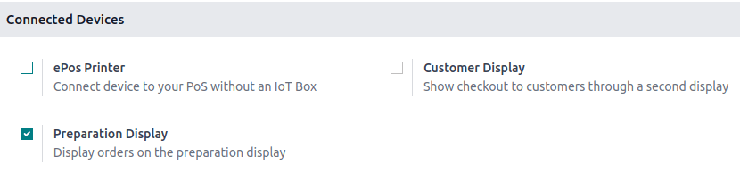
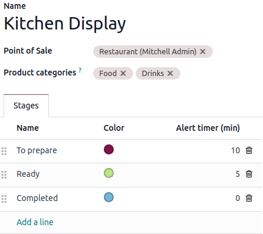
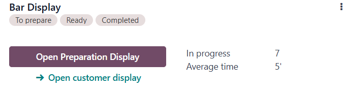
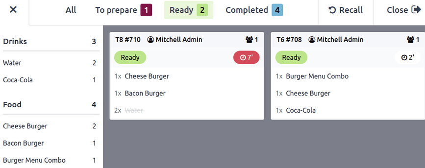

# Màn hình khâu chuẩn bị

The preparation display feature allows you to handle POS orders requiring preparation.
Concretely,

- **For retail**:  The preparation team is notified after a payment is completed at the POS
  to gather the purchased items for customer pickup.
- **For restaurants**: POS orders inform the kitchen of the meals to be prepared.

## Cấu hình

To enable the preparation display feature,

1. Go to the [POS settings](configuration.md#configuration-settings).
2. Scroll down to the Connected Devices section.
3. Check the Preparation Display option.

To create and set up a preparation display,

1. Go to Point of Sale ‣ Orders ‣ Preparation Display
2. Nhấp Mới.
3. Give the display a descriptive Name (e.g., `Main Kitchen`, `Bar`)
4. Set it up:
   1. Point of Sale: Select the POS that sends orders to this display.
   2. Product categories: Specify the POS Product categories sent to this
      display.
   3. Stages: Define the steps required for the orders to be ready.
      - Click Add a line to add a stage.
      - Assign specific colors to each stage for clarity (optional).
      - Define an Alert timer (min) for each stage to indicate the expected processing
        time.

#### NOTE
To edit a pre-existing preparation display, click the vertical ellipsis button
(<i class="fa fa-ellipsis-v"></i>) on the display's card and select Configure.

## Practical application

Go to Point of Sale ‣ Orders ‣ Preparation Display to get an overview of all
your displays.

The display card shows:

- The configured stages.
- The number of orders currently In progress.
- The Average time employees usually take to complete an order.

### Using the preparation display

To access the preparation display, click Open Preparation Display. This interface,
designed for employees, shows:

- **Stages and order count**: Displays the progress of orders across stages such as `To prepare`,
  `Ready`, and `Completed`, along with the number of orders in each stage.
- **Ordered products by category**: Lists all items in progress, grouped by POS categories (e.g.,
  `Drinks`, `Food`).
- **Order cards**: Summarizes individual orders, including:
  - Associated tables and order numbers.
  - Status, such as `Ready`, highlighted with the defined colors.
  - Waiting time, with visual indicators.

#### NOTE
The duration indicator turns red if the elapsed time exceeds the predefined alert time.

To update order progress:

- Click items on the order card to cross them off individually.
- Click the order card itself to mark all items at once.
- The card automatically moves to the next stage once every item is crossed off.
- Click <i class="fa fa-undo"></i> Recall to move an order back to the previous stage if you
  mistakenly sent it to the next stage.

### Màn hình cho khách hàng

In parallel, click Open customer display to open the customer interface. This
interface, designed for customers, provides an overview of orders that are:

- Ready for pickup.
- Almost there, indicating they are taken care of.

#### NOTE
The order number can be found at the top of the customer's receipt.
