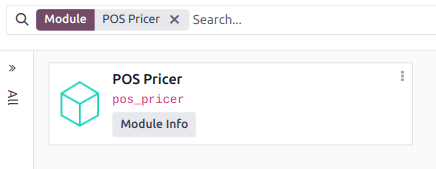
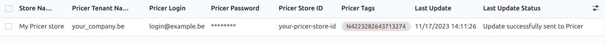
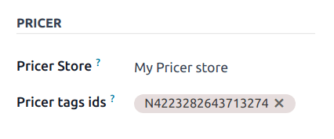
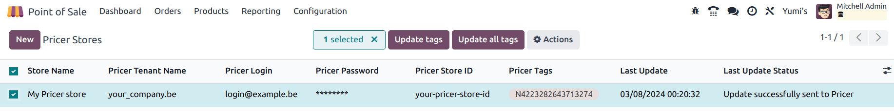

# Electronic shelf labels

Electronic shelf labels allow you to display product information like prices and barcodes on store\
shelves and to synchronize them remotely from the backend. This removes the need to print new labels\
when product information changes.

#### NOTE

Odoo uses electronic labels from [Pricer](https://www.pricer.com/).

## Cấu hình

### Pricer setup

1. [Get in touch with Pricer](https://www.pricer.com/contact) to create and configure your Pricer\
   account.
2. Create your stores: one pricer store equates to one physical store.
3. Link as many transceivers as needed to the Pricer store(s).
4.  Create the following variables to share product information between your Odoo database system and\
    Pricer. These variables act like placeholders on the label template.

    * `itemId`: this holds the unique internal identifier assigned to each product
    * `itemName`: the actual name of the product
    * `price`: the selling price of the product, including any applicable taxes
    * `presentation`: the template name used in Pricer for displaying the product information on the\
      label
    * `currency`: the currency of your company (e.g., USD, EUR)
    * `barcode`: the barcode number associated with each product

    **IMPORTANT**

    The names for these variables must be **identical** in your Pricer database.
5. Create a template named `NORMAL`. This template is used to display information on your digital\
   tags.

Once your account, stores, variables, and template are configured on Pricer, you can proceed with\
the setup of your Odoo database.

#### IMPORTANT

The account associated with your Pricer store must have access to send API requests to Pricer.

### Thiết lập Odoo

As a pre-requisite, [activate](../../../general/apps_modules.md#general-install) the POS Pricer module  *(technical
name: pos_pricer)* to have all the required features to use Pricer electronic tags.

Once the module is activated, configure your [pricer stores](electronic_labels.md#pricer-tags-stores) and associate[Pricer tags](electronic_labels.md#pricer-tags-tags) with your products.

#### Pricer stores

Similarly to the configuration in Pricer, you need to create one pricer store per physical location.\
To do so, go to Point of Sale ‣ Configuration ‣ Pricer Stores, click\
New, and fill in the line with the required information:

* Store Name: you can put any name of your liking.
* Pricer Tenant Name: the name of your company account in Pricer, usually followed by`-country_code`. This value is provided by Pricer.
* Pricer Login: the login of your Pricer account.
* Pricer Password: the password of your Pricer account.
* Pricer Store ID: the ID of the related Pricer store as defined on your Pricer\
  database.

#### NOTE

* The Pricer Tags column is updated automatically when a label is linked to a\
  product.
* The Last Update and Last Update Status columns are updated\
  automatically when the tags are updated.

#### Nhãn Pricer

For a label to display specific product information, the label needs to be associated with the\
product. To do so:

1.  Open the product form by going to Point of Sale ‣ Products ‣ Products and\
    clicking New or selecting an existing product.

    **NOTE**

    If you are creating a new product, configure and save it before associating any Pricer tags.
2. Go to the Sales tab, scroll to the Pricer section, and select the\
   corresponding Pricer Store.
3.  Fill in the Pricer tags ids field by copying the label's ID from the label itself or\
    scanning its barcode.

    **NOTE**

    Pricer tag IDs are composed of a letter followed by 16 digits.

Now that you have a product associated with a Pricer tag, we can send its information to Pricer.

### Practical application

Odoo automatically sends requests to Pricer to synchronize the tags every 12 hours if you make any\
modifications to:

> * Product name, price, barcode, or customer taxes
> * Tiền tệ
> * Associated Pricer store or Pricer tags

To force the update, activate the [developer mode](../../../general/developer_mode.md#developer-mode). Then:

1. Go to Point of Sale ‣ Configuration ‣ Pricer Store.
2. Select the desired store(s).
3. Click Update tags to update all tags affected by changes to:
   * Product name, price, barcode, or customer taxes
   * Tiền tệ
   * Associated Pricer store or Pricer tags

Alternatively, click Update all tags to force the update of every tag, regardless of\
whether changes were made.

If Pricer has processed and accepted the request, the status field shows Update\
successfully sent to Pricer. If there is any issue, the system displays an error message.

#### WARNING

If a request sent to Pricer fails, Odoo still considers that the product has been updated. In\
that case, we recommend forcing the update of all tags.
