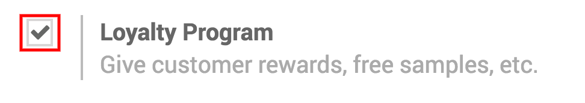
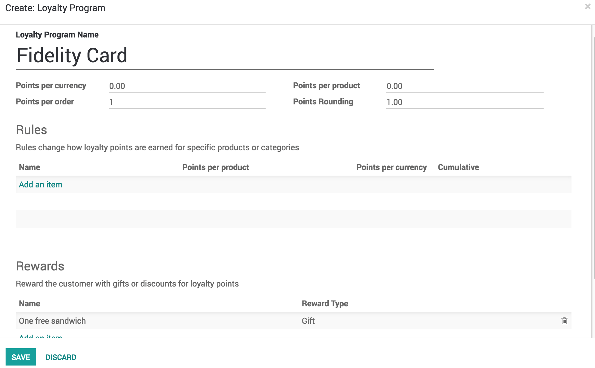
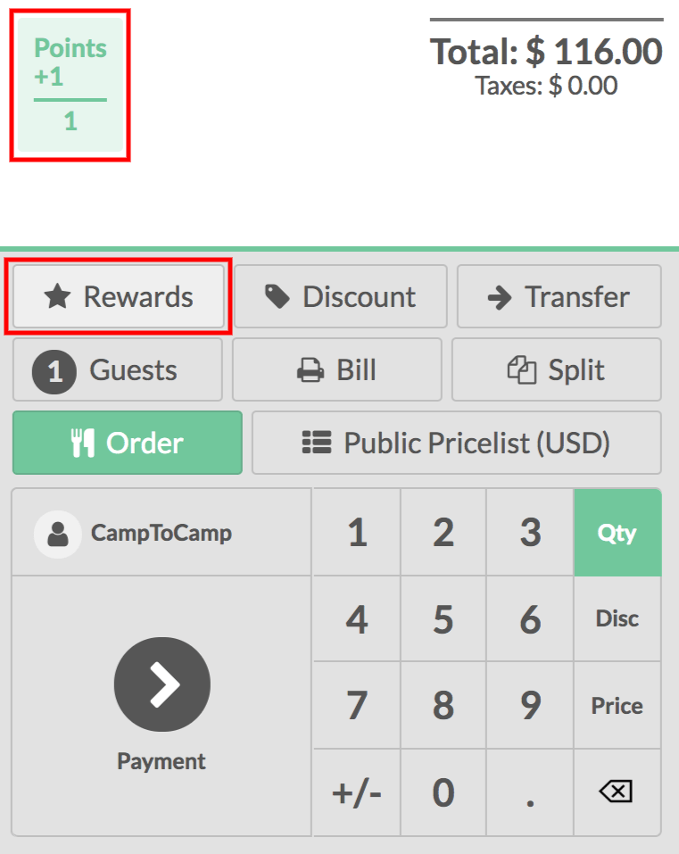

# Chương trình khách hàng thân thiết

Encourage your customers to continue to shop at your point of sale with
a *Loyalty Program*.

## Cấu hình

To activate the *Loyalty Program* feature, go to
Point of Sale ‣ Configuration ‣ Point of sale and
select your PoS interface. Under the Pricing features, select *Loyalty
Program*

From there you can create and edit your loyalty programs.

You can decide what type of program you wish to use, if the reward is a
discount or a gift, make it specific to some products or cover your
whole range. Apply rules so that it is only valid in specific situation
and everything in between.

## Use the loyalty program in your PoS interface

When a customer is set, you will now see the points they will get for
the transaction and they will accumulate until they are spent. They are
spent using the button *Rewards* when they have enough points
according to the rules defined in the loyalty program.

You can see the price is instantly updated to reflect the pricelist. You
can finalize the order in your usual way.

#### NOTE
If you select a customer with a default pricelist, it will be
applied. You can of course change it.
