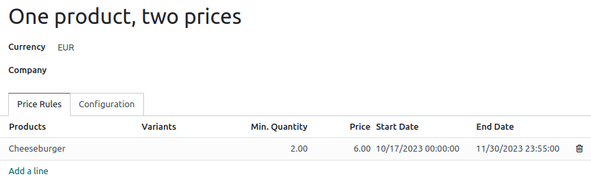
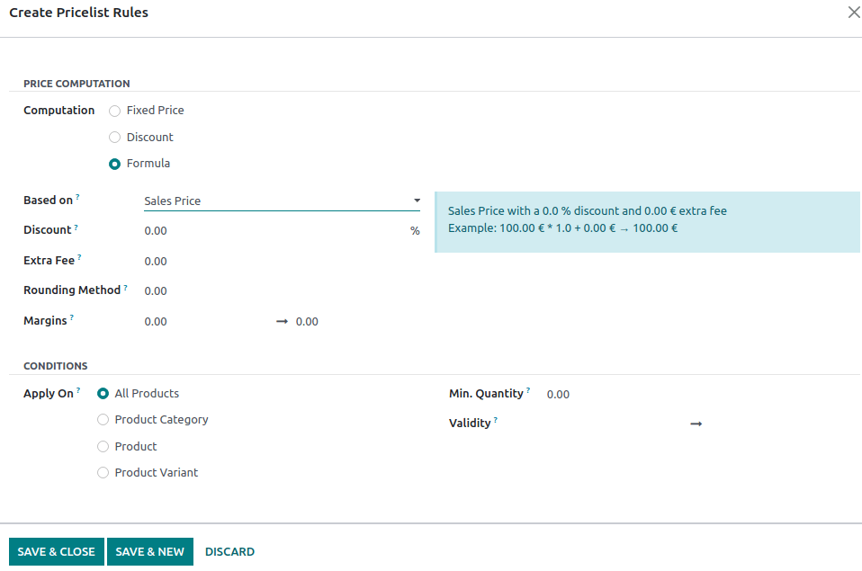

# Bảng giá

Pricelists allow you to adjust product prices depending on various criteria automatically. For
example, you can set POS-specific prices, create temporary discount periods, reward specific
customers, or offer discounts when set quantities are ordered.

## Cấu hình

Navigate to the [general POS app settings](../configuration.md#configuration-settings) and ensure
Flexible Pricelists are enabled under the Pricing section.

[Multiple prices per product](#pricelists-simple) is the default pricelist option for setting
simple fixed price rules per product. Select [Advanced price rules (discounts, formulas)](#pricelists-advanced) to apply price rules to multiple products at once and to compute prices
dynamically using percentage discounts or more complex formulas in addition to setting fixed prices.

#### NOTE
The selected pricelist type applies to the entire database, including the [Sales](../../sales/products_prices/prices/pricing.md) and [eCommerce](../../../websites/ecommerce/products/price_management.md#ecommerce-pricelists)
apps.

### Tạo bảng giá

Go to Point of Sale ‣ Products ‣ Pricelists and click New or
select an existing pricelist. The pricelist setup differs depending on the [selected pricelist
option](#pricelists-configuration).

#### Nhiều giá cho một sản phẩm

When pricelists are configured to use the Multiple prices per product option, it is
possible to use multiple fixed prices for different products or their variants depending, if
necessary, on one or several conditions. To add a new price rule to a pricelist:

1. Click Add a line, and select a **product** and its **variant** if needed.
2. Add the condition(s):
   - a product quantity to be reached by using the Min. Quantity column;
   - a determined period during which the pricelist is applied by using the Start Date
     and End Date columns.
3. Add the Price to be applied when the conditions are met (if any).

#### Advanced price rules

When pricelists are configured to use the Advanced price rules (discounts, formulas)
option, it is possible to use percentage discounts/mark-ups and formulas in addition to using fixed
prices. To add a new price rule to a pricelist, click Add a line. In the pop-up windows:

1. Select a Computation method:
   - Fixed Price to set a new fixed price (similarly to the Multiple prices
     per product option).
   - Discount to compute a percentage discount (e.g., `10.00` %) or mark-up (e.g.,
     `-10.00` %).
   - Formula to compute the price according to a formula. It is required to define what
     the calculation is **based on** (Sales Price, Cost, or Other
     Pricelist). You can then:
     - Apply a percentage Discount or mark-up.
     - Add an Extra Fee (e.g., $ `5.00`) or subtract a fixed amount (e.g., $ `-5.00`).
     - Define a [Rounding Method](cash_rounding.md) by forcing the price after
       Discount to be a multiple of the value set. The Extra Fee is applied
       afterward.
     - Specify the minimum (e.g., $ `20.00` ) and maximum (e.g., $ `50.00` ) profit
       Margins for computations based on Cost.
2. Select on which product(s) the price rule should be **applied**:
   - Tất cả sản phẩm
   - a Product Category
   - a Product
   - a Product Variant
3. Add conditions, such as a specific quantity to reach for the price to change by using the
   Min. Quantity field or a specific period during which the pricelist should be
   applied by using the Validity fields.

### Chọn bảng giá

Go to the [specific POS settings](../configuration.md#configuration-settings) and add all the available
pricelists in the Available field. Then, set its **default pricelist** in the
Default field.

When you [open a POS session](../../point_of_sale.md#pos-session-start), click the **pricelists** button, and select
the desired pricelist from the list.

#### NOTE
- Multiple pricelists must be selected for the **pricelist button** to be displayed.
- If a pricelist is selected on a POS order while its conditions are **not** met, the price will
  **not** be adjusted.

#### SEE ALSO
- [Pricelists, discounts, and formulas](../../sales/products_prices/prices/pricing.md)
- [How to use pricelists in an ecommerce environment](../../../websites/ecommerce/products/price_management.md#ecommerce-pricelists)
