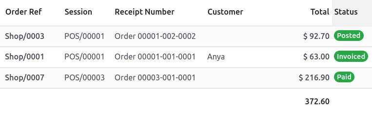

# Receipts and invoices

## Phiếu nhập kho

Set up receipts by going to Point of Sale ‣ Configuration ‣ Point of Sale,
selecting a POS, and scrolling down to the Bills & Receipts section.

To **customize** the **header** and **footer**, activate Header & Footer and fill in
both fields with the information to be printed on the receipts.

To **print receipts** automatically once the payment is registered, enable the Automatic
Receipt Printing setting.

#### SEE ALSO
- [Hoá đơn](applications/sales/point_of_sale/restaurant/bill_printing.md)
- [Máy in ePOS](applications/sales/point_of_sale/configuration/epos_printers.md)

### Reprint a receipt

From the POS interface, click Orders, open the dropdown selection menu next to the
search bar, and change the default All active orders filter to Paid. Then,
select the corresponding order and click Print Receipt.

#### NOTE
You can filter the list of orders using the search bar. Type in your reference and click
Receipt Number, Date, or Customer.

## Hóa đơn

Point of Sale allows you to issue and print invoices for [registered customers](applications/sales/point_of_sale.md#pos-customers)
upon payment and retrieve all past invoiced orders.

#### NOTE
An invoice created in a POS creates an entry into the corresponding [accounting journal](applications/finance/accounting/get_started/cheat_sheet.md#cheat-sheet-journals), previously [set up](#receipts-invoices-invoice-configuration).

### Cấu hình

To define what journals will be used for a specific POS, go to the [POS' settings](applications/sales/point_of_sale/configuration.md#configuration-settings) and scroll down to the accounting section. Then, you can determine the
accounting journals used by default for orders and invoices in the Default Journals
section.

### Invoice a customer

Upon processing a payment, click Invoice underneath the customer's name to issue an
invoice for that order.

Select the payment method and click Validate. The **invoice** is automatically issued
and ready to be downloaded and/or printed.

#### NOTE
To be able to issue an invoice, a [customer](applications/sales/point_of_sale.md#pos-customers) must be selected.

### Retrieve invoices

To retrieve invoices from the **POS dashboard**,

1. access all orders made through your POS by going to Point of Sale ‣ Orders ‣
   Orders;
2. to access an order's invoice, open the **order form** by selecting the order, then click
   Invoice.

#### NOTE
- **Invoiced orders** can be identified by the Invoiced status in the
  Status column.
- You can filter the list of orders to invoiced orders by clicking Filters and
  Invoiced.

### QR codes to generate invoices

Khách hàng cũng có thể yêu cầu hóa đơn bằng cách quét **mã QR** được in trên biên lai. Sau khi quét, họ cần điền thông tin thanh toán vào biểu mẫu và nhấp vào Lấy hóa đơn của tôi. Một mặt, thao tác này sẽ tạo ra hóa đơn có sẵn để tải xuống. Mặt khác, trạng thái đơn hàng sẽ chuyển từ Đã thanh toán hoặc Đã ghi sổ sang Đã xuất hóa đơn trong backend Odoo.

To use this feature, you have to enable QR codes on receipts by going to Point of
Sale ‣ Configuration ‣ Settings. Then, select the POS in the Point of Sale field,
scroll down to the Bills & Receipts section and enable Use QR code on
ticket.
