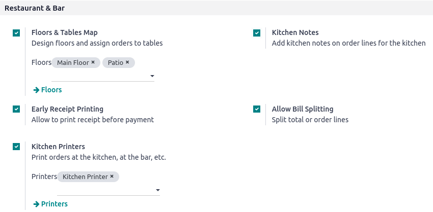

# Restaurant features

Managing a restaurant or a bar comes with specific needs. The Point of Sale application provides
various features that allow performing all the required tasks in such businesses.

Once the POS is set to be used in a restaurant or a bar, you can:

- [organize your floors and tables to reflect your interior](restaurant/floors_tables.md);
- [take orders](#restaurant-orders);
- [communicate with the kitchen or the bar through the POS](restaurant/kitchen_printing.md);
- [print bills in advance and split them](restaurant/bill_printing.md);
- [collect tips](restaurant/tips.md); and
- [set different taxes for takeaway food](pricing/fiscal_position.md).

## Cấu hình

To enable the restaurant and bar-specific features, go to Point of Sale ‣
Configuration ‣ Settings, select the POS, and activate Is a Bar/Restaurant.

These features are displayed in the Restaurant & Bar section.

## Take orders

Click a table to access the POS interface and start taking your customer's order. The system
automatically associates the orders and the table, allowing you to add more items later and generate
a bill specifically for that table's orders.

Once you have taken an order, click Change table to return to the floor plan view.

#### NOTE
As soon as you click a table, the number of guests is automatically set to one. If you
mistakenly select a table, click Release table to free it or [transfer the
customer](restaurant/floors_tables.md#floors-tables-transfer) to another table.

* [Floors and tables](restaurant/floors_tables.md)
* [Orders printing](restaurant/kitchen_printing.md)
* [Hoá đơn](restaurant/bill_printing.md)
* [Tiền tip](restaurant/tips.md)
