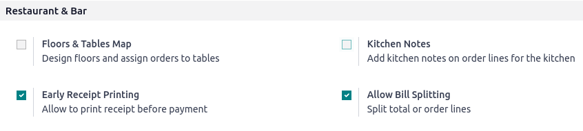

# Hoá đơn

Typical practices in restaurants or bars are to request the bill before proceeding to payment or
splitting it based on the items ordered. Odoo POS provides two features to perform these tasks
seamlessly: **Bill Printing** and **Bill Splitting**.

## Cấu hình

To activate the features, go to Point of Sale ‣ Configuration ‣ Settings,
select the POS, and activate Early Receipt Printing and Allow Bill Splitting
in the Restaurant & Bar section.

## In hóa đơn

From an open session, click Bill ‣ Print at any moment to generate and print a
bill.

#### NOTE
The printed bill is **not** final and will be updated to reflect any changes to the order.

## Tách hóa đơn

From an open session, click Split to select the items to regroup. Once everything is
selected, click Payment and proceed to checkout for these items. Repeat for each guest.

#### NOTE
- Once you return to the table, the selected items are no longer on order, as they have been paid
  for.
- The feature is available as soon as at least two items are ordered.

#### SEE ALSO
- [Floors and tables](floors_tables.md)
