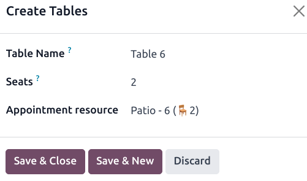
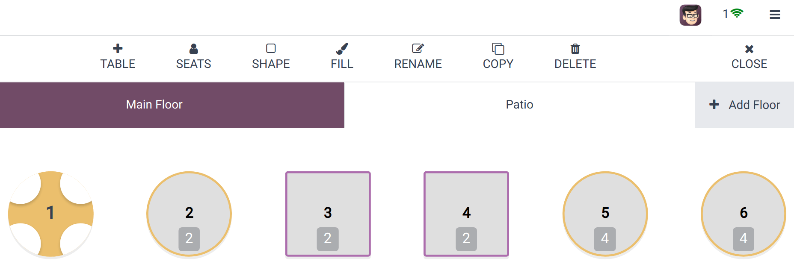

# Floors and tables

The **Floor plan view** enables you to manage restaurant floors and table arrangements and monitor
table status in real time, including occupancy, reservations, and kitchen orders.

## Cấu hình

### From the POS backend

Để tạo tầng và bàn từ backend, đi đến Điểm bán hàng ‣ Cấu hình ‣ Sơ đồ tầng, và nhấp vào Mới để tạo một tầng. Đặt tên cho tầng, chọn (các) điểm bán hàng liên quan và nhấp vào Thêm một dòng để tạo một bàn. Đặt tên cho bàn và xác định số lượng chỗ ngồi. Bạn cũng có thể liên kết bàn với một tài nguyên lịch hẹn để có thể đặt bàn. Sau khi hoàn tất, hãy nhấp vào Lưu & đóng hoặc Lưu & mới để xác nhận.

#### NOTE
The POS must be opened and [edited from the frontend](#floors-tables-frontend) to create a
map of your restaurant or bar reflecting your actual floor plan.

### From the POS frontend

To create floors and tables from the frontend, [open a POS session](../../point_of_sale.md#pos-session-start), click
the hamburger menu icon ≡ in the upper right corner, then Edit Plan to enter
the **edit mode**.

Click + Add Floor to add a floor, then enter a name in the pop-up window.

Sau khi tạo xong một tầng, hãy thêm một bàn bằng cách nhấp vào + BÀN. Để di chuyển, hãy chọn bàn đó và kéo thả theo ý muốn. Bạn cũng có thể sửa đổi các thuộc tính của bàn đã chọn, chẳng hạn như số lượng chỗ ngồi bằng cách nhấp vào CHỖ NGỒI, hình dạng bàn bằng cách sử dụng HÌNH DẠNG, màu bàn bằng cách sử dụng MÀU hoặc tên bàn bằng cách nhấp vào ĐẶT LẠI TÊN. Để sao chép một bàn hiện có, hãy chọn bàn đó và nhấp vào SAO CHÉP. Bạn cũng có thể xóa bàn bằng cách nhấp vào XOÁ.

After making all the necessary modifications, click CLOSE to save.

#### NOTE
If no table is selected, the modifications are applied to the floor.

#### WARNING
Removing a table or a floor cannot be undone.

## Table transfer

To move customers from one table to another, select a table and click → Transfer on the
POS interface. This redirects you to the floor plan view, where you can choose the new table to
which you want to transfer the customers.

When you transfer customers, all of the orders they have placed and that are linked to the original
table are also transferred.
