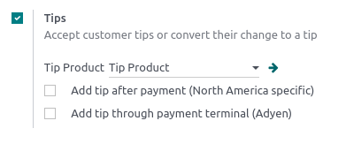

# Tiền tip

Tipping is customary in multiple countries. Point of Sale allows tipping in [shops](applications/sales/point_of_sale.md#pos-sell),
[bars](applications/sales/point_of_sale/restaurant.md), or [restaurants](applications/sales/point_of_sale/restaurant.md).

## Cấu hình

Để cho phép nhận tiền tip trong POS, kích hoạt tính năng Tip tại Điểm bán ‣ Cấu hình ‣ Cài đặt. Ở đầu trang, chọn POS mà bạn muốn cho phép **tip**, cuộn xuống phần Thanh toán và tích vào Tip. Sau khi bật, thêm Sản phẩm tip vào trường tương ứng và lưu lại. Sản phẩm được chỉ định sẽ được sử dụng làm tham chiếu trên hóa đơn của khách hàng.

### Tip products

**Tip products** can be created on the spot. To do so, enter a product's name in the [Tip
Product](#configuration) field and click Create or press **enter**. The product is
automatically configured to be used as a tip at the payment screen.

However, if you wish to be able to select the tip product in a POS session, you must activate the
**Available in POS** setting. To do so, click Create and edit... to open the product
configuration form. Then, go to the Sales tab, tick the Available in POS
checkbox, and click Save & Close.

#### NOTE
- When you create a product to use as a tip, leave the **product type** as Consumable
  to avoid unnecessary inventory movements.
- You can only select one tip product per POS, but you can choose a different one for each.

### Tip using an Adyen terminal

If you use an [Adyen](applications/sales/point_of_sale/payment_methods/terminals/adyen.md) payment terminal and wish to enable
**tips** using the terminal, check Add tip through payment terminal (Adyen) below the
[tip settings](#configuration).

### Tip after payment

If you use a POS system in a bar or a restaurant, you can enable Add tip after payment
(North America specific). Doing so generates a bill to print and complete manually by the customer
and the waiter. That bill indicates the tip value the customer chooses to give after the payment.

#### IMPORTANT
To use this feature, the selected payment method must have a bank journal attributed.

## Add tips

To add tips to an order, [access the payment screen](applications/sales/point_of_sale.md#pos-sell) and click ♥ Tip.
Then, enter the tipping amount, click Confirm to validate, and process the payment.

Alternatively, you can select the [tip product](#tip-product) on the POS interface to add it to
the cart. When selected, the product is automatically set as a tip, and its default value equals its
**Sales Price**.

### Tip using an Adyen terminal

During checkout, select **Adyen** as the payment terminal, and send the payment request to the
device by clicking Send. The customers are asked to enter the desired tipping amount on
the terminal's screen before proceeding to the payment.

### Tip after payment

At checkout, select a card payment method and click Close Tab. Doing so generates a bill
to complete by the customer.

On the following screen, click the percentage (15%, 20%, 25%),
No Tip, or enter the tipping amount the customer chose to give. Then, click
Settle to move to the following order.

