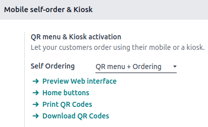
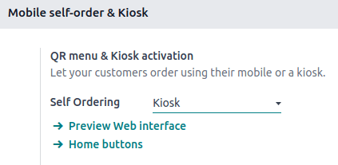
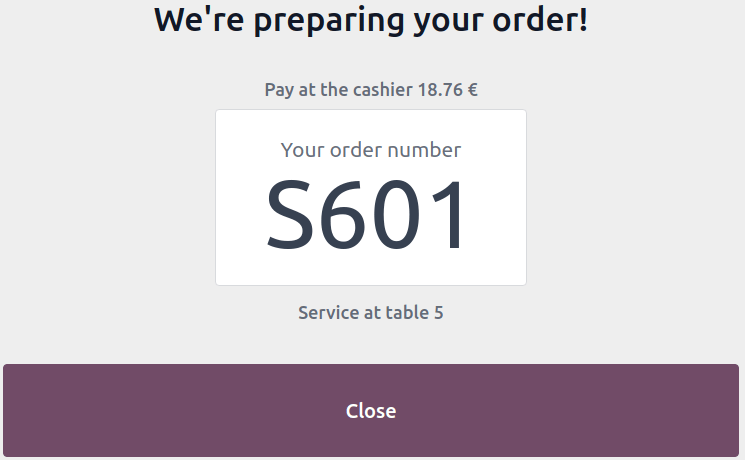

# Self-ordering

The self-ordering feature allows customers to browse your menu or product catalog, place an order,
and complete payment using their mobile device or a self-ordering kiosk.

## Cấu hình

### Feature activation

To enable this feature and select a self-ordering type, access the [POS settings](configuration/#configuration-settings), scroll down to the Mobile self-order & Kiosk section, and
select a Self Ordering type under the QR menu & Kiosk activation section.

You can choose from:

Menu QR

Select QR menu or QR menu + Ordering to give customers access to your
menu or product catalog by scanning a QR code on their personal device. The latter also
allows them to place an order and make a payment.

- Click <i class="fa fa-arrow-right"></i> Print QR Codes to download a .pdf document with the
  generated QR codes.
- Click <i class="fa fa-arrow-right"></i> Download QR Codes to download a compressed file
  with the generated QR codes.

#### NOTE
In **restaurants**, printing or downloading QR codes generates as many QR codes as the
number of available tables. In **shops**, it generates only one generic QR code.

Ki-ốt

When Kiosk is selected, customers can access the menu or product catalog, place
orders, and pay from a self-ordering kiosk.

Once a self-ordering type is selected, the [additional settings](#pos-self-order-add-settings)
update to fit the selected type's needs.

### Additional settings

Nút Trang chủ

The Home buttons are displayed on the kiosk or mobile device interfaces when
customers are self-ordering. To set them up, click <i class="fa fa-arrow-right"></i> Home
buttons. Then,

1. Click New to add a new button.
2. Set the Label.
3. Enter a URL preceded by `https://` to redirect customers to a specific URL when
   clicking the button. For instance, you might want to redirect them to a campaign video for
   a new product or to a contest page.
4. In the same URL column, enter `/products` to create a button that redirects
   customers to the product catalog.
5. Select the Points of Sale to ensure this button only appears on the selected
   POS' self-ordering interface.
6. Select a predefined Style from the dropdown menu.

#### NOTE
- Leaving the Points of Sale field empty shares the button with all POS.
- The Preview column automatically updates,  giving you a glimpse of the
  button's appearance based on its configuration.

Service location and payment options

- Set where the service occurs by selecting Table or Pickup zone
  under the Service field.
- Define when and how customers pay in the Pay after field. Customers can pay
  after Each meal or for Each order.
- The service location and payment options available depend on the type of self-ordering
  service and POS:
  - **QR menu + Ordering**:
    - **Restaurants**: Customers can be served at their table or the pickup zone.
      - When served at their table, they can pay after each meal or each order.
      - When served at the pickup zone, they can only pay after each order.
    - **Shops**: Customers can only be served at the pickup zone and pay after each order.
    - Regardless of the type of POS, customers can pay [online](../../finance/payment_providers/) or using any configured [payment
      method](payment_methods/).
  - **Ki-ốt**:
    - Regardless of the type of POS, customers can either be served at their table or in the
      pickup zone, but they must pay after each order.
    - The kiosk self-ordering only works with [Adyen](payment_methods/terminals/adyen.md)
      and [Stripe](payment_methods/terminals/stripe.md) terminals.
    - The Online Payment feature is not supported.

#### SEE ALSO
- [Thanh toán online](../../finance/payment_providers/)
- [Phương thức thanh toán](payment_methods/)

Ngôn ngữ

This option allows you to enable multiple languages for the self-ordering interface. The
suggested languages are those already installed in Odoo. To expand the selection, add more
languages:

1. Click <i class="fa fa-arrow-right"></i> Add Languages.
2. Add as many languages as needed to the Languages field.
3. Nhấp Thêm.
4. Add those languages to the Available field.

#### SEE ALSO
[Thay đổi ngôn ngữ](../../general/users/language.md)

Màn hình chờ

Splash screens are introductory screens displayed when the self-ordering interface or kiosk is
launched. They typically contain branding, welcome messages, or usage instructions.

- To add a splash screen image, click <i class="fa fa-paperclip"></i> Add images, select and
  open an image.
- To remove a splash screen image, hover over the image and click <i class="fa fa-times"></i>
  (Delete).

#### NOTE
You can add multiple splash screen images at once.

Eat in/ Take out

Activate this setting to [adjust the tax rate](pricing/fiscal_position.md) based on whether
customers dine in or take their order to go. Then,

- Fill in the field with an existing Alternative Fiscal Position;
- Create and set up a new fiscal position by filling in the field and clicking
  Create & Edit; or
- Create and set up a new fiscal position by clicking <i class="fa fa-arrow-right"></i> Fiscal
  Positions.

#### SEE ALSO
[Flexible taxes (fiscal positions)](pricing/fiscal_position.md)

### Xem trước

Review the interface before making the self-ordering feature available to customers to ensure all
settings are applied correctly. Click <i class="fa fa-arrow-right"></i> Preview Web interface
under the Self  Ordering field to ensure all [additional settings](#pos-self-order-add-settings) are correctly applied.

## Usage guidelines

Menu QR

On the POS user's end, access the self-ordering interface by

- Scanning a downloaded or printed QR code; or
- Clicking the <i class="fa fa-ellipsis-v"></i> (vertical ellipsis) icon on the POS card,
  then Mobile Menu.

On the customers' end,

1. Access the self-ordering interface by scanning a downloaded or printed QR code.
2. Click the [home button](#pos-self-order-add-settings) to reach the menu or catalog.
3. Select the items and click Order to place an order.
4. Follow the instructions on-screen to assign a table and pay for the order.

Ki-ốt

On the POS user's end,

1. Click Start Kiosk.
2. Open the provided URL on the self-ordering kiosk(s).
   - Copy and paste it; or
   - Click Open in New Tab.

#### NOTE
- Once a session is open, Start Kiosk switches to Open Kiosk on the
  POS card.
- Click Open Kiosk on the POS card to reopen the popup window and access the
  self-ordering interface.

On the customers' end,

1. Click the [home button](#pos-self-order-add-settings) from a self-ordering kiosk to
   reach the menu or product catalog.
2. Select the items and click Order to place an order.
3. Follow the instructions on-screen to assign a table and pay for the order.

#### IMPORTANT
- A POS session must be open for customers to place an order.
- Once an order is placed, it is automatically sent to [the preparation screen](preparation.md) and added to the list of POS orders.
