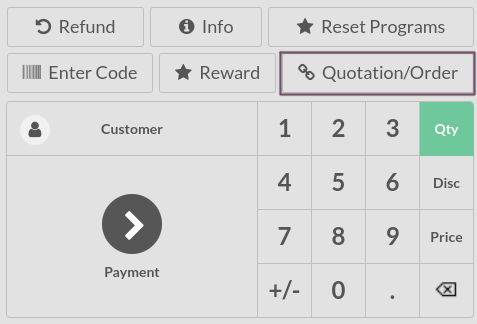
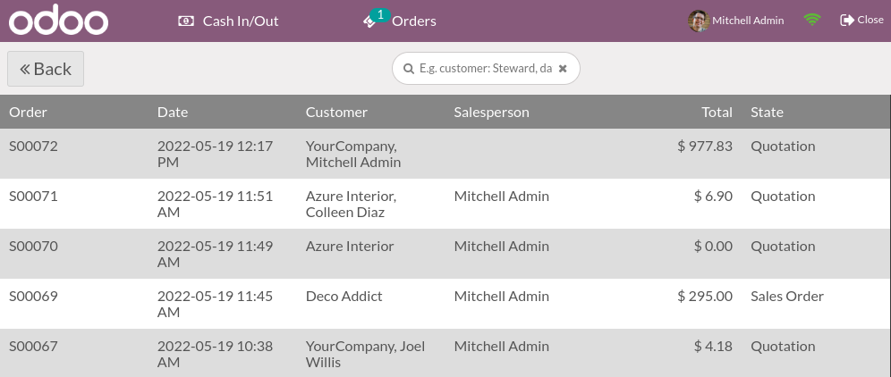

# Đơn bán hàng

When working in retail, you might need to order products directly from your Point of sale.
Fortunately, Odoo Point of Sale is fully integrated with Odoo Sales, meaning that you can create a
sales order and pay for it directly from your point of sale.

## Select a sales order

From the **Point of Sale** application, open a new session. Then, click on
Quotations/Orders to get the complete list of quotations and sales orders created on the
sales application.

#### NOTE
To ease finding the right sales order, you can filter that list on the **customer** or on the
**order reference**. You can also set the customer before clicking on
Quotations/Orders to reduce the list to one particular customer.

## Apply a down payment or settle the order

From the list of sales order, select one to make a payment.

Bạn có thể:

- Settle the order **partially**: after clicking on Apply a down payment, enter the
  percentage of down payment you want the customer to pay. Then, click on ok and proceed
  with the order.
- Settle the order **completely**: click on Settle the order to pay for the total of the
  sales order.

#### NOTE
Once you settle a sales order, the applied down payment is automatically deducted from the total
amount.

#### SEE ALSO
- [Khoản trả trước](../../sales/invoicing/down_payment.md)
