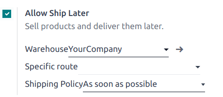

# Giao hàng sau

The **Ship Later** feature allows you to sell products and schedule delivery at a later date. It is
useful, for example, when a product is out of stock or so voluminous that it requires to be shipped,
or if, for any reason, the customer needs their order to be shipped later, etc.

## Cấu hình

[Go to the POS settings](applications/sales/point_of_sale/configuration.md#configuration-settings), scroll down to the Inventory
section, and enable Allow Ship Later.

Once activated, you can:

- Choose the location from where the products are shipped by selecting a Warehouse.
- Define a Specific route, or leave this field empty to use the default route.
- Define the Shipping Policy; select As soon as possible if the products
  can be delivered separately or When all products are ready to ship all the products at
  once.

#### SEE ALSO
- [Delivery methods](applications/inventory_and_mrp/inventory/shipping_receiving/setup_configuration.md)
- [Kho hàng](applications/inventory_and_mrp/inventory/warehouses_storage/inventory_management/warehouses.md)

## Practical application

1. [Open a session](applications/sales/point_of_sale.md#pos-session-start) and make a sale.
2. On the payment screen, set a customer and select Ship Later.
3. On the popup window, set a shipping date and click Confirm to proceed to payment.

The system instantly creates a delivery order from the warehouse to the shipping address.

#### NOTE
The selected customer must have referenced an address in the system for products to be shipped.
