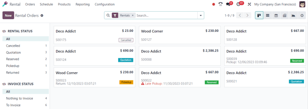
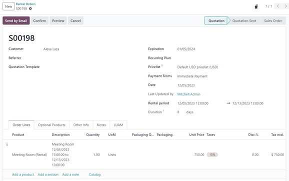
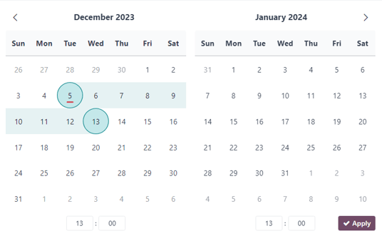
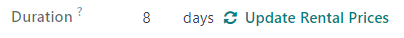
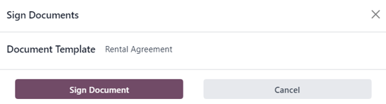

# Cho thuê

The Odoo *Rental* application provides comprehensive solutions to configure and manage rentals.

Send quotations, confirm orders, schedule rentals, register products when they are picked up and
returned, and invoice customers from this single platform.

#### SEE ALSO
- [Odoo Rental: product page](https://www.odoo.com/app/rental)
- [Odoo Tutorials: Rental](https://www.odoo.com/slides/rental-48)

## Trang tổng quan

Upon opening the *Rental* application, the Rental Orders dashboard is revealed.

In the default kanban view, all rentals are visible. Each rental card displays the customer name,
the price of the rental, the related sales order number, along with the status of the rental.

#### NOTE
Rental kanban cards that do **not** display a rental status means those rentals have confirmed
quotations, but have not been picked up yet.

On the left sidebar, the Rental Status for each rental can be found. Beneath that, the
Invoice Status of the rentals is accessible. Clicking any option in the left sidebar
filters the displayed rentals on the dashboard.

## Cài đặt

To configure additional rental delay costs, availability of rental items, or minimum time of rental,
navigate to Rental app ‣ Configuration ‣ Settings.

In the Rental section, there are options to configure Default Delay Costs
and Default Padding Time. There is also the option to activate Rental
Transfers and Digital Documents.

- Default Delay Costs are additional costs for late returns.
- Default Padding Time represents the minimum amount of time between two rentals.
- Rental Transfers means stock deliveries and receipts can be used for rental orders.
- Digital Documents allows users to upload documents for customers to sign prior to
  : confirming their rental.

In the Rent Online section, there are options to configure a Minimal Rental
Duration and designate Unavailability days, or days during which pickup and return are
not possible.

## Sản phẩm cho thuê

To view all products that can rented in the database, navigate to Rentals app ‣
Products. By default, the Can be Rented search filter appears in the search bar.

Each product kanban card displays that product's name, rental price, and product image (if
applicable).

## Giá cho thuê

To adjust the rental pricing on a product, go to the Products page in the *Rental* app,
then select the desired product or click New to create a new product from scratch.

On the product form, ensure the Can be Rented checkbox is ticked. Then, open the
Rental prices tab.

#### NOTE
If creating a rental product outside of the *Rental* app, just ensure the Can be
Rented checkbox is ticked on the product form. By default, this checkbox is ticked whenever a
product is created directly in the *Rental* application.

### Định giá

Under the Pricing section of the Rental prices tab, designate custom rental
prices and rental periods for the product.

To add pricing for a rental, click Add a price. Then, choose a *pricing period*
() in the Period column, or create a new
pricing period by typing in the name and clicking Create.

Next, decide whether or not to apply this custom rental price to a specific Pricelist.

Lastly, enter the desired Price for that specific Period.

#### NOTE
There is no limit to how many pricing lines can be added. Multiple pricing options for rental
products are typically used to give discounts for customers who agree to longer rental durations.

To delete any rental pricing option, click the 🗑️ (trash) icon, and that row is
deleted.

### Dự trữ

Under the Reservations section of the Rental prices tab, there is the option
to configure additional fines for any Extra Hour or Extra Day that the
customer takes to return a rental.

There is also the option to set a Security Time, expressed in hours, to make the rental
product temporarily unavailable between two rental orders. Such a feature may prove useful if
maintenance or cleaning is required between rentals.

### Price computing

Odoo always uses two rules to compute the price of a product when a rental order is created:

1. Only one price line is used.
2. The cheapest line is selected.

## Đơn cho thuê

To create a rental order in the *Rental* app, navigate to Rental app ‣ Orders ‣
Orders, and click New. Doing so reveals a blank rental order form to be filled in
accordingly.

Start by adding a Customer, then configure the desired duration of the rental in the
Rental period field.

To adjust the rental duration, click the first date in the Rental period field, and
select the range of dates to represent the rental duration from the pop-up calendar form that
appears.

Once complete, click Apply in the calendar pop-up form. Following that, the pop-up form
disappears, and the designated time period of the rental is represented in the Duration
field.

Next, add a rental product in the Order Lines tab, by clicking Add a
product, and selecting the desired rental product to add to the form.

#### NOTE
If a rental product is added *before* the Rental period field has been properly
configured, the user can *still* adjust the Rental period field accordingly.

Simply select the desired range of dates to represent the duration of the rental, then click
Update Rental Prices in the Duration field.

Doing so reveals a Confirmation pop-up window. If everything is correct, click
Ok, and Odoo recalculates the rental price accordingly.

Once all the information has been entered correctly on the rental order form, click the
Send by Email button to send the quotation to the customer, or click the
Confirm button to confirm the order.

## Chữ ký khách hàng

Upon confirming a rental order, the Sign Documents button appears. This gives the
ability to request the customer sign a rental agreement, outlining the arrangement between the
company and customer, *before* they pick up the rental product(s).

Such documents can ensure everything is returned on-time and in its original condition.

#### IMPORTANT
The Sign Documents button/option **only** appears if the Digital
Documents feature has been activated in the *Rental* application settings. To do so, navigate to
Rental app ‣ Configuration ‣ Settings, activate Digital
Documents, and click Save.

#### NOTE
This feature also requires the [Sign](../productivity/sign.md) app. If necessary, Odoo
automatically installs it after activating the Digital Documents setting.

To request a customer signature on a rental agreement, select a confirmed rental order, and click
the Sign Documents button to reveal a Sign Documents pop-up window.

From here, select the desired document from the Document Template field. Then, click
Sign Document. Doing so reveals a New Signature Request pop-up window.

Upon confirming the information in the New Signature Request pop-up form, click
Sign Now to initiate the signing process.

A separate page is then revealed, showcasing the document to be signed, which is accessible to the
customer via the customer portal.

Odoo guides the customer through the signing process with clear, clickable indicators, and allows
them to create electronic signatures to quickly complete the form.

Once the document has been signed and completed, click the Validate & Send Completed
Document button at the bottom of the document.

Upon clicking the Validate & Send Completed Document button, Odoo presents the option to
download the signed document for record-keeping purposes, if necessary.

#### SEE ALSO
[Odoo Tutorials: Sign](https://www.odoo.com/slides/sign-61)

## Pickup products

When a customer picks up the product(s), navigate to the appropriate rental order, click the
Pickup button, and then click Validate in the Validate a pickup
pop-up form that appears.

Doing so places a Picked-up status banner on the rental order.

## Trả hàng

When a customer returns the product(s), navigate to the appropriate rental order, click the
Return button, and validate the return by clicking Validate in the
Validate a return pop-up form that appears.

Doing so places a Returned status banner on the rental order.

## Print pickup and return receipts

Pickup and return receipts can be printed for customers when they pick up and/or return rental
products.

To print pickup and/or return receipts, navigate to the appropriate rental order, click the
⚙️ (gear) icon to reveal a drop-down menu.

From this drop-down menu, hover over the Print option to reveal a sub-menu. Then select
Pickup and Return Receipt.

Odoo generates and downloads a PDF, detailing all information about the current status of the rented
item(s).
