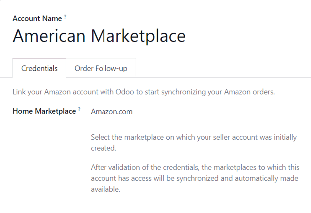

# Amazon Connector configuration

Odoo allows users to register an Amazon seller account in the database, but the user **must** have
a paid Amazon Seller account prior to completing the configuration.

Set up a paid Seller account on Amazon by first logging into the Amazon platform, and navigating to
Account & Lists ‣ Start a Selling Account from the drop-down menu located in
the header section.

Then on the Sell with Amazon page, follow the sign-up process and finally proceed to
follow the instructions below to register and link that Amazon Seller account in Odoo.

#### SEE ALSO
[Sell with Amazon](https://www.amazon.com/b/?node=12766669011)

## Connect Amazon Seller account to Odoo

To connect an Amazon Seller account in Odoo, navigate to Sales app ‣
Configuration ‣ Settings ‣ Connectors section, activate the Amazon Sync feature,
and click Save.

Then, return to Sales app ‣ Configuration ‣ Settings ‣ Connectors section,
and click on the Amazon Accounts link under the Amazon Sync setting.

Doing so reveals a separate Amazon Accounts page. From here, click New to
create and link a new Amazon account.

On the blank Amazon Account form page, start by choosing a name for the account (e.g.
`American Marketplace`). Then, in the Credentials tab, select the marketplace on which
the seller account was initially created from the Home Marketplace drop-down menu.

After saving, the field in the Credentials tab is replaced by a Link with
Amazon button.

Clicking that button redirects to either the Amazon login page, or directly to the required consent
page, if the user is already logged in to Amazon.

On the login page, log in to the desired Amazon seller account.

On the consent page, confirm that Amazon is allowed to give Odoo access to the account and related
data.

Upon confirmation, Amazon returns the user to Odoo, and the account has been registered.

With the Amazon account successfully registered, the marketplaces available to this specific account
are synchronized with Odoo and listed under the Marketplaces tab.

If desired, remove items from the list of synchronized marketplaces to disable synchronization.

## Amazon orders in Odoo

When an Amazon order is synchronized, up to three line items are created on the sales order in Odoo.
Each one represents a product sold on Amazon: one for the product that was sold on Amazon
Marketplace, one for the shipping charges (if any), and one for the gift wrapping charges (if any).

The selection of a database product for a sales order item is done by matching its
Internal Reference (a customizable product reference idenifier in Odoo, like `FURN001`)
with the Amazon *SKU* for marketplace items, the Amazon *Shipping Code* for delivery charges, and
the Amazon *Gift Wrapping* code for gift wrapping charges.

For marketplace products, pairings are saved as *Amazon Offers*, which are listed under the
Offers smart button on the account form.

Offers are automatically created when the pairing is established, and they're used for subsequent
orders to lookup SKUs. If no offer with a matching SKU is found, [the internal reference is
used instead](#amazon-matching).

If no database product with a matching internal reference is found for a given Amazon SKU or gift
wrapping code, then a default database product, *Amazon Sale*, is used. The same is done with the
default product *Amazon Shipping* if no database product is found for a given Amazon shipping code.

#### NOTE
To modify default products, activate the [developer mode](../../../general/developer_mode.md#developer-mode), and navigate to
Sales app ‣ Configuration ‣ Settings ‣ Connectors ‣ Amazon Sync ‣
Default Products.

## Product tax configuration

To allow for tax reporting of Amazon sales with Odoo, the taxes applied to the sales order items are
those set on the product, or determined by the fiscal position.

Make sure to have the correct taxes set on your products in Odoo, or have it done by a fiscal
position, to avoid discrepancies in the subtotals between *Amazon Seller Central* and Odoo.

#### NOTE
As Amazon does not necessarily apply the same taxes as those configured in Odoo, it may happen
that order totals differ by a few cents between Odoo and *Amazon Seller Central*. Those
differences can be resolved with a write-off when reconciling the payments in Odoo.

## Add a new marketplace

All marketplaces are supported by the Amazon Connector. To add a new marketplace, proceed as
follows:

1. Activate the [developer mode](../../../general/developer_mode.md#developer-mode).
2. Go to Sales app ‣ Configuration ‣ Settings ‣ Connectors ‣ Amazon Sync ‣
   Amazon Marketplaces.
3. Click New to create a new marketplace record.
4. Enter the Marketplace ID in the API Idenifier field, and select the Amazon
   Region for your marketplace as described in the [Amazon Documentation for marketplace IDs and
   regions](https://developer-docs.amazon.com/sp-api/docs/marketplace-ids), and the
   Seller Central URL as described in the [Amazon Documentation for seller central URLs](https://developer-docs.amazon.com/sp-api/docs/seller-central-urls).
5. Set the Name of the record to `Amazon.<country code>` to easily retrieve it (e.g.
   `Amazon.se`). The API Identifier, the Region and the Seller
   Central URL fields should respectively hold the *Marketplace ID*, the selected Amazon region,
   and the *Seller Central URL* values from the Amazon Documentation.
6. Once the marketplace is saved, update the Amazon Account configuration by going to
   Sales app ‣ Configuration ‣ Settings ‣ Connectors ‣ Amazon Sync ‣
   Amazon Accounts.
7. Chọn tài khoản mà bạn muốn sử dụng trên marketplace mới, đi tới tab Marketplace, và nhấn vào Cập nhật marketplace hiện có. Một hoạt ảnh sẽ xác nhận sự thành công của thao tác. Các marketplace mới thêm sẽ tự động được thêm vào danh sách các marketplace đã được đồng bộ hóa. Nếu marketplace mới không được thêm vào danh sách, điều đó có nghĩa là marketplace đó không tương thích hoặc không khả dụng cho tài khoản người bán.

#### SEE ALSO
- [Amazon Connector features](features.md)
- [Amazon order management](manage.md)
