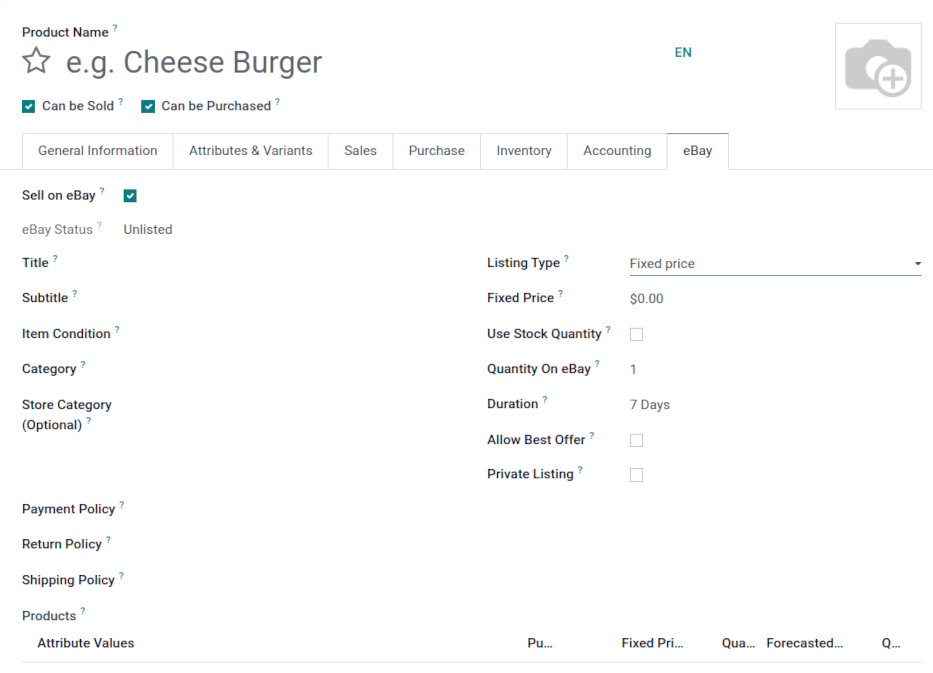
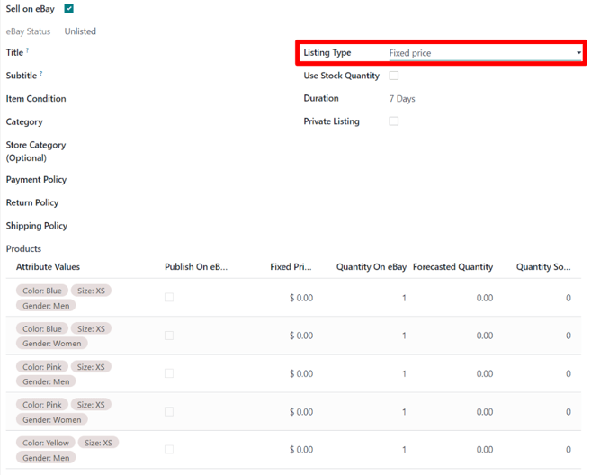

# How to list a product?

In order to list a product on eBay and Odoo there are two methods in Odoo to do so:

1. (*Preferred method*) Make a product in Odoo and list the item eBay.
   - Click List Item on eBay in the top menu of the product template. The product
     template can be accessed by navigating to Sales app ‣ Products ‣ Product
     and selecting the individual product.
2. (*Less preferred method*) List the item on eBay, then create the product in Odoo, and finally
   link product to the item on eBay.
   - Click Link With Existing eBay Listing in the top menu on the product template.The
     product template can be accessed by navigating to Sales app ‣ Product ‣
     Product and selecting the individual product.

#### NOTE
If an order comes in and the listing from the order is not linked to a product, eBay will create
a consumable product.product in its place. These consumables should be altered on the *sales
order* while in draft state to represent a storable product, and then the user can link to the
listing as they come in.

#### SEE ALSO
To learn more about the eBay connector visit these pages as well:

- [eBay connector setup](setup.md)
- [Linking existing listings](linking_listings.md)
- [Troubleshooting eBay connector](troubleshooting.md)

## Listing without variation

Access the product template by navigating to Sales app ‣ Products ‣ Product and
selecting the individual product.

In order to list a product, select the Sell on eBay field on a product template.
Sell on eBay is either in an eBay tab or under the Product
name. Click Save if necessary.

When the Use Stock Quantity field is checked, the quantity set on eBay is the Odoo
*Forecast Quantity* (Odoo *Inventory* app).

The policies need to be set in order to be able to list on eBay. A value must be selected for the
following fields Payment Policy, Return Policy, and Shipping
Policy. The options are imported from the eBay database. If no option appears, they can be imported
by navigating to Sales app ‣ Configuration ‣ Settings ‣ eBay, and clicking on
the Policies button in the Synchronization field. This button **only**
appears once the production and sandbox credentials have been set.

The Description Template allows the administrator to use templates in listings. The
default template only uses the eBay Description field of the product. HTML can be used
inside the Description Template, and in the eBay Description in Odoo 14.
Starting in Odoo 15, the powerbox feature is available to use in the template and description.
Simply type a forward slash `/` to reveal a menu with formatting, layout, and text options. To add
an image, type `/image`.

To use images in the listing, an image needs to be added as one of the *Attachments* on the product
template.

#### SEE ALSO
For more information on template configuration in Odoo visit:
[Mẫu Email](../../../general/companies/email_template.md).

## Listing with variations

When the Sell on eBay is checked on a product containing variations with
Fixed Price as Listing Type, the eBay form is slightly different. Go to the
Variants tab to or click Configure Variants in the top menu to configure the
variant settings. Pricing can be configured for each variation.

When the Listing Type is changed to Fixed Price, Odoo presents a
variant table at the bottom of the eBay tab, in which the Fixed Price can be
entered, and the decision to Publish on eBay can be made for specific variants, along
with other options.

## Product identifiers

Products identifiers such as EAN, UPC, Brand or MPN are required in most of the eBay categories.

### EAN and UPC identifiers

The module manages the EAN and UPC identifiers with the Barcode field of the product
variant. If the Barcode field is empty or is value is not valid, the EAN and UPC values
will be set as 'Does not apply' as recommended by eBay.

Barcodes can be found on the product template, under the the General Information tab.
Access the product template, first, by navigating to Sales app ‣ Products ‣
Product and selecting the individual product.

### Listing with item specifics

In order to add item specifics, one should create a product attribute with a single value in the
Attributes & Variants tab on the product form. Examples of item specifics include: `MPN`
or `Brand`. The Brand and MPN values are working as item specifics and should be defined in the
Attributes & Variants tab on the product form. If these values are not set, 'Does not
apply' will be used for the eBay listing.

## Process invoices and payments

### Posting payment

When eBay orders are placed they are always paid for up front, via the eBay site. At no point will
users pay for items on eBay through Odoo. Therefore, once orders are synced into Odoo from eBay they
are already paid for. Odoo's invoicing and payment functionalities are not utilized. However,
invoices need to be created and marked as Paid to “close” the *Sales Order*.

Users can opt to mass create and post invoices in batches. To do so, navigate to Quotations in the
list view by going to Sales app ‣ Orders ‣ Quotations. In the upper right
corner, select the list view icon. Hover over the icons to reveal the name of each. Then check the
boxes on the left that invoices should be made for and go to the Action menu or ⚙️ [Gear
icon] . Click on Create Invoices.

A pop-up will appear and click on the Create and view invoice button. A new screen will
populate with the newly created invoices. Next, select all of them by clicking on the box icon next
to Number in the header row of the list, this will select all the records. Then navigate
to the Action menu and click Post entries. Following this step, a pop-up
will appear and click on Post journal entries. This will take the invoices out of
*draft* and set them to *posted*.

### Reconciling payments

Users typically utilize PayPal to receive payment from eBay, and then send lump sums from PayPal
into their bank account. To reconcile this income, users can reconcile the one PayPal transfer with
all related invoices.

First navigate to the Accounting Dashboard by going to the Accounting
app ‣ Dashboard ‣ Bank. Create a new transaction and enter the Label
as `eBay Sales`. Fill out the Amount and enter a Statement date in. Click on
Create and edit.

For the Ending Balance field, enter the same account that was entered for the
Amount above. Click on Save. Next, open the new balance that needs to be
reconciled. Under the tab marked: Match Existing Entries select the entries that are
included in this balance.

After adding all the necessary entries, click Validate to complete the reconciliation.
To verify the payment, navigate to Customers ‣ Invoices and select the desired
customer invoice. The *Paid* label should appear under the Payment Status column.

#### SEE ALSO
- [Troubleshooting eBay connector](troubleshooting.md)
- [Linking existing listings](linking_listings.md)
- [eBay connector setup](setup.md)
