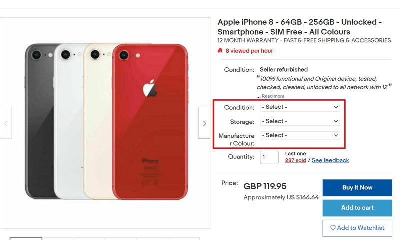
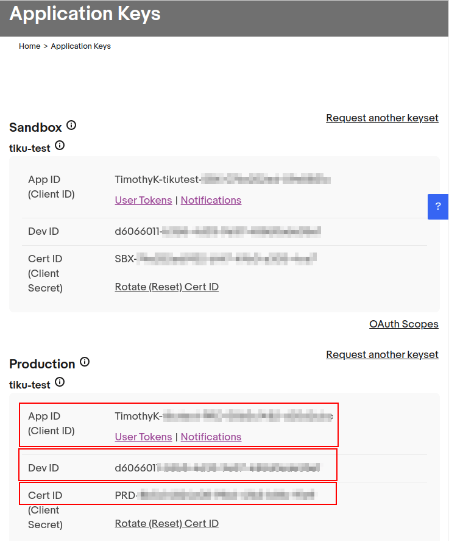
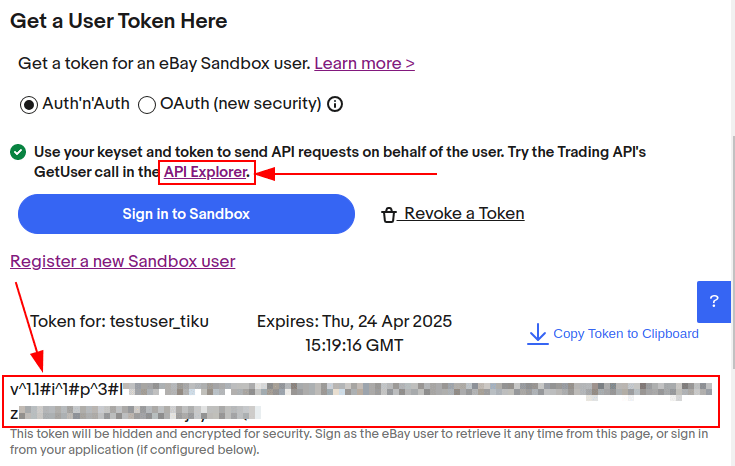

# eBay connector setup

## Tổng quan

Odoo's eBay connector allows eBay listings to connect with Odoo products. Once connected,
[updates to the listings](applications/sales/sales/ebay_connector/linking_listings.md) can be made in Odoo or in eBay. When an item sells
on eBay, draft *sales orders* are created in Odoo for the user to review and confirm. Once the sales
order is confirmed, Odoo *Inventory* and *Sales* apps function standard to pull products out of
inventory, and allow the user to create invoices.

#### SEE ALSO
To learn more about the eBay connector visit these pages as well:

- [How to list a product?](applications/sales/sales/ebay_connector/manage.md)
- [Linking existing listings](applications/sales/sales/ebay_connector/linking_listings.md)
- [Troubleshooting eBay connector](applications/sales/sales/ebay_connector/troubleshooting.md)

### eBay - Odoo linked fields

The following are eBay product details. Each of these eBay fields update corresponding fields in
Odoo.

- eBay URL
- eBay status
- Quantity sold
- Ngày bắt đầu
- Tiêu đề
- Phụ đề
- Item condition
- Danh mục
- Category 2
- Store category
- Store category 2
- Payment policy
- Seller profiles
- Postal code
- Shipping policy
- Listing type (fixed price or auction)
  - Starting price for Auction
  - Buy it now price
  - Fixed Price amount
- Use stock quantity
- Quantity on eBay
- Thời hạn
- Allow best offer
- Private listing
- eBay description
- eBay product image
- Quốc gia

### eBay terms

*Variations* group multiple products into one, with variation (or variant) options. Variations can
sync to Odoo's attributes and values. Variations will appear in drop down menus near the top of the
page when viewing an eBay listing. These are comparable to product variants in Odoo.

*Item specifics*, located at the bottom of the listing, detail product-specific information. These
specifics don't sync with Odoo fields by default; a development is required to link these fields.

*Sandbox* and *Production* are terms that are used to categorize the eBay environments as either
still in development/testing (*Sandbox*) or for use in the real instance of the database with real
customer information/dataset (*Production*). It is recommended to start first in the *Sandbox* to
test, and then following the processes below, create a *Production* instance.

#### IMPORTANT
The environment selection **must** remain the same for all environment settings on eBay and on
Odoo throughout this setup.

### eBay actions available on Odoo

The following are built-in actions in Odoo that add or update eBay listings:

- **List**/ **Link**: generate a new eBay listing with an Odoo product by clicking List
  Item on eBay or Link With Existing eBay Listing.
- Revise item button: after making changes to an eBay listing in Odoo, save the record,
  and then click the Revise Item in Odoo to update the eBay listing.
- **Relist**: if an item's listing was ended early or auto-relist was not selected, a
  user can relist the item from Odoo. The start date will reset.
- End item's listing button: end a listing on eBay directly from Odoo.
- **Unlink product listings**: users can unlink a product from the eBay listing; the listing will
  stay intact on eBay.

## Setup required on Odoo prior to eBay setup

To link eBay with Odoo, install the eBay module by navigating to the Odoo dashboard and clicking
into the Apps application. Search the term `eBay` and install the `eBay Connector`
module.

The following items must be configured before eBay is set up:

- In Odoo, create and configure products that are intended to be listed in eBay. eBay does not
  import new products into Odoo. All products must first be created in Odoo, and then linked to
  listings.
  - Odoo does not allow multiple eBay listings to be linked per product in Odoo. If the company
    sells the same product for multiple listings, follow these instructions:
    - Set up one *base* product (noted in the Component field of the ) from which all eBay listings will pull from. This will be a storable product
      so stock can be kept. Highlighted in green below, this product will be included in the kit on
      each subsequent “linked” product below.
    - Set up 2+ *linked* products (noted in the Product field of the , one for each eBay listing. The product type will be determined by the
      company's accounting settings, as explained in the Odoo documentation. Highlighted in yellow
      below, each product should have a BoM type equal to Kit and have the
      base product as a Component of the kit. When this linked eBay product is sold, the
      delivery order created will have the base product listed in lieu of the linked product.

    

  > #### SEE ALSO
  > [Danh mục vật tư](applications/inventory_and_mrp/manufacturing/basic_setup/bill_configuration.md)
- eBay does not automatically create invoices for eBay orders that get pushed into Odoo. Set
  invoicing policy on eBay products: invoicing policy will dictate when the product can be invoiced.
  Since most eBay users collect payment before the product is shipped, “invoice on ordered” will
  allow users to mass create invoices for eBay orders every day.
- Set the Outgoing Shipments route for the warehouse to Deliver goods
  directly (1 step).

  #### WARNING
  When the Outgoing Shipments route is set to two or three steps, a known bug occurs:
  eBay wrongly marks orders as delivered when the pick operation in Odoo is confirmed. The
  expected behavior is to mark orders as delivered **after** the *delivery order* is confirmed.
  This mislabeling prevents tracking numbers in eBay from being imported onto the delivery order.
- If the Accounting/Invoicing apps are installed, practice registering payment and reconciling
  invoices created from eBay orders with incoming eBay money.

  #### SEE ALSO
  [Đối chiếu ngân hàng](applications/finance/accounting/bank/reconciliation.md)
- Generate a marketplace account deletion/closure notification token. To begin, navigate to
  Sales app ‣ Configuration ‣ Settings. Under the eBay heading,
  change the mode to Production, and input random text values for the
  Production Cert Key. Then click the Generate Token button under the
  eBay Marketplace Account Deletion/Closure Notifications section. This token will be
  used during the setup on eBay for the deletion/closure notifications configuration.

## Set up on eBay

### Set up eBay developer account

To start, create an eBay developer account via [eBay's developer portal](https://go.developer.ebay.com/). This site requires a different login and password than the eBay
account, though the same email address can be used to register. The verification to create a
developer account is around 24 hours.

### Set up eBay keyset

Once the eBay developer account is created, set up an application on [eBay's developer portal](https://go.developer.ebay.com/). Next, navigate to the Hi [username] heading at top
right of screen, then from the drop-down menu options, click Application Keysets. Doing
so opens a pop-up that prompts the user to Enter Application Title (up to fifty
characters), and choose a development environment (Sandbox or Production).
These two fields generate first keyset. This application title is not saved until the keyset is
generated. Click on Create a keyset to generate the keyset.

#### WARNING
The newly created *production keyset* is disabled by default. Activate it by subscribing to the
eBay Marketplace 'account deletion or closure notifications' or by applying to eBay for an
exemption. Once enabled, the database can make 5000 calls per day using this keyset.

#### Configure account deletion / notification settings (Production)

To configure notifications or delete the database on a production environment, navigate to the [eBay
developer portal](https://go.developer.ebay.com/). Configure the account deletion/notification
settings in eBay by navigating to the `Hi [username]` at top right of screen, then
Application Keysets.

Next, click the marketplace deletion/account closure notification option under the
Production keyset column. Enter an email under Email to notify if marketplace
account deletion notification endpoint is down. Click Save to enable the email.

Following this action, enter the Marketplace account deletion notification endpoint URL
provided by Odoo. This HTTPs endpoint is found in Odoo by navigating to Sales app
‣ Configuration ‣ Settings, in the eBay Marketplace Account Deletion/Closure
Notifications field.

Clicking the Generate Token button in Odoo below this field creates a verification token
for the eBay production environment. In Odoo, Copy the newly created token and navigate
to eBay to fill in the Verification token field. Click Save to enable the
Event Notification Delivery Method.

After completing the above fields, click Send Test Notification to test the new
notifications. Proceed to the next step when the green check mark appears. Revisit the above
settings if the test post is not as expected.

After configuring notification settings, go back to the Application Keys page to
generate production keysets.

#### Creating the keyset

A successful setup of the notifications enables the ability to create Production Keysets which are
needed in the remainder of the Odoo configuration. Navigate back to the Application
Keys page generate a production keyset.

The administrator is prompted to Confirm the Primary Contact. Enter or confirm the
account owner (the person legally responsible for the eBay API License Agreement). Fill out
First Name, Last Name, Email, Phone. Then, select
either the Individual or Business options.

#### NOTE
The provided email address or phone number does **not** have to match the account's. eBay uses
this information to contacting the business or individual in case of issues with user tokens.
Additional contacts can be added from the Profile & Contacts page on eBay.

Click on Continue to Create Keys to confirm the primary contact. The
Application Keys populates in a new screen and an email is also sent to the developer
account. An App ID (Client ID), Dev ID, and Cert ID (Client
Secret) all populate.

Copy these values down as they will be input into Odoo later in the process.

### Create eBay user token

Now, create a *user token* in eBay by navigating to the `Hi [username]` at top right of screen,
then User Access Tokens.

Select the correct Environment: Sandbox for testing or
Production for the live database. Maintain the same selection for all environment
settings on both eBay and Odoo.

Next, select the radio button labeled Auth'n'Auth.

Choose Sign in to Production or Sign in to Sandbox to get a user token in
the chosen environment. This button varies based on the selection made above for either
Sandbox or Production.

Doing so triggers a a pop-up window to Confirm your Legal Address. Complete the required
fields, which are First Name, Last Name, Primary Email,
Legal Address, and Account Type. For Account Type, select either
Individual or Business. To complete the confirmation, click Sign
into eBay to get a Token.

#### NOTE
eBay will contact this individual or business should there be any issues with the application
keys. Other contacts can be added on the Profile & Contacts eBay page.

The administrator will be redirected to either a sandbox or production sign-in page for eBay. This
login is different than the eBay developer's console, it is the eBay account where the items will be
sold on. This email and/or login can differ from the eBay developer account.

Enter the Email or Username for the eBay account and sign into the eBay
account.

#### IMPORTANT
Should an additional user be needed for the sandbox simulation, a test user needs to be created.
Visit [eBay's Register for Sandbox form](https://developer.ebay.com/sandbox/register). Detailed
instructions can be found on eBay's help pages: [Create a test Sandbox user](https://developer.ebay.com/api-docs/static/gs_create-a-test-sandbox-user.html).

### Grant application access

After signing into the production or sandbox environment, eBay presents the administrator with an
*agreement* to grant access to the user's eBay data.

Clicking Agree allows eBay to link the eBay account with the *application programming
interface* (API). This agreement can be changed at any time by visiting eBay's account preferences.

#### WARNING
eBay has a timed sequence between signing in and agreeing to the terms for the  linkage to the account. Once complete a User
Token will populate on the User Tokens page.

A User Token will populate on the screen. Make sure to copy this token down as it will
be used in the next steps along with the Application Keyset.

#### IMPORTANT
Signing in to the eBay account is necessary to create to the token. The eBay developer can also
revoke the token by clicking on the Revoke a Token link.

### API explorer

Now that the Application Keyset and User Token have been created, a test can
be executed via the [API Explorer](https://developer.ebay.com/DevZone/build-test/test-tool/default.aspx) to ensure that the
 is configured correctly. This test will execute a
simple search using the .

To begin the  test, click on Get OAuth
Application Token. This will populate the key into the Token field.

A basic search function is set to execute. Click on Execute to complete the test. A
successful test will respond with a Call Response of `200 OK` with a corresponding
Time.

## Entering credentials into Odoo

The previously copied User Token and Application Keyset are now ready to be
entered into the Odoo database.

Navigate back the eBay settings in Odoo (Sales app ‣ Configuration ‣ Settings
‣ eBay) and paste the following credentials from eBay into the corresponding fields in Odoo.

| Nền tảng   | Dev Key/ID                 | Token                    | App Key/ID                 | Cert Key/ID                 |
|------------|----------------------------|--------------------------|----------------------------|-----------------------------|
| eBay       | Dev ID                     | Mã token người dùng      | App ID (Client ID)         | Cert ID (Client Secret)     |
| Odoo       | Mã khoá của lập trình viên | Production/Sandbox Token | Production/Sandbox App Key | Production/Sandbox Cert Key |

#### IMPORTANT
The Application Keyset can be accessed by going to [eBay's developer portal](https://go.developer.ebay.com/) and navigate to the `Hi [username]` at top right of screen,
then click on Application Keysets. Get to the *User Token* in eBay by navigating to
the `Hi [username]` at top right of screen, then User Access Tokens and click on
Sign in to Sandbox. The User Token can also be accessed by clicking on
User Tokens from the Application Keys page.

Confirm that the setup is correct by saving the credentials in Odoo. Once the initial setup is
complete, a new menu tab in products will appear called `eBay` with the option to Sell on
eBay. See the [How to list a product?](applications/sales/sales/ebay_connector/manage.md) documentation on how to list products.

#### SEE ALSO
Now that the setup is complete, proceed to either:

- [Create listings](applications/sales/sales/ebay_connector/manage.md)
- [Link existing listings](applications/sales/sales/ebay_connector/linking_listings.md)
