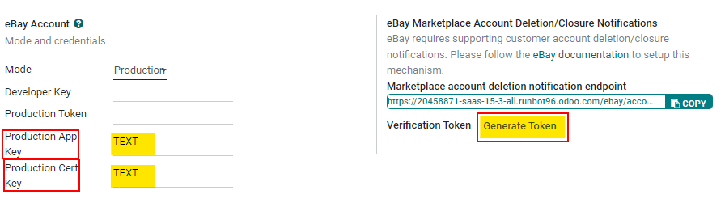
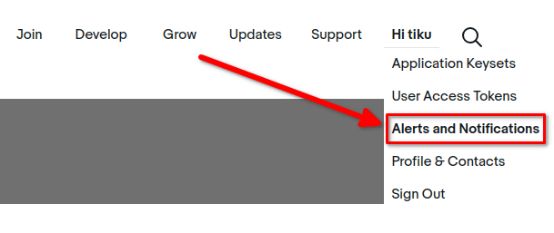
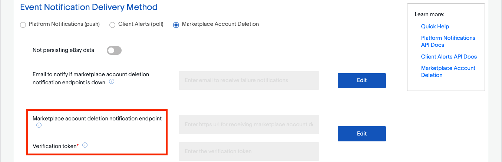
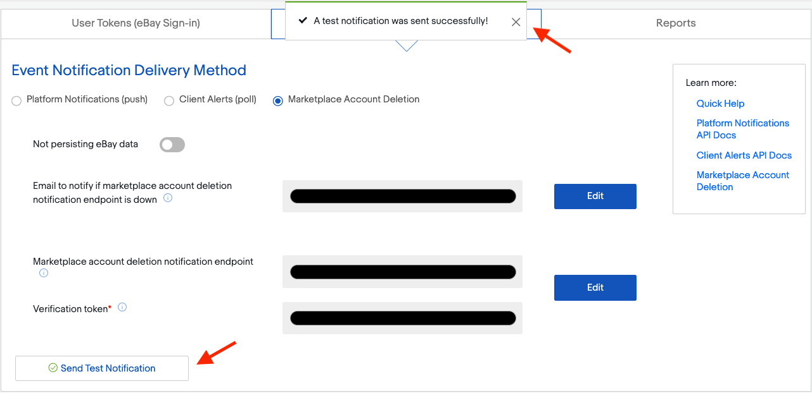

# Troubleshooting eBay connector

#### SEE ALSO
To learn more about the eBay connector visit these pages as well:

- [eBay connector setup](setup.md)
- [How to list a product?](manage.md)
- [Linking existing listings](linking_listings.md)

## Accept account deletion notifications

Since September 2021, **eBay requires supporting customer account deletion/closure notifications**.
As such, when eBay receives an account request for deletion, all eBay partners must confirm the
reception of the request and take further action if necessary.

Odoo has a notification endpoint to receive those notifications, confirm the reception of the
request, and handle the first set of actions to anonymize the account details in *Contacts* and
remove the customer's access to the portal.

#### IMPORTANT
Make sure to correctly [set up the subscription to the marketplace account deletion
notifications](#ebay-subscribe-account-deletion-notifications) as eBay may temporarily disable
the related eBay account until the subscription is completed.

### Verify the installation of Odoo is up to date

In order to activate the endpoint, the module *eBay Connector - Account Deletion* must be installed.
If the Odoo database was first created after September 2021, the module is installed automatically
and the administrator can proceed to the [next step](#ebay-retrieve-endpoint-details).

#### Update Odoo to the latest release

The notification endpoint is made available through a new Odoo module; to be able to install it, the
administrator must make sure that the Odoo source code is up-to-date.

- If the company uses Odoo on Odoo.com or Odoo.sh platform, the code is already up-to-date, so
  proceed to the next step.
- If the company uses Odoo with an on-premise setup or through a partner, then the administrator
  must update the installation as detailed in [this documentation page](../../../../administration/on_premise/update.md) or by contacting an integrating partner.

#### Update the list of available modules

New modules must be *discovered* by the Odoo instance to be available in the Apps
menu.

To do so, activate the [developer mode](../../../general/developer_mode.md#developer-mode), and go to Apps ->
Update Apps List. A wizard will ask for confirmation.

#### Install the eBay Connector - Account Deletion update

#### WARNING
**Never** install new modules in the production database without testing them in a duplicate or
staging environment. For Odoo.com customers, a duplicate database can be created from the
database management page. For Odoo.sh users, the administrator should use a staging or duplicate
database. For on-premise users, the administrator should use a staging environment - contact the
integrating partner for more information regarding how to test a new module in a particular
setup.

To install the module, go to the Apps menu, remove the `Apps` search facet and
search for `eBay`. If the module *eBay Connector - Account Deletion* is present and marked as
installed, the Odoo database is already up-to-date and the administrator can proceed with the next
step. If it is not yet installed, install it now.

### Retrieve endpoint details from Odoo

The endpoint details can be found in Sales ‣ Configuration ‣ Settings ‣ eBay.
First, input random text values for the Production App Key and for the
Production Cert Key. Click on Generate Token to retrieve the
Verification Token.

### Subscribe to account deletion notifications

Navigate to the [eBay developer portal](https://go.developer.ebay.com/). Configure the account
deletion/notification settings in eBay by navigating to the `Hi [username]` at the top right of
screen, then go to Alerts & Notifications.

To subscribe to deletion/closure notifications, eBay needs a few details:

- An *email address* to send notifications to if the endpoint is unreachable.
- The *endpoint details*:
  - The URL to Odoo's account deletion notification endpoint
  - A verification token

### Verify the connectivity with the endpoint

After setting the retrieved endpoint details in eBay's dashboard, consider testing the connectivity
with the Send Test Notification button.

> The following confirmation message should be received: "A test notification was sent successfully!"

#### SEE ALSO
- [How to list a product?](manage.md)
- [Linking existing listings](linking_listings.md)
- [eBay connector setup](setup.md)
