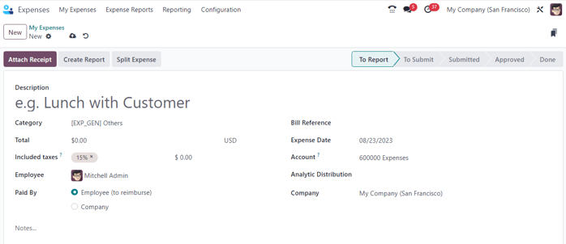
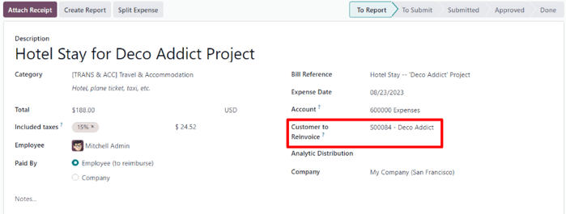
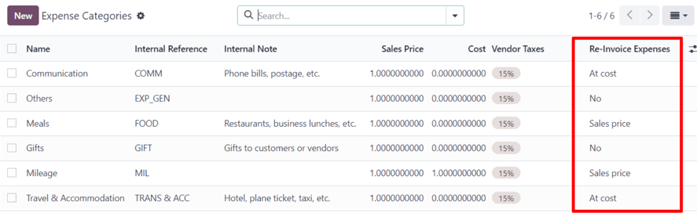
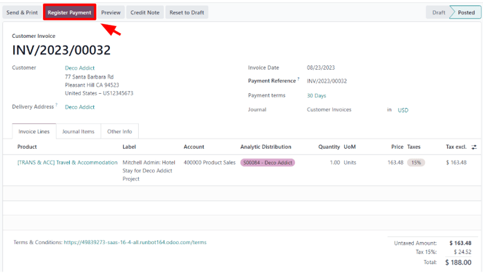

# Reinvoice expenses to customers

While working on a project for a client, employees often have to spend their own money on various
expenses related to the project.

For example, an employee may need to use their own money to pay for a hotel, while they provide an
on-site service for a client. As a company, this expense should be reinvoiced to the customer. With
Odoo, these kinds of expenses can quickly be reinvoiced to the customer related to the project.

## Expenses application

To be able to reinvoice a customer for an expense, the *Expenses* application **must** be installed.

To install the *Expenses* application, navigate to main Odoo dashboard ‣ Apps,
and click Install on the *Expenses* application block. When clicked, Odoo installs the
application, refreshes the page, and returns to the main Odoo dashboard.

## Add expenses to sales orders

To begin, have a sales order confirmed in the *Sales* app to which a reinvoiced expense can be
added. Or, create a new sales order from scratch. To do that, navigate to the Sales
app ‣ New. Doing so reveals a blank quotation form.

Then, add a Customer, and add a product to the Order Lines tab, by clicking
Add a product. Next, select a product from the drop-down menu.

Lastly, click Confirm to confirm the sales order.

With the sales order confirmed, it's time to create an expense.

To do that, navigate to the *Expenses* application, by going to main Odoo dashboard
‣ Expenses.

Then, from the *Expenses* dashboard, click New to reveal a blank expenses form.

On the expenses form, add a Description to easily reference the expense.

Then, in the Category field, select one of the following options from the drop-down
menu:

- Communication: any form of communication related to a project/order.
- Others: expense that doesn't fit into any other categories.
- Meals: any form of meal costs related to a project/order.
- Gifts: any form of gift costs related to a project/order.
- Mileage: any form of mileage (gas) costs related to project/order.
- Travel & Accommodation: any travel or accommodation costs related to a project/order.

For this sample workflow, which will reinvoice a customer for a brief hotel stay, the
Category for this example is [TRANS & ACC] Travel & Accommodation.

#### NOTE
The following example requires the *Sales*, *Accounting*, and *Expense* apps to view/modify all
the fields mentioned during the workflow.

Beneath the Category field, enter in the amount to be expensed in the Total
field.

Next, designate if there are any Included taxes in the Total. If a
preconfigured tax amount is selected from the Included taxes field, Odoo auto-calculates
the taxed amount, based on the amount entered in the Total field.

Then, choose which Employee was responsible for the expense, and choose an option in the
Paid By field: Employee (to reimburse) or Company.

In this case, our employee paid for the hotel with their own money, so the Employee (to
reimburse) option is chosen.

On the right-hand side of the expenses form, the option to add a Bill Reference is
available. Beneath that, the auto-populated Expense Date and Account fields
are available.

#### NOTE
The Expense Date and Account field can be modified, if needed.

Next, in the Customer to Reinvoice field, click the blank field to reveal a drop-down
menu. From this drop-down menu, select the appropriate sales order to which this expense should be
attached. This field **must** be filled, in order to reinvoice a customer for an expense.

Lastly, the option to modify the Analytic Distribution and Company fields
are available. These fields are *not* required to complete a reinvoiced expense to a customer, but
are available to modify, if needed.

Also, at the bottom of the expense form, there is a Notes... section, wherein any notes
related to this expense can be added, if needed.

At the top of the expense form, there are buttons to Attach Receipt, Create
Report, and Split Expense.

If there is a physical or digital receipt that should be attached to the expense, click
Attach Receipt.

If the cost of this expense needs to be split, click Split Expense. This feature can be
used for a number of reasons (spitting expense with another employee, to accommodate different tax
rates, etc.).

If neither of these options are necessary, click Create Report to lock in the expense
report that was just configured.

Doing so reveals an Expense Report Summary for the new expense.

Here, once the details related to the expense have been confirmed, click Submit to
Manager. This sends the expense report to the approving manager, who will review the expense.

The manager in charge of reviewing and approving the expense will inspect the details related to
the expense, and if there are no issues, they will click the Approve button — which
*only* appears on the manager's view of the Expense Report Summary that's been submitted
to the manager by the employee.

Once approved, the buttons at the top of the Expense Report Summary change once again.
At this point, the buttons at the top of the Expense Report Summary are: Post
Journal Entries, Report in Next Payslip, Refuse, and Reset to
Draft.

When the manager is satisfied with the Expense Report Summary, they'll click
Post Journal Entries.

Upon clicking Post Journal Entries, that button disappears, and the Analytic
Distribution column in the Expense tab is filled with the sales order that was
initially configured to the expense in the Customer to Reinvoice field.

#### IMPORTANT
By default, the Customer to Reinvoice field is enabled for the [TRANS &
ACC] Travel & Accommodation, [COMM] Communication, [FOOD] Meals, and
[MIL] Mileage expense category.

It should be noted that **not** all of the default expense categories that come installed with
the *Expenses* application have reinvoicing policies activated. The setting may have to be
manually activated.

To do that, navigate to Expenses app ‣ Configuration ‣ Expenses Categories
to view a list of all expense categories in the database.

Look in the Re-Invoice Expenses column to see which selections have been made for
each expense category.

To modify an expense category, click the <i class="fa fa-arrow-right"></i> (right arrow) in the
Category field, to reveal that specific expense from.

Under the Invoicing section, in the Re-Invoice Expenses field, select
either At cost or Sales price.

## Reinvoice expense

With those steps completed, it's time to return to the sales order to complete the reinvoice of the
expense to the customer.

To do that, navigate to main Odoo dashboard ‣ Sales app, and select the
appropriate sales order that should be reinvoiced for the expense.

On the sales form, the newly-configured expense is now in the Order Lines tab, with its
Delivered column filled in, and ready to be invoiced.

After confirming the details of the expense, click Create Invoice at the top of the
sales order. When clicked, a Create invoices pop-up window appears.

From this pop-up window, leave the Create Invoice field on the default
Regular invoice option, and click Create Draft Invoice.

Doing so reveals a Customer Invoice Draft showing *only* the expense in the
Invoice Lines tab.

If all the information related to the expense is correct, click Confirm to confirm the
invoice. Doing so moves the status of the invoice from Draft to Posted.

To send the invoice to the customer, click Send & Print. Doing so reveals a
Send pop-up window, with a preconfigured message and PDF invoice in the body of the
message. The message can be reviewed and modified, if needed.

Once ready, click Send & Print to send the invoice to the customer. When clicked, the
pop-up window disappears, and Odoo sends the message/invoice to the customer. Additionally, a PDF of
the invoice is automatically downloaded for record-keeping and/or printing purposes.

Back on the Customer Invoice, click the Register Payment button when the
customer pays for the invoiced expense.

When Register Payment is clicked, a Register Payment pop-up window appears.
In this pop-up window, the necessary fields are auto-populated with the correct information. After
reviewing the information, click Create Payment.

Once Create Payment is clicked, the pop-up window disappears, and a green In
Payment banner is in the upper-right corner of the invoice, signifying this invoice is paid for in
full. Thus, completing the workflow.

#### SEE ALSO
- [Invoice based on delivered or ordered quantities](applications/sales/sales/invoicing/invoicing_policy.md)
- [Invoicing based on time and materials](applications/sales/sales/invoicing/time_materials.md)
- [Invoice project milestones](applications/sales/sales/invoicing/milestone.md)
