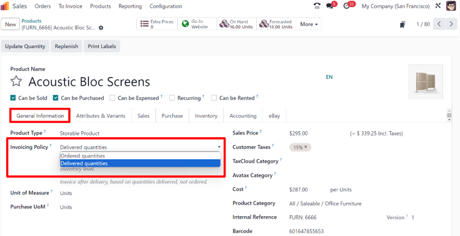
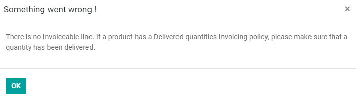

# Invoice based on delivered or ordered quantities

Different business policies might require different options for invoicing:

- The *Invoice what is ordered* rule is used as the default mode in Odoo *Sales*, which means
  customers are invoiced once the sales order is confirmed.
- The *Invoice what is delivered* rule invoices customers once the delivery is done. This rule is
  often used for businesses that sell materials, liquids, or food in large quantities. In these
  cases, the ordered quantity may differ slightly from the delivered quantity, making it preferable
  to invoice the quantity actually delivered.

Being able to have different invoicing options provides more flexibility.

## Invoicing policy features

To activate the necessary invoicing policy features, go to Sales app ‣
Configuration ‣ Settings, and under the Invoicing heading, select an
Invoicing Policy rule: Invoice what is ordered or Invoice what is
delivered.

#### IMPORTANT
If the Invoice what is delivered rule is chosen, it is **not** possible to activate
the Automatic Invoice feature, which automatically generates invoices when an online
payment is confirmed.

## Invoicing policy on product form

On any product page, via the Sales app ‣ Products ‣ Products dashboard, locate
the Invoicing Policy option located under the General Information tab. It
can be changed manually using the drop-down menu.

## Impact on sales flow

In Odoo *Sales*, the basic sales flow starts with the creation of a quotation. Then, that quotation
is sent to a customer. Next, it needs to be confirmed, which turns the quotation into a sales order.
This, in turn, creates an invoice.

The following is a breakdown of how invoicing policy rules impact the aforementioned sales flow:

- Invoice what is ordered: No impact on the basic sales flow. An invoice is created as
  soon as a sale is confirmed.
- Invoice what is delivered: Minor impact on sales flow, because the delivered quantity
  needs to be manually entered on the sales order. Or, the *Inventory* app can be installed and used
  to confirm the delivered quantity before creating an invoice with the *Sales* app.

#### WARNING
If a user attempts to create an invoice without validating the delivered quantity, the following
error message appears: There is no invoiceable line. If a product has a Delivered
quantities invoicing policy, please make sure that a quantity has been delivered.

#### NOTE
Once a quotation is confirmed, and the status changes from Quotation sent to
Sales order, the delivered and invoiced quantities are available to view, directly
from the sales order. This is true for both invoicing policy rule options.

Odoo automatically adds the quantities to the invoice, both Delivered and
Invoiced, even if it's a partial delivery, when the quotation is confirmed.

Finally, there are a few different options to create an invoice: Regular invoice,
Down payment (percentage) or Down payment (fixed amount).

#### SEE ALSO
Be sure to check out the documentation explaining down payment options to learn more:
[Khoản trả trước](down_payment.md)
