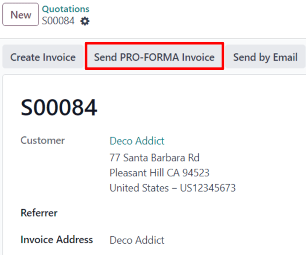
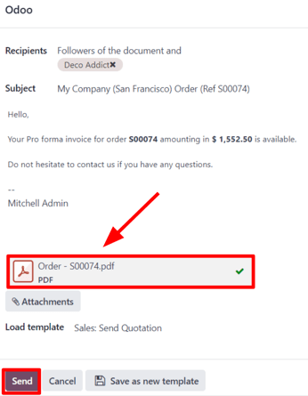

# Hóa đơn chiếu lệ

A *pro-forma invoice* is an abridged or estimated invoice sent in advance of a delivery of goods. It
notes the kind and quantity of goods, their value, and other important information, such as weight
and transportation charges.

Pro-forma invoices are commonly used as preliminary invoices with a quotation. They are also used
during importation for customs purposes. They differ from a normal invoice, in that they are *not* a
demand (or request) for payment.

## Cấu hình

In order to utilize pro-forma invoices, the *Pro-Forma Invoice* feature **must** be activated.

To enable this feature, navigate to Sales app ‣ Configuration ‣ Settings, and
in the Quotations & Orders section, click the checkbox next to Pro-Forma
Invoice. Then, click Save to save all changes.

## Send pro-forma invoice

With the Pro-Forma Invoice feature activated, the option to send a pro-forma invoice is
now available on any quotation or sales order, via the Send Pro-Forma Invoice button.

#### NOTE
Pro-forma invoices can **not** be sent for a sales order or quotation if an invoice for a down
payment has already been sent, or for a recurring subscription.

In either case, the Send Pro-Froma Invoice button does **not** appear.

However, pro-forma invoices **can** be sent for services, event registrations, courses, and/or
new subscriptions. Pro-forma invoices are not limited to physical, consumable, or storable goods.

When the Send Pro-Forma Invoice button is clicked, a pop-up window appears, from which
an email can be sent.

In the pop-up window, the Recipients field is auto-populated with the customer from the
sales order or quotation. The Subject field and the body of the email can be modified,
if necessary.

The pro-forma invoice is automatically added as an attachment to the email.

When ready, click Send, and Odoo instantly sends the email, with the attached pro-forma
invoice, to the customer.

#### SEE ALSO
[Invoice based on delivered or ordered quantities](invoicing_policy.md)
