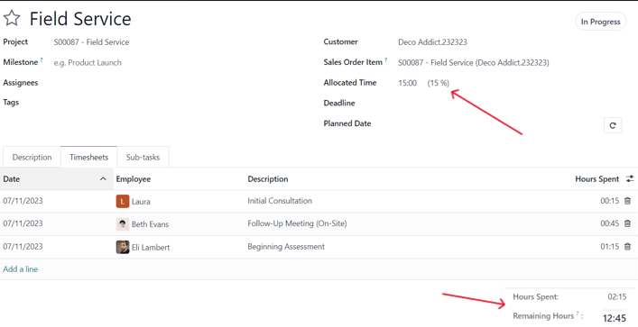
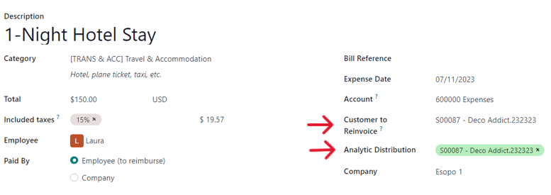
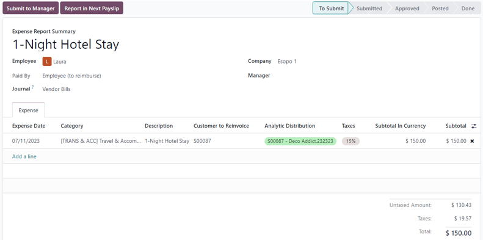
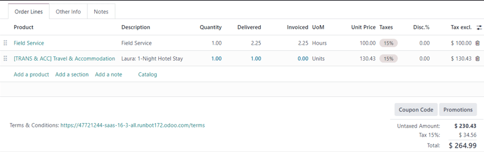
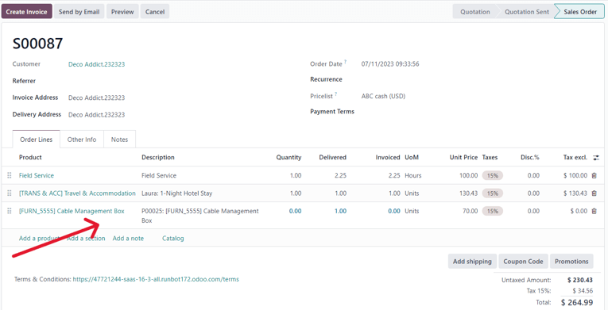

# Invoicing based on time and materials

Invoicing based on time and/or materials is typically used when accurately estimating the size of a\
project isn't possible, or when the requirements of a project may change.

This is different from a fixed-price contract, when a customer agrees to pay a specified total for\
the fulfillment of the contract---no matter what needs to be paid to the employees, sub-contractors,\
vendors, suppliers, and so on.

The Odoo _Sales_ app can invoice for time and various other expenses (e.g. transport, lodging), as\
well as purchases needed to fulfill an order.

## App and settings configuration

First, in order to accurately keep track of the progress of a project, the Odoo _Project_ an&#x64;_&#x41;ccounting_ apps **must** be installed.

To install the _Project_ app, navigate to Odoo main dashboard ‣ Apps. Then, on\
the Apps page, locate the Project app block, and click Activate.\
The page automatically refreshes and returns to the main Odoo dashboard, where the _Project_ app is\
now available to access.

Repeat the same process to install the _Accounting_ application.

After installation, click the Accounting app icon from the main Odoo dashboard, and\
navigate to Configuration ‣ Settings. On the Settings page, scroll\
down to the Analytics section, and ensure the box next to Analytic\
Accounting is checked.

Then, click Save to save all changes.

Then, navigate to Odoo main dashboard ‣ Project app ‣ Configuration ‣\
Settings. On the Settings page, in the Time Management section, ensure the\
box beside the Timesheets feature is checked.

Then, click Save to save all changes.

## Service product configuration

With the _Timesheets_ feature activated in the _Project_ app, it is now possible to invoice for time\
spent on a project, but **only** when the following product configurations have been made.

#### IMPORTANT

Invoicing for time spent on a project is **only** possible with products that have _Service_ set\
as the _Product Type_ on their product form.

To configure a service product, first navigate to Sales app ‣ Products ‣\
Products. On the Products page, select the desired service product to be configured, or\
click New to create a new product.

From the product form, in the General Information tab, set the Product Type\
to Service. Then, open the drop-down menu in the Invoicing Policy field, and\
select Based on Timesheets.

Next, from the Create on Order drop-down menu, select Project & Task. That\
setting indicates that, when a sales order is created with this specific service product, a new\
project and task is created in the _Project_ app.

#### NOTE

The option Task can be chosen instead from the Create on Order drop-down\
menu. If Task is chosen, select an existing project that the task will appear in from\
Project field, which only appears if Task is chosen in the\
Create on Order field.

## Add time spent to sales order

After properly configuring a service product with the correct _Invoicing Policy_ and _Create on_\
_Order_ options, it is possible to add time spent to a sales order.

To see that in action, navigate to Sales app ‣ New to open a blank quotation\
form. Then, proceed to add a Customer, and in the Order Lines tab, click\
Add a product, and select the properly [configured service product](time_materials.md#sales-invoicing-configured-service-product) from the drop-down menu.

Next, click Confirm to confirm the order.

After confirming the sales order, two smart buttons appear at the top of the order form:\
Projects and Tasks.

If the Projects smart button is clicked, it reveals the specific project related to this\
sales order. If the Tasks smart button is clicked, it reveals the specific project task\
related to this sales order. Both are also accessible in the _Project_ app.

In order to add time spent on a sales order, click the Tasks smart button.

On the task form, select the Timesheets tab. From the Timesheets tab,\
employees can be assigned to work on the project, and the time they spend working on the task can be\
added by the employees or by the person who created the sales order.

To add an employee, and the time spent working on the task, click Add a line in the\
Timesheets tab. Then, select the appropriate Date and Employee.\
There is also the option to add a brief description of the work done during this time in the\
Description column, but it's not required.

Lastly, enter the amount of time worked on the task in the Hours Spent column, and click\
away to complete that line in the Timesheets tab.

#### NOTE

The time entered in the Hours Spent column is immediately reflected in the\
Allocated Time field (located near the top of the task form) as a percentage, which\
reflects how much of the total allocated work hours have been done so far.

That same information is found as numerical hours in the Hours Spent and\
Remaining Hours fields, located at the bottom of the Timesheets tab.

Repeat this process for however many employees and hours have been worked on the project.

## Invoice time spent

Sau khi đã thêm đầy đủ nhân viên cần thiết và thời gian làm việc vào nhiệm vụ của dự án, hãy quay lại đơn bán hàng để lập hóa đơn cho khách hàng dựa trên số giờ đã làm việc. Để thực hiện điều này, bạn có thể nhấp vào nút thông minh Đơn bán hàng ở đầu biểu mẫu nhiệm vụ, hoặc quay lại đơn bán hàng thông qua thanh breadcrumb nằm ở góc trên bên trái màn hình.

Back on the sales order form, the time that was added to the task is reflected in the\
Order Lines tab (in the Delivered column) and in the new Recorded\
Hours smart button at the top of the sales order.

To invoice the customer for time spent on the project, click Create Invoice, and select\
Regular invoice from the Create invoices pop-up window. Then, click\
Create Draft Invoice.

Doing so reveals a Customer Invoice Draft, clearly showing all the work that's been done\
in the Invoice Lines tab.

Click Confirm to confirm the invoice and continue with the invoicing process.

#### SEE ALSO

[Invoice based on delivered or ordered quantities](applications/sales/sales/invoicing/invoicing_policy.md)

## Cấu hình chi phí

In order to track and invoice expenses related to a sales order, the Odoo _Expenses_ app **must** be\
installed.

To install the _Expenses_ app, navigate to Odoo main dashboard ‣ Apps. Then, on\
the Apps page, locate the Expenses app block, and click\
Activate.

The page automatically refreshes and returns to the main Odoo dashboard, where the\
Expenses app is now available to access.

## Add expenses to sales order

To add an expense to a sales order, first navigate to the Expenses app. Then, from\
the main _Expenses_ dashboard, click New, which reveals a blank expense form.

On the expense form, add a Description of the expense (e.g. `Hotel Stay`, `Plane Ticket`). Next, in the Category field, select the appropriate option from the drop-down\
menu (e.g. Meals, Miles, Travel & Accommodation).

#### NOTE

Expense categories can be added and modified by navigating to Expenses app ‣\
Configuration ‣ Expense Categories.

Then, enter the total amount of the expense in the Total field, as well as any\
Included Taxes that may apply. Next, ensure that the correct Employee is\
selected, and designate who paid for the expense in the Paid By field: the\
Employee (to reimburse) or the Company.

Next, in the Customer to Reinvoice field, select the appropriate sales order from the\
drop-down menu. Then, select that same sales order information from the Analytic\
Distribution field, as well.

#### NOTE

The Analytic Distribution field will **only** have the corresponding sales order as\
an option if the sales order contains a service product that is billed based on _Timesheets_,_Milestones_, or _Delivered Quantities_.

If there are any receipts that should be uploaded and attached to the expense, click the\
Attach Receipt button, and upload the necessary documents to the expense. This is**not** required, but it may affect whether or not an expense is approved.

When all the information has been entered, click Create Report to create an expense\
report detailing all the expense information that was just entered.

Then, there's the option to Submit to Manager for approval. Once approved, the\
Report in Next Payslip appears.

To showcase a complete flow in this example, select Submit to Manager. Then, the manager\
would click Approve to approve this expense, and click Post Journal Entries\
to post this expense to the accounting journal.

## Invoice expenses

To invoice a customer for an [expense on a sales order](time_materials.md#sales-invoicing-add-expenses-sales-order), navigate to the related sales order, either from the\
Sales app or from the expense report in the Expenses app. From the\
expense report, click the Sales Orders smart button at the top of the page.

If the expense report was linked to the sales order, the newly-configured expense now has its own\
line in the Order Lines tab, and can be invoiced to the customer.

To invoice the customer for the expense on the sales order, click Create Invoice, select\
Regular Invoice from the Create invoices pop-up window, then click\
Create Draft Invoice.

Doing so reveals a Customer Invoice Draft for the expense. Then, the invoicing process\
can be completed as usual.

## Cấu hình mua hàng

In order to invoice a customer for purchases made on a sales order, the _Purchase_ application**must** be installed.

To install the _Purchase_ application, navigate to Odoo main dashboard ‣ Apps.\
Then, on the Apps page, locate the Purchase app block, and click\
Activate. The page automatically refreshes and returns to the main Odoo dashboard, where\
the Purchase app is now available to access.

## Add purchase to sales order

To add a purchase to a sales order, a purchase order must first be created. To create a purchase\
order, navigate to Purchase app ‣ New to reveal a blank purchase order form.

First, add a Vendor to the purchase order. Then, under the Products tab,\
click the extra column options drop-down menu, represented by two horizontal lines with\
dots on them, located to the far-right of the column headers. From that drop-down menu, select\
Analytic Distribution.

After adding the Analytic Distribution column to the headers on the Products\
tab of the purchase order form, proceed to add the product(s) to the purchase order. To do that,\
click Add a product, and select the desired product from the drop-down menu. Repeat for\
all the products to add.

#### IMPORTANT

In order for a purchase to be properly invoiced on a sales order, the product on the purchase\
order **must** be marked as Can be Expensed, have an Invoicing Policy set\
to Delivered quantities, and have the At cost option selected in the\
Re-Invoice Expenses field on its product form.

Then, select the appropriate Analytic Distribution associated with the sales order to\
which this purchase order is related. To do that, click the empty Analytic Distribution\
field to reveal an Analytic pop-up window.

Then, from the Departments drop-down menu, select the analytic distribution associated\
with the desired sales order to be invoiced for the purchase.

Once all the information is entered in the Products tab of the purchase order, confirm\
the order by clicking Confirm Order. Then, click Receive Products when the\
products have been received. This creates a receipt form.

#### NOTE

If any serial/lot numbers must be entered before validating the receipt of products, then on the\
receipt form, click the details icon represented by four horizontal lines located to\
the far-right of the product line.

This reveals a Detailed Operations tab, in which the necessary Lot/Serial\
Number(s) and Done quantity can be added. When ready, click Confirm to\
confirm the data.

Then, click Validate to validate the purchase order.

Next, return to the purchase order, via the breadcrumb links at the top of the page, and click\
Create Bill to create a vendor bill that can be invoiced to the customer on the attached\
sales order.

#### NOTE

Make sure to enter a Bill Date on the Vendor Bill Draft before\
confirming. If a Bill Date is _not_ entered, an error window appears, requesting that\
information to be entered before confirmation can occur.

Then, click Confirm to confirm the vendor bill, which is then automatically added to the\
sales order, where it can be invoiced directly to the customer attached to it.

## Invoice purchase

To invoice a customer for a purchase on a sales order, first [add the purchase to the sales\
order](time_materials.md#sales-invoicing-add-purchase-to-sales-order), then navigate to the desired sales order in\
the Sales app.

On the sales order that was attached to the purchase order, the purchased product now has its own\
product line under the Order Lines tab, and it is ready to be invoiced.

To invoice the customer for the purchase, simply click Create Invoice, select\
Regular Invoice from the Create invoices pop-up window, then click\
Create Draft Invoice.

Doing so reveals a Customer Invoice Draft with the newly-added purchase order product in\
the Invoice Lines tab.

To complete the invoicing process, click Confirm to confirm the invoice, and then click\
Register Payment in the Register Payment pop-up form.
