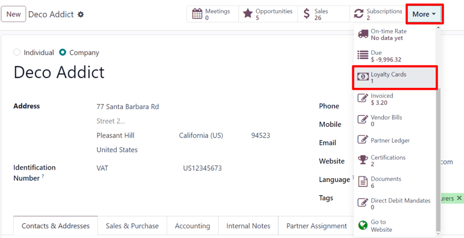

# Discount and loyalty programs

The Odoo *Sales*, *eCommerce*, and *Point of Sale* applications allow users to create discount and
loyalty programs that customers can use for online and in-store shopping. These programs offer more
varied, public, and time-sensitive pricing options than [pricelists](prices/pricing.md).

## Configure the settings

To begin using discount and loyalty programs, navigate to Sales ‣ Configuration
‣ Settings. Under the Pricing heading, activate the Discounts, Loyalty &
Gift Card setting by checking the box next to the feature. Finally, click Save to save
the changes.

## Configure discount and loyalty programs

To create discount and loyalty programs, go to Sales ‣ Products ‣ Discount &
Loyalty.

If no discount or loyalty programs have been created yet, Odoo provides a choice of templates to
help create the first program. Choose one of the template cards, or click New to create
a new program from scratch.

Or, if there are already existing programs, select an existing program to edit it.

#### NOTE
Templates **only** appear when no programs have been created, and they disappear once the first
program is created.

Creating or editing a program opens the program form.

The program form contains the following fields:

- Program Name: Enter the name of the program in this field. The program name is **not**
  visible to the customer.
- Program Type: Select the desired [program type](#sales-pricing-management-program-types) from the drop-down menu.
- Currency: Select the currency used for the program.
- Bảng giá: Nếu muốn, hãy chọn một bảng giá từ menu thả xuống để áp dụng chương trình khách hàng thân thiết này cho một bảng giá cụ thể (và khách hàng được đính kèm vào bảng giá). Có thể chọn nhiều hơn một bảng giá trong trường này. Khi một chương trình khách hàng thân thiết duy nhất được liên kết với nhiều bảng giá, thì những phân khúc khách hàng khác nhau có thể có các bảng giá khác nhau, nhưng *cùng* chương trình khách hàng thân thiết. Nếu trường này để trống, chương trình sẽ áp dụng cho tất cả mọi người, bất kể bảng giá nào.
- Points Unit: Enter the name of the points used for the Loyalty Cards
  program (e.g. `Loyalty Points`). The points unit name *is* visible to the customer. This field is
  **only** available when the Program Type is set to Loyalty Cards.
- Start Date: Select the date on which the program becomes valid. Leave this field blank
  if the program should always be valid and not expire.
- End Date: Select the date on which the program stops being valid. Leave this field
  blank if the program should always be valid and not expire.
- Limit Usage: If desired, tick this checkbox, and enter a number of usages
  to limit the number of times the program can be used during the validity period.
- Company: If working in a multi-company database, choose the one company for which the
  program is available. If left blank, the program is available to all companies in the database.
- Available On: Select the apps on which the program is available.
- Website: Select a website on which the program is available. Leave this field blank to
  make it available on all websites.
- Point of Sale: Select the point(s) of sale at which the program is available. Leave
  this field blank to make it available at all .

#### NOTE
The options available on the program form vary depending on the [Program Type](#sales-pricing-management-program-types) selected.

All of the existing cards, codes, coupons, etc. that have been generated for the program are
accessible through the smart button located at the top of the form.

#### NOTE
In Odoo 17 (and later), when a loyalty card or coupon is associated with a contact in the
database, a Loyalty Cards smart button conditionally appears on the contact form.

This smart button **only** appears if a loyalty card or coupon is associated with the contact.

### Loại chương trình

The different Program Types available on the program form are:

- Coupons: Generate and share single-use coupon codes that grant immediate access to
  rewards.
- Loyalty Cards: When making purchases, the customer accumulates points to exchange for
  rewards on current and/or future orders.
- Promotions: Set conditional rules for ordering products, which, when fulfilled, grant
  access to rewards for the customer.
- Discount Code: Set codes which, when entered upon checkout, grant discounts to the
  customer.
- Buy X Get Y: for every (X) item bought, the customer is granted 1 credit. After
  accumulating a specified amount of credits, the customer can trade them in to receive (Y) item.
- Next Order Coupons: Generate and share single-use coupon codes that grant access to
  rewards on the customer's next order.

### Quy tắc có điều kiện

Next, configure the Conditional rules that determine when the program applies to a
customer's order.

In the Rules & Rewards tab, click Add next to Conditional rules
to add *conditions* to the program. This reveals a Create Conditional rules pop-up
window.

#### NOTE
The options for Conditional rules vary depending on the selected [Program Type](#sales-pricing-management-program-types).

The following options are available for configuring conditional rules:

- Discount Code: Enter a custom code to be used for the Discount Code
  program, or use the default one generated by Odoo. This field is only available when the
  Program Type is set to Discount Code.
- Minimum Quantity: Enter the minimum number of products that must be purchased in order
  to access the reward. Set the minimum quantity to at least `1` to ensure that the customer must
  make a purchase in order to access the reward.
- Minimum Purchase: Enter the minimum amount (in currency), with tax
  Included or tax Excluded, that must be spent in order to access the reward. If both a
  minimum quantity *and* minimum purchase amount are entered, then the customer's order must meet
  both conditions.
- Products: Select the specific product(s) for which the program applies. Leave this
  field blank to apply it to all products.
- Categories: Select the category of products for which the program applies. Choose
  All to apply it to all product categories.
- Product Tag: Select a tag to apply the program to products with that specific tag.
- Grant: Enter the number of points the customer earns per order,
  per currency spent, or per unit paid (for the Loyalty Cards
  and Buy X Get Y programs).

Click Save & Close to save the rule and close the pop-up window, or click
Save & New to save the rule and immediately create a new one.

### Phần thưởng

In the Rules & Rewards tab of the program form, click Add next to
Rewards to add *rewards* to the program. This reveals a Create Rewards
pop-up window.

#### NOTE
The options for Rewards vary depending on the selected [Program Type](#sales-pricing-management-program-types).

The following options are available for configuring rewards:

- Reward Type: Select the reward type among Free Product,
  Discount, and Free Shipping. The other options for reward configuration
  depend on the Reward Type selected.
  - Sản phẩm miễn phí:
    - Quantity Rewarded: Select the number of free products rewarded to the customer.
    - Product: Select the product given for free as a reward. Only one product can be
      selected.
    - Product Tag: Select a tag to further specify the free product eligible for the
      reward.
  - Chiết khấu:
    - Discount: Enter the discounted amount in either percentage,
      currency per point, or currency per order. Then, select whether the
      discount applies to the entire Order, only the Cheapest Product on the
      order, or only Specific Products.
    - Max Discount: Enter the maximum amount (in currency) that this reward may grant as
      a discount. Leave this field at `0` for no limit.
  - Miễn phí vận chuyển:
    - Max Discount: Enter the maximum amount (in currency) that this reward may grant as
      a discount. Leave this field at `0` for no limit.
- In exchange of: Enter the number of points required to exchange for the reward (for
  the Loyalty Cards and Buy X Get Y programs).
- Description on order: Enter the description of the reward, which is displayed to the
  customer upon checkout.

