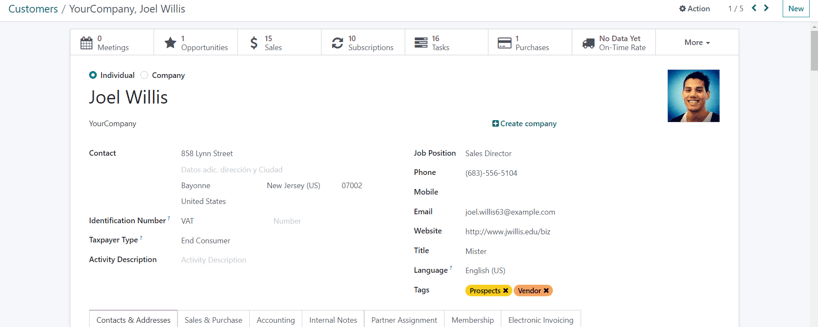
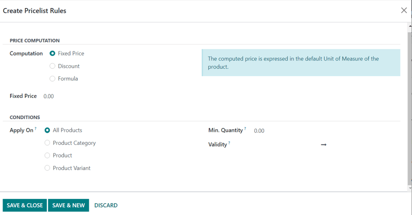

# Pricelists, discounts, and formulas

Odoo *Sales* has a useful pricelist feature that can be tailored to fit any unique pricing strategy.

A *pricelist* is a list of prices (or price rules) that Odoo uses to determine the appropriate price
for a customer. These pricelists can be set with specific criteria (such as time periods, minimum
quantity sold, and more) in order to apply certain prices or discounts.

Pricelists suggest certain prices, but they can always be overridden on the sales order.

## Pricing strategy options

To choose a pricing strategy, first navigate to Sales app ‣ Configuration ‣
Settings. In the Pricing section, click the checkbox next to the Pricelists
feature.

Doing so reveals two additional options beneath it: Multiple prices per product and
Advanced price rules (discounts, formulas). A link labeled Pricelists also
appears, which leads to a separate pricelists page, wherein pricelists can be created and/or
modified.

- Multiple prices per product: provides the option to set several different prices per
  product.
- Advanced price rules (discounts, formulas): provides the option to create detailed
  price rules and apply discounts, margins, and roundings.

After clicking the checkbox beside the Pricelists feature, select one of those two
options, then click Save to save all changes.

## Bảng giá

After activating and saving the Pricelists feature, the Settings page
reloads and, from here, either select the Pricelists link (beneath the
Pricelists feature on the Settings page), or navigate to
Sales app ‣ Products ‣ Pricelists.

Either option reveals the Pricelists page, in which pricelists can be created and/or
modified at any time.

#### IMPORTANT
The order of the pricelists on the Pricelists page has an impact on how they are
applied. If several pricelists share the same criteria, **only** the first listed pricelist is
applied.

For example, for two pricelists with different rules, but same criteria (e.g., same website, same
country), only the *first* pricelist in the list is applied.

#### NOTE
The Public Pricelist is the default pricelist used with Odoo *Sales* and *eCommerce*.
This pricelist is applied by default, if there are no matching criteria.

#### NOTE
In Odoo 17 (and above), it is no longer required to have a pricelist entered in the
Pricelist field on a quotation form in order to confirm it (i.e. turn it into a sales
order).

It should also be noted that, in Odoo 17 (and above), a chatter section can be found on pricelist
forms, which enhances the ability to communicate about them.

From the Pricelists page, either select the desired pricelist to edit, or click
New to create a new pricelist, which reveals a blank pricelist form that can be
configured in a number of different ways.

When creating a new pricelist, start by adding a name for the pricelist at the top of the form, in
the blank field. Next, select which Currency should be used.

Then, if working in a multi-company environment, select which company this pricelist should apply to
in the Company field. If this field is left blank, the pricelist is automatically
applied to all companies in the database.

### Price Rules tab

The Price Rules tab functionality on a pricelist form varies depending on the
Pricelists setting chosen: either Multiple prices per product or
Advanced price rules (discounts, formulas).

However, the Time-based rules tab and Configuration tab are always the same,
regardless of the chosen Pricelists setting.

#### Nhiều giá cho một sản phẩm

With the Multiple prices per product setting activated, the Price Rules tab
on pricelist forms provides the option to add specific products, with a specific price, to a
pricelist.

To add a specific product and price to a pricelist form, click the Price Rules tab, then
click Add a line in the Products column. Then, select the desired product
for which a specific price should be applied.

Next, if necessary, select a product variant under the Variants column (e.g. a specific
product size, color, etc.). If no variants are selected, then this price will apply to all variants
of the product.

If a minimum amount of the product must be purchased in order to apply the specific price, enter the
amount under the Min. Quantity column.

To configure the price of the product for this specific pricelist, enter the desired amount under
the Price column. Then, there is the option to add a Start Date and
End Date to the configured product price, if desired.

To add another product line, click Add a line again, and repeat the process. There is no
limit to how many products can be added in the Price Rules tab of a pricelist form.

For more information, check out the following section: [Multiple prices per product](#sales-multiple-prices-per-product).

#### Advanced price rules

With the Advanced price rules (discounts, formulas) setting activated, the
Price Rules tab on pricelist forms provides the option to configure detailed price rules
based on formulas.

Check out the [Advanced price rules (discounts, formulas)](#sales-advanced-price-rules) section
for detailed steps on how to add advanced price rules to a pricelist.

### Recurring Prices tab

Time-based rules are used specifically with subscription products. Be sure to check out the Odoo
[Subscriptions](../../../subscriptions/) documentation for more information.

Under the Recurring Prices tab, the same functionality of the Price Rules
tab is present. The only difference being that a recurring time period can be applied in the
Recurring Plan column.

Once Products and/or Product Variants are selected, click Add a
price rule, and select the blank field in the Recurring Plan column to reveal a
drop-down menu of pre-designated recurrence periods (e.g. `Monthly`, `Quarterly`, `Weekly`, etc.).

New recurrence periods can also be created from this column. To do so, type in the name for the new
Recurring Plan, then select Create from the resulting drop-down menu to
create the time period, which can be edited later.

Or, select Create and edit... to reveal a Create Recurring Plan pop-up form.
From this pop-up form, the new recurrence period can be configured, with specific
Details, Self-Service, and Pricing options. When the
configurations are complete, click the Save & Close button.

Lastly, add the desired price for this recurring price rule in the Recurring Price
column.

#### SEE ALSO
[Đăng ký](../../../subscriptions/)

### Rental rules tab

Under the Rental rules tab, specific price rules can be configured for various rental
products, using the same methodology as the Price Rules and Recurring Prices
tabs.

To add a rental rule, click Add a line, and select a desired product in the
Products column. Then, select any specific Variants, if necessary.

Next, designate a Period of time for the rental rule (e.g. `Daily`, `Hourly`, etc.).

Lastly, configure a Price for the rental rule in the respective column.

### Tab cấu hình

Under the Configuration tab, there are a few options that can further customize the
pricelist.

From here, under the Availability section, in the Country Groups field,
certain country groups can be added to the pricelist. There is no limit to how many country groups
can be added in this field.

#### NOTE
If no country is set for a customer, Odoo takes the first pricelist without any country group.

Under the Website section, there are a few options that can be configured. In the
Website field, this pricelist can be applied to a specific website, if working in a
multi-website environment. If left blank, the pricelist is applied to all websites in the database.

Tick the Selectable checkbox to have this pricelist as a selectable option for
customers to choose as they shop. If the Selectable box is left unticked, customers
**cannot** select this pricelist for themselves.

Lastly, there is the option to add an E-commerce Promotional Code. To add a code, type
in the desired promo code that, when entered during the checkout process, applies the pricelist to
the customer, even if the customer does not fall into the previously-specified criteria.

#### Show discount percentage to customers

In the Discounts section, there is a Discount Policy label with two radio
options to choose from: Discount included in the price or Show public price &
discount to the customer.

If Discount included in the price is selected, the price shown to the customer already
accounts for the discount being applied. However, if Show public price & discount to the
customer is selected, the customer sees the actual public price *and* how much they are saving with
this pricelist discount.

## Customer pricelist application

While the default pricelist applied to any customer is the Public Pricelist, Odoo
provides the opportunity to directly apply a different pricelist to customers on their contact form.

To do that, open the desired customer's contact form, either by navigating to Sales
app ‣ Orders ‣ Customers and selecting the customer from the main Customers page,
or by clicking on the customer's name on a sales order.

On the desired customer's contact form, under the Sales & Purchase tab, in the
Sales section, designate what pricelist should be applied to this specific customer from
the drop-down menu in the Pricelist field.

#### NOTE
When a customer is added to the database, the default pricelist is automatically applied to them.
There is **no way** to have a blank *Pricelist* field on a contact form. Even if that field is
left blank, the default pricelist appears when that contact form is opened again.

However, when that contact is added to a quotation, and the *Pricelist* field is auto-populated
(based on the information from their contact form), that predetermined pricelist can be removed
from the *Pricelist* field, and the quotation can still be confirmed, and subsequently, turned
into a sales order.

## Nhiều giá cho một sản phẩm

To apply several prices per individual product, select the Multiple prices per product
option, after enabling the Pricelists feature on the *Sales* app setting page
(Sales app ‣ Configuration ‣ Settings), and click Save.

Next, apply pricelists to specific products using the product form. Navigate to the
Sales app ‣ Products ‣ Products and select the product for which multiple
prices should be applied. Selecting a product from the Products page reveals that
specific product's product form on a separate page.

On the product form, click the Extra Prices smart button, located at the top of the
form.

Doing so reveals a separate page displaying the Price Rules that are specific to that
particular product. Here, price rules can be edited or created at any time.

To create a new price rule for a product from this specific Price Rules page, click
New to add a new, customizable row that has the desired product already populated in the
Applied On column.

Next, select which Pricelist this specific product price rule should apply to, via the
drop-down menu in the Pricelist column.

#### NOTE
The Public Pricelist is the default pricelist used with Odoo *Sales* and *eCommerce*.

After the desired pricelist is added to the row, designate a Min. Quantity for the price
rule.

Next, enter the desired amount in the Price column. Then, if needed, enter a
Start Date and End Date for the product's price rule.

And lastly, if working in a multi-company environment, select which company this price rule should
be applied to in the Company field. Leaving this field blank means the price rule
applies for all companies in the database.

Click away from the row to activate Odoo's auto-save capability, meaning that newly-created price
rule is now ready to be used.

Proceed to add as many unique price rules per product as desired. There is no limit to how many
price rules can be added per product.

With the price rule(s) in place for a specific product, customers who fall into those corresponding
pricelists automatically see those new prices applied. The number of price rules applied to a
particular product are also displayed in the Extra Prices smart button, located on every
product form.

#### NOTE
When a price rule/pricelist is added to a product via the Extra Prices smart button,
it is also reflected on the pricelist itself. Similarly, when a price rule for a specific product
is added to a pricelist, it is also reflected on the product form via the Extra
Prices smart button.

## Chiết khấu

The *Discounts* feature allows the ability to set a discount or increase the price on *individual
items* in a sales order. This is calculated as a percentage of that product's sales price.

To access discounts, navigate to the *Sales* app setting page (Sales app ‣
Configuration ‣ Settings), and click the Discounts checkbox, then click
Save.

After the setting has been activated, navigate to the desired quotation by going to
Sales app ‣ Orders ‣ Quotations at the top of the page. Once there, click on
the desired quote from the list.

In the order lines section of the quotation form, a new column heading will appear labeled
Disc.%. This column is used to set discounts on individual line items. Enter the desired
discount for each product line and the new price will automatically be calculated in the quote
Total at the bottom of the page.

### Discount button

In Odoo 17, with the [Discounts setting](#sales-discounts) enabled, a Discount
button appears at the bottom of sales orders.

When the Discount button on a sales order is clicked, a Discount pop-up
window appears.

On this pop-up window, configure the Discount percentage, and select one of the
following discount options: On All Order Lines, Global Discount, or
Fixed Amount.

- On All Order Lines: When selected, Odoo provides the ability to add the specified
  discount percentage (configured in the Discount field of the pop-up window) on all
  existing order lines of the sales order.
- Global Discount: When selected, Odoo adds a discount product to the order, which has
  the cumulative value equivalent to the specified discount percentage (configured in the
  Discount field of the pop-up window). Any product added (or removed) *after* the
  discount is added does **not** affect the discount value on the order line.
- Fixed Amount: When selected, the percentage designation in the Discount
  field turns to a monetary value (e.g. dollars), wherein a specific amount must be entered. This
  configured value is added as a discount line on the sales order.

#### NOTE
It is more beneficial to add a Fixed Amount discount after **all** desired products
have been added to a sales order. If there are changes made to the sales order *after* the
discount is added, make sure to change the value on the Discount line, or remove the
line and add the discount again.

## Advanced price rules

The Advanced price rules (discounts, formulas) pricelist feature provides the option to
set price change rules based on discounts and formulas. These changes can be relative to the product
list/catalog price, the product's cost, or another pricelist.

To use advanced pricing rules, with discounts and formulas, select the Advanced price
rules (discounts, formulas) option, after enabling the Pricelists feature on the
*Sales* app setting page (Sales app ‣ Configuration ‣ Settings), and click
Save.

After activating and saving that Pricelists feature, the Settings page
reloads and, from here, either select the Pricelists link (beneath the
Pricelists feature on the Settings page), or navigate to
Sales app ‣ Products ‣ Pricelists.

Either option reveals the Pricelists page, in which pricelists can be created and/or
modified at any time.

From the Pricelists page, select a desired pricelist to modify, or create a new
pricelist by clicking the New button.

On the pricelist form, under the Price Rules tab, click Add a line to add an
advanced price rule. Doing so reveals a Create Pricelist Rules pop-up form, in which the
advanced rule is configured.

### Price computation

On this form, first choose one of the three Computation options:

- Fixed Price: the price computation is based on a fixed price.
- Discount: the price computation is based on a discount.
- Formula: the price computation is based on a formula.

#### NOTE
Each Computation option reveals its own computation-specific fields on the form.

If Fixed Price is selected, enter the desired price in the Fixed Price field
below. If Discount is selected, enter the desired discount percentage in the
Discount field that appears.

If Formula is selected, a number of configurable options appear.

To configure the Formula computation option, start by selecting an option from the
Based on field: Sales Price, Cost, or Other
Pricelist. This determines what the advanced price rule formula will be based on.

Next, in the Discount field, determine how much of a discount should be applied. It
should be noted that a mark-up can be applied by setting a negative discount in this field.

Then, in the Extra Fee field, specify a fixed amount to add (or subtract) to the amount
calculated with the discount. After that, enter a desired figure in the Rounding Method
field. The rounding method sets the price so that it is a multiple of the value in the field.

#### NOTE
Rounding is applied *after* the discount and *before* the surcharge.

Lastly, specify the minimum amount of margin over the base price in the Margins field.

Once all formula-related configurations are complete, Odoo provides an example of the formula in a
blue block to the right of the configurations.

### Điều kiện

At the bottom of the Create Pricelist Rules pop-up form is the Conditions
section.

Here, start by selecting one of the options in the Apply On field:

- All Products: the advanced pricelist rule will be applied to all products.
- Product Category: the advanced pricelist rule will be applied to a specific category
  of products.
- Product: the advanced pricelist rule will be applied to a specific product.
- Product Variant: the advanced pricelist rule will be applied to a specific product
  variant.

If any of those options, apart from All Products, are selected, a new option-specific
field appears, in which the specific Product Category, Product, or
Product Variant must be chosen.

Then, select a minimum quantity to be applied to the advanced pricelist rule in the Min.
Quantity field. Lastly, select a range of dates for the pricelist item validation in the
Validity field.

Once all configurations are complete, either click Save & Close to save the advanced
pricelist rule, or click Save & New to immediately create another advanced pricelist
rule on a fresh form.

#### NOTE
If a price rule is set for a particular product, and another one for its product category, Odoo
takes the rule of the product itself.

#### SEE ALSO
- [Ngoại tệ](currencies.md)
- [Quản lý giá](../../../../websites/ecommerce/products/price_management.md)
