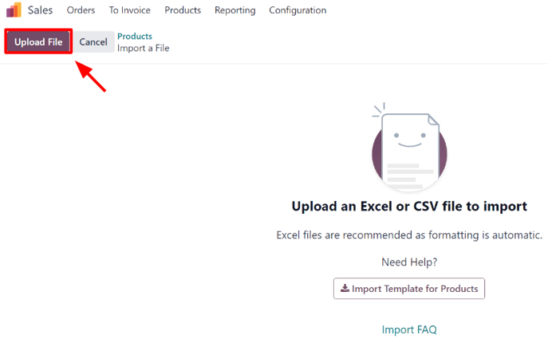
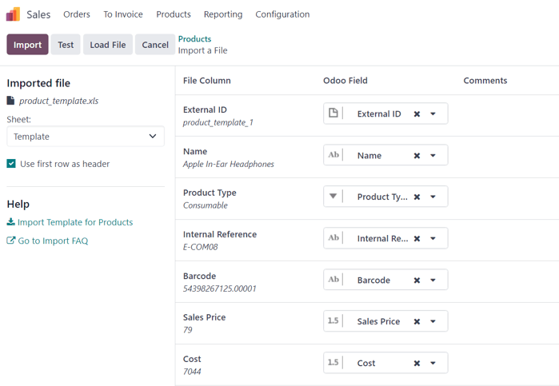
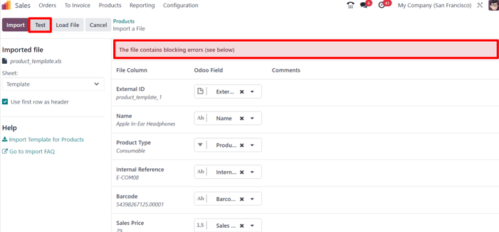
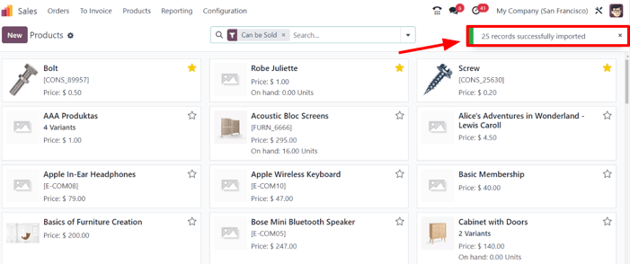
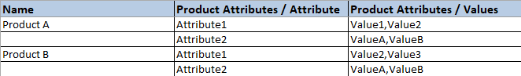

# Nhập sản phẩm

Odoo *Sales* provides a template for importing products with categories and variants, which can be
opened and edited with any spreadsheet software (Microsoft Excel, OpenOffice, Google Sheets, etc.).

When this spreadsheet is filled out properly, it can be quickly uploaded to the Odoo database. When
uploaded, those products are instantly added, accessible, and editable in the product catalog.

## Import template

In order to import products with categories and variants, the *Import Template for Products*
**must** be downloaded. Once downloaded, the template can be adjusted and customized, and then
uploaded back into the Odoo database.

To download the necessary import template, navigate to Sales app ‣ Products ‣
Products. On the Products page, click the ⚙️ (gear) icon in the upper-left
corner. Doing so reveals a drop-down menu.

From this drop-down menu, select the Import records option.

Selecting Import records reveals a separate page with a link to download the
Import Template for Products. Click that link to download the template.

Once the template download is complete, open the spreadsheet file to customize it.

## Customize product import template

When the import template has been downloaded and opened, it's time to modify its contents. However,
before any changes are made, there are a few elements to keep in mind during the process:

- Feel free to remove any columns that aren't deemed necessary. But, it is *strongly* advised that
  the Internal Reference column remains.

  While it's not mandatory, having a unique identifier (e.g. `FURN_001`) in the Internal
  Reference column for each product can be helpful in many cases. This can even be from previous
  software spreadsheets to ease the transition into Odoo.

  For example, when updating imported products, the same file can be imported several times without
  creating duplicates, thus enhancing the efficiency and simplicity of imported product management.
- Do **not** change the labels of columns that are meant to be imported. Otherwise, Odoo won't
  recognize them, forcing the user to map them on the import screen manually.
- Feel free to add new columns to the template spreadsheet, if desired. However, to be added, those
  fields **must** exist in Odoo. If Odoo can't match the column name with a field, it can be matched
  manually during the import process.

  During the import process of the completed template, Odoo reveals a page showcasing all the
  elements of the newly-configured product template spreadsheet, separated by File
  Column, Odoo Field, and Comments.

  To manually match a column name with a field in Odoo, click the Odoo Field drop-down
  menu next to the File Column that needs a manual adjustment, and select the
  appropriate field from that drop-down menu.
  

## Import product template spreadsheet

After customizing the product template spreadsheet, return to the Odoo product import page, where
the template download link is found, and click the Upload File button in the upper-left
corner.

Then, a pop-up window appears, in which the completed product template spreadsheet file should be
selected and uploaded to Odoo.

After that, Odoo reveals a page showcasing all the elements of the newly-configured product template
spreadsheet, separated by File Column, Odoo Field, and Comments.

From here, the File Column can be manually assigned to an Odoo Field, if
necessary.

To make sure everything is appropriate, and all the columns and fields are lined up accurately,
click the Test button in the upper-left corner.

If everything is lined up and applied correctly, Odoo reveals a blue banner at the top of the page,
informing the user that Everything seems valid.

If there are any errors, Odoo reveals a red banner at the top of the page, with instructions of
where to locate the specific issues, and how to fix them.

Once those errors are fixed, click Test again to ensure all necessary issues have been
remedied appropriately.

If additional product template spreadsheets need to be uploaded, click the Load File
button, select the desired product template spreadsheet, and repeat the process.

When everything is ready, click the Import button.

When clicked, Odoo instantly imports those products, and reveals the main Products page,
with a pop-up message in the upper-right corner. This pop-up message informs the user how many
products were successfully imported.

At this point, all the newly-imported products are accessible and editable via the
Products page.

## Import relation fields, attributes, and variants

It's important to note that an Odoo object is always related to many other objects. For example, a
product is linked to product categories, attributes, vendors, and things of this nature. These
links/connections are known as relations.

#### NOTE
In order to import product relations, the records of the related object **must** be imported
*first* from their own list menu.

### Trường quan hệ

On product forms in Odoo, there are a number of fields that can be modified and customized at any
time. These fields are found under every tab on a product form. While these fields are easily
editable directly on the product form, they can also be modified via a product import.

As mentioned, relation fields of this nature can **only** be imported for products if they already
exist in the database. For example, if a user attempts to import a product with a *Product Type*, it
can only be one of the preconfigured product types existing in the database (e.g. *Storable
Product*, *Consumable*, etc.).

To import information for a relation field on a product import template spreadsheet, add the name of
the field as a column name/title on the spreadsheet. Then, on the appropriate product line, add the
desired relation field option.

When all desired relation field information has been entered, save the spreadsheet, and import it
to the database, per the process mentioned above (Sales app ‣ Products ‣
Products ‣ ⚙️ (gear) icon ‣ Import records ‣ Upload File).

Once the spreadsheet with the newly-configured relation field information has been uploaded, click
Import, and Odoo returns to the Products page.

When the newly-changed/modified products, complete with the new relation field information, has been
imported and uploaded, that new information can be found on the Products page.

### Attributes and values

Odoo also allows users to import product attributes and values that can be used for products that
already exist in the database, and/or with imported products.

To import attributes and values, a separate spreadsheet or CSV file dedicated to attributes and
values **must** be imported and uploaded before they can be used for other products.

The column names/titles of the attributes and values spreadsheet should be as follows:
Attribute, Display Type, Variant Creation Mode, and
Values / Value.

- Attribute: name of the attribute (e.g. `Size`).
- Display Type: display type used in the product configurator. There are three display
  type options:
  - Radio: values displayed as radio buttons
  - Selection: values displayed in a selection list
  - Color: values denoted as a color selection
- Variant Creation Mode: how the variants are created when applied to a product. There
  are three variant creation mode options:
  - Instantly: all possible variants are created as soon as the attribute, and its
    values, are added to a product
  - Dynamically: each variant is created **only** when its corresponding attributes and
    values are added to a sales order
  - Never: variants are **never** created for the attribute

    #### NOTE
    The Variants Creation Mode **cannot** be changed once the attribute is used on at
    least one product.
- Values/Value: values pertaining to the corresponding attribute. If there are multiple
  values for the same attribute, the values need to be in individual lines on the spreadsheet.

Once the desired attributes and values have been entered and saved in the spreadsheet, it's time to
import and upload it into Odoo. To do that, navigate to Sales app ‣ Configuration
‣ Attributes ‣ ⚙️ (gear) icon ‣ Import records ‣ Upload File.

Once the spreadsheet with the newly-configured attributes and values has been uploaded, click
Import, and Odoo returns to the Attributes page. That's where those
newly-added attributes and values can be found and edited, if necessary.

As mentioned previously, when attributes and values have been added to the Odoo database, they can
be used for existing or imported products.

### Biến thể sản phẩm

When product attributes and values are configured in the database, they can be used on product
import spreadsheets to add more information and detail to products being imported.

To import products with product attributes and values, the product import template spreadsheet must
be configured with specific Product Attributes / Attribute, Product
Attributes / Values, and Name columns.

There can be other columns, as well, but these columns are **required** in order to properly import
products with specific variants.

- Name: product name
- Product Attributes / Attribute: name of attribute
- Product Attributes / Values: values pertaining to the corresponding attribute

When the desired products and product variants have been entered and saved in the spreadsheet, it's
time to import and upload them into Odoo. To do that, navigate to Sales app ‣
Products ‣ Products ‣ ⚙️ (gear) icon ‣ Import records ‣ Upload File.

Once the spreadsheet with the newly-configured products and product variants has been uploaded,
click Import, and Odoo returns to the Products page. That's where the
newly-added products can be found.

To view and modify the attributes and variants on any products, select the desired product from the
Products page, and click the Attributes & Variants tab.

#### SEE ALSO
[Biến thể sản phẩm](applications/sales/sales/products_prices/products/variants.md)
