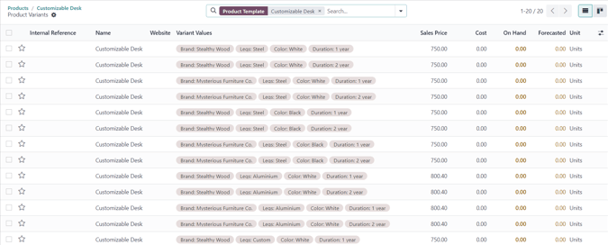

# Biến thể sản phẩm

Product variants are used to give single products a variety of different characteristics and options
for customers to choose from, such as size, style, or color, just to name a few.

Products variants can be managed via their individual product template, or by navigating to either
the Product Variants or Attributes page. All of these options are located
within the Odoo *Sales* application.

#### SEE ALSO
[Biến thể sản phẩm](../../../../websites/ecommerce/products.md#ecommerce-products-product-variants)

## Cấu hình

To use product variants, the *Variants* setting **must** be activated in the Odoo *Sales*
application.

To do that, go to Sales app ‣ Configuration ‣ Settings, and locate the
Product Catalog section at the top of the page.

In that section, check the box to enable the Variants feature.

Then, click Save at the top of the Settings page.

## Thuộc tính

Before product variants can be set up, attributes **must** be created. To create, manage, and modify
attributes, navigate to Sales app ‣ Configuration ‣ Attributes.

#### NOTE
The order of attributes on the Attributes page dictates how they appear on the
*Product Configurator*, *Point of Sale* dashboard, and *eCommerce* pages.

To create a new attribute from the Attributes page, click New. Doing so
reveals a blank attributes form that can be customized and configured in a number of ways.

First, create an Attribute Name, such as `Color` or `Size`.

Next, select one of the options from the Display Type field. The Display
Type determines how this product is shown on the online store, *Point of Sale* dashboard, and
*Product Configurator*.

The Display Type options are:

- Pills: options appear as selectable buttons on the product page of the online store.
- Color: options appear as small, colored squares, which reflect any HTML color codes
- Radio: options appear in a bullet-style list on the product page of the online store.
- Select: options appear in a drop-down menu on the product page of the online store.
  set, on the product page of the online store.
- Multi-checkbox (option): options appear as selectable checkboxes on the product page
  of the online store.

The Variant Creation Mode field informs Odoo when to automatically create a new variant
once an attribute is added to a product.

#### NOTE
The Variant Creation Mode field **must** be set to Never (option) in
order for the Multi-checkbox (option) to work properly as the Display
Type.

- Instantly: creates all possible variants as soon as attributes and values are added
  to a product template.
- Dynamically: creates variants **only** when corresponding attributes and values are
  added to a sales order.
- Never (option): never automatically creates variants.

#### WARNING
Once added to a product, an attribute's Variants Creation Mode cannot be edited.

The eCommerce Filter Visibility field determines whether or not these attribute options
are visible to the customer on the front-end, as they shop on the online store.

- Visible: the attribute values are visible to customers on the front-end.
- Hidden: the attribute values are hidden from customers on the front-end.

Lastly, in the optional eCommerce Category field, select a category from a drop-down
menu to group similar attributes under the same section for added specificity and organization.

#### NOTE
To view the details related to the attribute category selected, click the internal link
<i class="fa fa-arrow-right"></i> (right arrow) icon to the far-right of the
eCommerce Category field, once an option has been selected. Doing so reveals that
attribute category's detail form.

Here, the Category Name and Sequence is displayed at the top. Followed by
Related Attributes associated with the category. These attributes can be
dragged-and-dropped into a desirable order of priority.

Attributes can be directly added to the category, as well, by clicking Add a line.

### Giá trị thuộc tính

Attribute values should be added to the Attribute Values tab. Values can be added to an
attribute at any time, if needed.

To add a value, click Add a line in the Attribute Values tab.

Then, enter the name of the value in the Value column. Next, check the box in the
Is custom value column, if the value is custom (i.e. the customer gets to provide unique
specifications that are specific to this particular value).

#### NOTE
If the Display Type - Color option is selected, the option to add an HTML
color code will appear to the far-right of the value line, to make it easier for salespeople and
customers to know exactly what color option they're choosing.

To choose a color, click the blank circle in the Color column, which reveals an HTML
color selector pop-up window.

In this pop-up window, select a specific color by dragging the color slider to a particular hue,
and clicking on the color portion directly on the color gradient window.

Or, choose a specific color by clicking the *dropper* icon, and selecting a desired color that's
currently clickable on the screen.

Once an attribute is added to a product, that product is listed and accessible, via the attribute's
Related Products smart button. That button lists every product in the database currently
using that attribute.

## Biến thể sản phẩm

Once an attribute is created, use the attribute (and its values) to create a product variant. To do
that, go to Sales app ‣ Products ‣ Products, and select an existing product to
view that desired product's form. Or, click Create to create a new product, to which a
product variant can be added.

On the product form, click the Attributes & Variants tab to view, manage, and modify
attributes and values for the product.

To add an attribute to a product, and subsequent attribute values, click Add a line in
the Attributes & Variants tab. Then, choose the desired attribute from the drop-down
menu that appears.

Once an attribute is selected in the Attribute column, proceed to select the specific
attribute values to apply to the product, via the drop-down menu available in the Values
column.

#### NOTE
There is no limit to how many values can be added.

### Cấu hình biến thể

To the far-right of the attribute line is a Configure button. When clicked, Odoo reveals
a separate page showcasing those specific Product Variant Values.

Here, the specific Value name, HTML Color Index (if applicable), and
Value Price Extra are viewable.

#### NOTE
The Value Price Extra represents the increase in the sales price if the attribute is
selected.

When a value is clicked on the Product Variant Values page, Odoo reveals a separate
page, detailing that value's related details.

On the specific product variant detail page, the Value and Value Price Extra
fields can be found, along with an Exclude for field.

In the Exclude for field, different Product Templates and specific
Attribute Values can be added. When added, this specific attribute value will be
excluded from those specific products.

### Variants smart button

When a product has attributes and variants configured in its Attributes & Variants tab,
a Variants smart button appears at the top of the product form. The Variants
smart button indicates how many variants are currently configured for that specific product.

When the Variants smart button is clicked, Odoo reveals a separate page showcasing all
the specific product variant combinations configured for that specific product.

## Impact of variants

In addition to offering more detailed product options to customers, product variants have their own
impacts that can be taken advantage of throughout the Odoo database.

- Barcode: barcodes are associated with each variant, instead of the product template.
  Each individual variant can have its own unique barcode/SKU.
- Price: every product variant has its own public price, which is the sum of the
  product template price *and* any extra charges for particular attributes.
- Inventory: inventory is counted for each individual product variant. On the product
  template form, the inventory reflects the sum of all variants, but the actual inventory is
  computed by individual variants.
- Picture: each product variant can have its own specific picture.

#### NOTE
Changes to the product template automatically apply to every variant of that product.

#### SEE ALSO
[Nhập sản phẩm](import.md)
