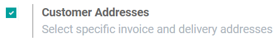
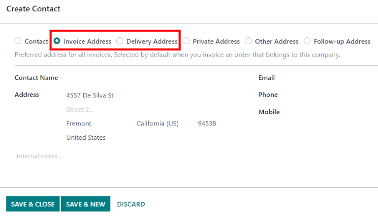

# Deliveries and invoices to different addresses

People and businesses often use separate addresses for billing (invoicing) and shipping (delivery)
purposes. With the Odoo *Sales* app, contacts can have different specified addresses for delivery
and invoicing.

## Cài đặt

To properly utilize multiple addresses in Odoo, go to Accounting app ‣
Configuration ‣ Settings, and scroll down to the Customer Invoices heading. Then,
tick the checkbox.

## Contact form configuration

To add multiple addresses to a contact, go to Sales app ‣ Orders ‣ Customers,
and clear any default filters from the search bar. Then, click on the desired customer to open their
contact form.

From the contact form, click Edit, and then select Add, which is located
under the Contacts & Addresses tab. Doing so reveals a Create Contact pop-up
form, in which additional addresses can be configured.

On the Create Contact pop-up form, start by clicking the default Other
Address field to reveal a drop-down menu of address-related options.

Chọn bất kỳ tùy chọn nào sau đây:

- Liên hệ: thêm một liên hệ khác vào biểu mẫu liên hệ hiện có.
- Địa chỉ lập hóa đơn: thêm địa chỉ lập hóa đơn cụ thể vào biểu mẫu liên hệ hiện có.
- Địa chỉ giao hàng: thêm địa chỉ giao hàng cụ thể vào biểu mẫu liên hệ hiện có.
- Địa chỉ khác: thêm địa chỉ thay thế vào biểu mẫu liên hệ hiện có.
- Địa chỉ riêng tư: thêm địa chỉ riêng tư vào biểu mẫu liên hệ hiện có.

Once an option is selected, proceed to enter the corresponding contact information that should be
used for the specified address type.

Then, click Save & Close to save the address and close the Create Contact
window. Or, click Save & New to save the address and immediately input another one.

## Address added to quotations

When a customer is added to a quotation, the Invoice Address and Delivery
Address fields autopopulate with the corresponding addresses specified on the customer's contact
form.

The Invoice Address and Delivery Address can also be edited directly from
the quotation by clicking the Edit button, and then clicking the ➡️ (right
arrow) internal link buttons next to each address line.

These addresses can be updated at any time to ensure accurate invoicing and delivery.
