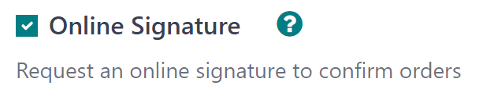
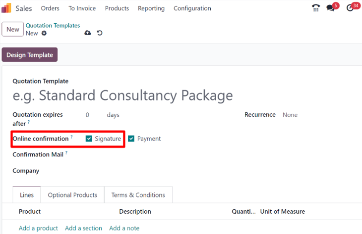
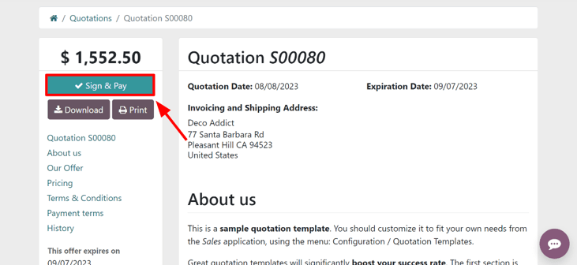

# Online signatures for order confirmations

The Odoo *Sales* application provides customers with the ability to confirm orders, via an online
signature, directly on the sales order. Once the sales order is electronically signed by the
customer, the salesperson attached to the sales order is instantly notified that the order is
confirmed.

## Activate online signatures

In order to have customers confirm orders with an online signature, the *Online Signature* feature
**must** be activated.

To activate the *Online Signature* feature, go to Sales app ‣ Configuration ‣
Settings, scroll to the Quotations & Orders heading, and activate the
Online Signature feature by checking the box beside it.

Then, click the Save button in the top-left corner.

#### NOTE
When making a quotation template, the online signature feature is the Signature
option, located in the Online confirmation field of the quotation template form.

On standard quotations, the online signature feature is the Signature option, located
under the Other Info tab of the quotation form.

## Order confirmations with online signatures

When clients access quotations online through their customer portal, there's a Sign &
Pay button directly on the quotation.

When clicked, a Validate Order pop-up window appears. In this pop-up window, the
Full Name field is auto-populated, based on the contact information in the database.

Then, customers have the option to enter an online signature with any of the following options:
Auto, Draw, or Load.

Auto lets Odoo automatically generate an online signature based on the information in
the Full Name field. Draw lets the customer use the cursor to create a
custom signature directly on the pop-up window. And Load lets the customer upload a
previously-created signature file from their computer.

After the customer has chosen any of the three previously mentioned signature options
(Auto, Draw, or Load), they will click the Accept &
Sign button.

When Accept & Sign is clicked, the various payment method options become available for
them to choose from (if the *online payment* option applies to this quotation).

Then, when the quotation is paid and confirmed, a delivery order is automatically created (if the
Odoo *Inventory* app is installed).

#### SEE ALSO
- [Mẫu báo giá](applications/sales/sales/send_quotations/quote_template.md)
- [Online payment order confirmation](applications/sales/sales/send_quotations/get_paid_to_validate.md)
